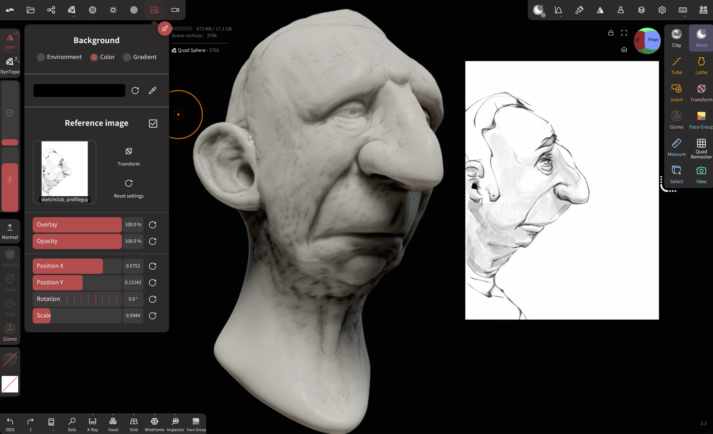
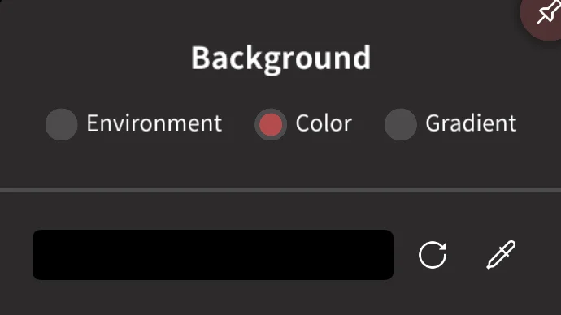
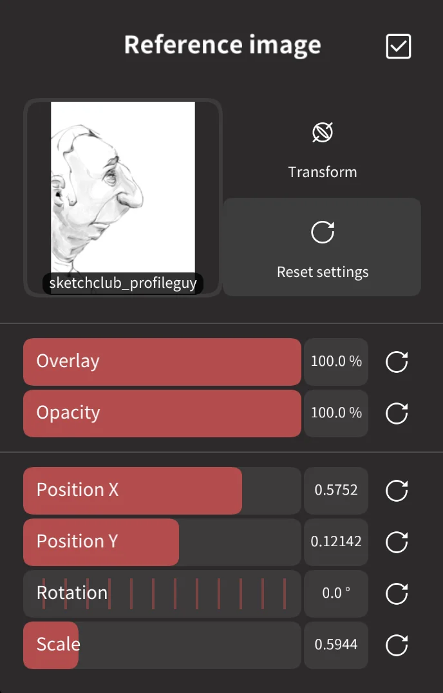

#  Background

This menu controls the background color of Nomad, as well as any reference images to be used.

## Background 

There are three options for the viewport background.

* `Environment` - Show the environment map selected in [Shading](shading). This can be further controlled with Blur and Exposure (brightness) controsl. 
* `Color` - A flat color that you can choose
* `Gradient` - A ramp of colour from top to bottom. The Factor slider lets you determine the midpoint of the gradient.  

## Reference Image

You can add an image of your choice on the background to be used for reference.
You can change the position and scale, for example if you want to move it to the screen corner.

###  Transform 

This button will let you place the reference image interactively. Use 2 fingers to pan, scale, rotate the reference image into place. The final placement will be reflected in the sliders below:

* `Overlay` - at 0% the reference image will always be behind your objects, at 100% it is in front. 
* `Opacity` - How transparent the image is.
* `Position` - The X and X position of the image.
* `Rotation` - Image rotation.
* `Scale` - Image scale.

::: tip

Cameras and reference images are linked. 

This means if you setup your reference image to line up with your sculpt, if you create a camera from the [Camera menu](camera), the reference image position, rotation, scale are also stored with the camera. You can turn off the reference image, rotate to another viewport. If you look through the camera again, the reference image will be activated with the settings you used.

This even includes choosing different images for different cameras!

 

:::
