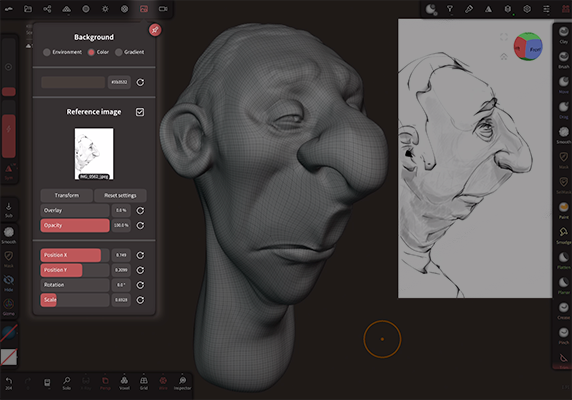
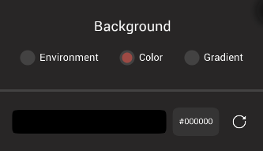
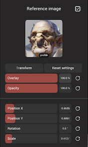

# Background  

This menu controls the background color of Nomad, as well as any reference images to be used.

## Background 

There are three options for the viewport background.

| Method              | Description  |
| :---:               | :---:        |
| Environment         | Show the image of the current environment  |
| Color               | A flat color that you can choose |
| Gradient            | A ramp of colour from top to bottom |

## Reference Image

You can add an image of your choice on the background to be used for reference.
You can change the position and scale, for example if you want to move it on the screen corner.

Note that you can also set up the overlay level.
At overlay 0, the mesh will entirely occlude the reference image.
At overlay 1, the mesh will be occluded entirely by the image.
In-between values can be useful if you really want to use the reference image as a guide.

::: tip

Cameras will store the reference image properties when they are created. 

For example you can setup a reference image exactly where you need it, and create a camera from the camera menu. You can turn the reference off move the camera somewhere else, but when you select the camera in the camera menu, or double click the camera in the scene outliner, the reference image will be restored.

This even includes choosing different images!

 

:::
