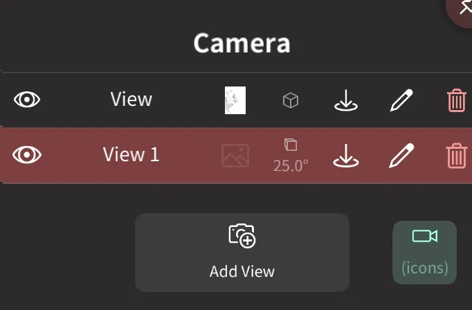
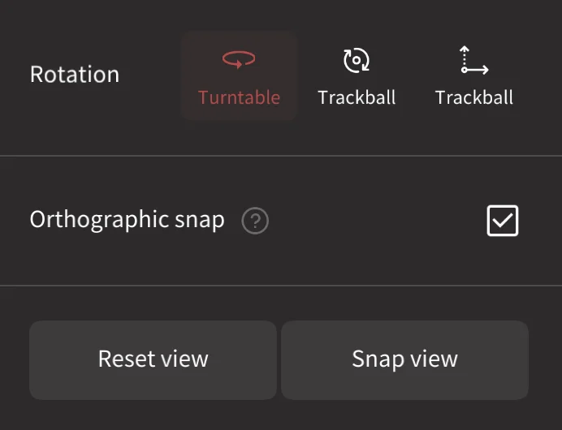

#  Camera

This menu lets you create and modify cameras, as well as control how you interact with cameras.

Cameras in Nomad have several uses:

* Setup views for sculpting from precise angles
* Used like a photo camera to frame your objects
* as a first person perspective camera to navigate your scene
* as an orthographic camera for isometric games or industrial style rendering.

## Controlling the camera

### Rotation
You rotate the camera by dragging *one* finger on the background.
If you drag the finger on your model, it will instead start the sculpting operation.

::: tip Can I rotate the camera if I can't access the background?
Yes, you can put *two* fingers on the screen - as if you wanted to start a pan/zoom gesture - and then release *one* finger.
:::

### Focus / Reset
*Double tap* on the model to focus the picked point.
If you *double tap* in the background, the camera will focus on the selected mesh instead.

### Translation
By moving *two* fingers, you can pan the camera.

### Zooming
By using the pinch gesture you can zoom in/out.

### Rolling
You can *roll* the view by rotating *two* fingers.
::: warning
This gesture is only available for `trackball` rotation mode.
:::

## Camera controls

### Views
You can save camera view points by using `Add View`.
If you click on the view name, then the camera will restore the view.

::: tip
A saved view will save the [Projection Type](#projection-type) settings and also the [Reference image](background.md).  
It can be useful if you want to cycle between front/left/back reference views with different backgrounds.
:::

| Action      | Icon                          | Description                                                                 |
| :---------: | :---------------------------: | :-------------------------------------------------------------------------: |
| Visibility  |     | Toggle the camera. Hidden cameras will be skipped from previous/next button |
| Name        |                               | Select the camera                                                           |
| Image       |        | A thumbnail of a reference image if it is linked to the camera              |
| Update View |  | Update the saved view with the current view point                           |
| Edit Name   |       | Edit the camera name                                                        |
| Delete      |        | Delete the camera                                                           |

###  Add View
Create a new camera based on the current view.

###  Icons

Toggle if camera icons are visible in the viewport. If a camera is selected, its icon is always visible.

### Projection Type
You can change the `Field of View` (FOV / focal length) of your camera.
It is usually advised to use a low FOV for sculpting purposes, as it can help for proportion.  
You can also use the `Orthographic` mode, which is more or less similar to a FOV equal to 0

### First Person
Enable setting the pivot to be directly on the camera, rather than on the sculpture. Dragging a finger on the background will keep the camera position locked, but change the rotation, similar to how first person games work. Useful when sculpting environments rather than single objects.

### Rotation Type
By default the camera is using the `Turntable` rotation mode.
It means you have only two degrees of freedom, it is more intuitive but in some cases you'll want more flexibility.  
You can switch to `Trackball`, you'll be able to *roll* the view by rotating *two* fingers on the viewport. On desktop there is an alternate trackball mode that might be more familar to some users.

### Orthographic snap

When enabled, if you have a keyboard holding down shift while rotating the view will snap the camera to the nearest front/back/top/bottom/left/right view, and make the camera orthographic. The camera will also be made orthograhic when the view cube is clicked to snap to front/back/left/right/top/bottom.

### Reset view

Move the camera to the front, and fit the scene into the view

### Snap view
Snap to the closest front/back/left/right/top/bottom view. If you are already in one of those views, clicking again will snap 180 degrees to the opposite side.

### Speed

If you feel the camera moves too slow or too quickly, you can set a speed multiplier for `rotation`, `translation` and `zooming`. Useful if your sculpt is very big or very small.

### Pivot overview

When you rotate the camera you can see a small pink dot, this is your camera pivot point.  
It's very important to understand where your pivot is so that you don't get lost or frustrated by the camera.

By default the pivot is update through these operations:
- double tap on the model
- double tap on the background (the new pivot will be on the center of your mesh)
- putting *two* fingers on screen (pan/zoom/roll) will update the pivot on the center of the *two* fingers

### Update Pivot...

You can further customise the pivot to be updated with these options:

* When camera starts moving 
* Allow air pivot
* When double tapping
* Sculpt (stroke)

::: tip
When you are used to it, you can hide the (hint) pink dot if you go in the [Settings](settings.md) menus.
:::

### Double tap on object
When `Focus` is enabled, double tapping will move the pivot to the tapped object.

### Double tap on background
When enabled, set the pivot to be one of Selection, Scene, or toggle between them.

