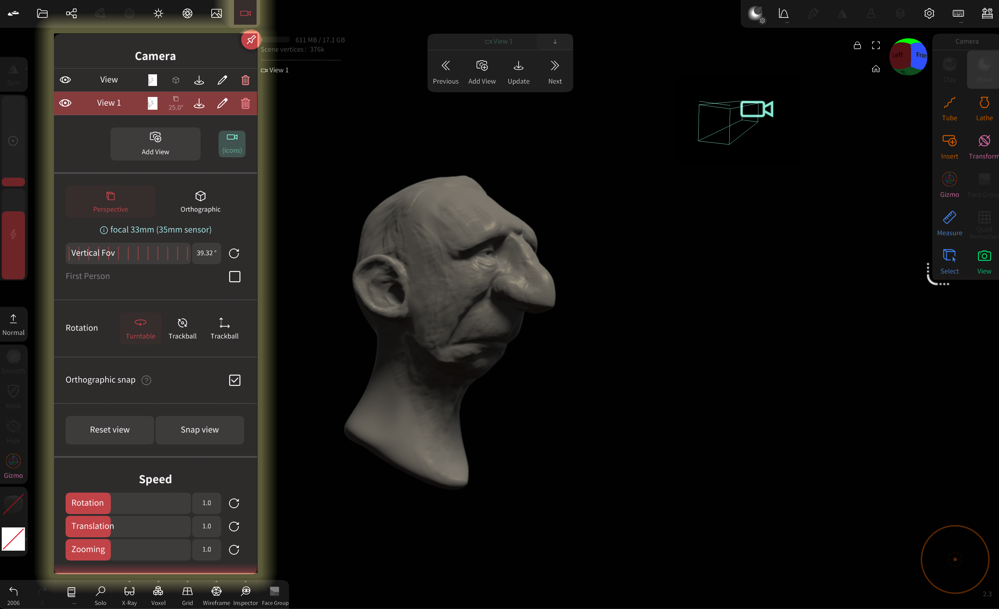
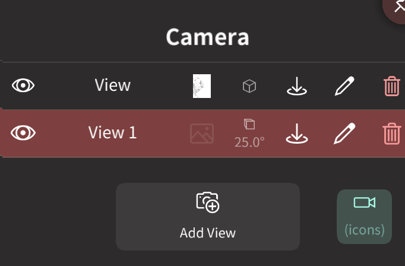
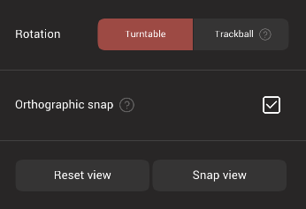
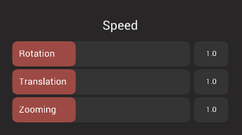
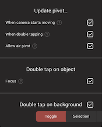

#  Camera

This menu lets you create and modify cameras, as well as control how you interact with cameras.

Cameras in Nomad have several uses:

* Setup views for sculpting from precise angles
* Used like a photo camera to frame your objects
* as a first person perspective camera to navigate your scene
* as an orthographic camera for isometric games or industrial style rendering.

## Controlling the camera

### Rotation
You rotate the camera by dragging *one* finger on the background.
If you drag the finger on your model, it will instead start the sculpting operation.

::: tip Can I rotate the camera if I can't access the background?
Yes, you can simply put *two* fingers on the screen - as if you wanted to start a pan/zoom gesture - and then simply release *one* finger.
:::

### Focus / Reset
*Double tap* on the model to focus the picked point.
If you *double tap* in the background, the camera will focus on the selected mesh instead.

### Translation
By moving *two* fingers, you can pan the camera.

### Zooming
By using the pinch gesture you can zoom in/out.

### Rolling
You can *roll* the view by rotating *two* fingers.
::: warning
This gesture is only available for `trackball` rotation mode.
:::

## Camera controls

### Views
You can save camera view points by using `Add View`.
If you click on the view name, then the camera will restore the view.

::: tip
A saved view will save the [Projection Type](#projection-type) settings but also the [Reference image](background.md).  
It can be useful if you want to cycle between front/left/back reference views with different backgrounds.
:::

| Action      | Icon                         | Description                                                                 |
| :---------: | :--------------------------: | :-------------------------------------------------------------------------: |
| Visibility  |     | Toggle the camera. Hidden cameras will be skipped from previous/next button |
| Name        |                              | Select the camera                                                           |
| Update View |  | Update the saved view with the current view point                           |
| Edit Name   |       | Edit the camera name                                                        |
| Delete      |        | Delete the camera                                                           |

### Add View
Create a new camera based on the current view.

### Projection Type
You can change the `Field of View` (FOV / focal length) of your camera.
It is usually advised to use a low FOV for sculpting purposes, as it can help for proportion.  
You can also use the `Orthographic` mode, which is more or less similar to a FOV equal to 0

### First Person
Enable setting the pivot to be directly on the camera, rather than on the sculpture. Dragging a finger on the background will keep the camera position locked, but change the rotation, similar to how first person games work. Useful when sculpting environments rather than single objects.

### Rotation Type
By default the camera is using the `Orbit` rotation mode.
It means you have only two degrees of freedom, it is more intuitive but in some cases you'll want more flexibility.  
You can switch to `Trackball`, you'll be able to *roll* the view by rotating *two* fingers on the viewport.

### Pivot
When you rotate the camera you can see a small pink dot, this is your camera pivot point.  
It's very important to understand where your pivot is so that you don't get lost or frustrated by the camera.

By default the pivot is update through these operations:
- double tap on the model
- double tap on the background (the new pivot will be on the center of your mesh)
- putting *two* fingers on screen (pan/zoom/roll) will update the pivot on the center of the *two* fingers

::: tip
When you are used to it, you can hide the (hint) pink dot if you go in the [Settings](settings.md) menus.
:::

### Orthographic snap
Enable the camera to swap to orthographic mode when the view cube is clicked on to snap to front/back/left/right/top/bottom. Often when looking in these directions you want to sculpt without perspective distortion, this will automatically turn off perspective for those views, and turn it back on when looking from other angles.

### Reset view
Move the camera to the default position when Nomad is started.

### Snap view
Snap to the closest front/back/left/right/top/bottom view. If you are already in one of those views, clicking again will snap 180 degrees to the opposite side.

### Speed

Set the speed of rotation, translation, zoom operations, useful if your sculpture is either very big or very small.

### Update Pivot...
Nomad does a best guess of where the pivot for the camera should be when rotating, but you can control it with these options. Eg when doing focusing on the nose of character, you could double click on the nose to set the pivot, then turn off all these options so the camera will only pivot around the nose. When finished, enable these options again.

### Double tap on object
When `Focus` is enabled, double tapping will move the pivot to the tapped object.

### Double tap on background
When enabled, set the pivot to be one of Selection, Scene, or toggle between them.