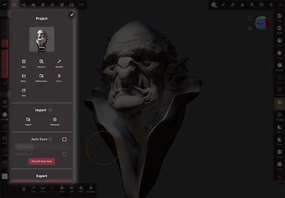
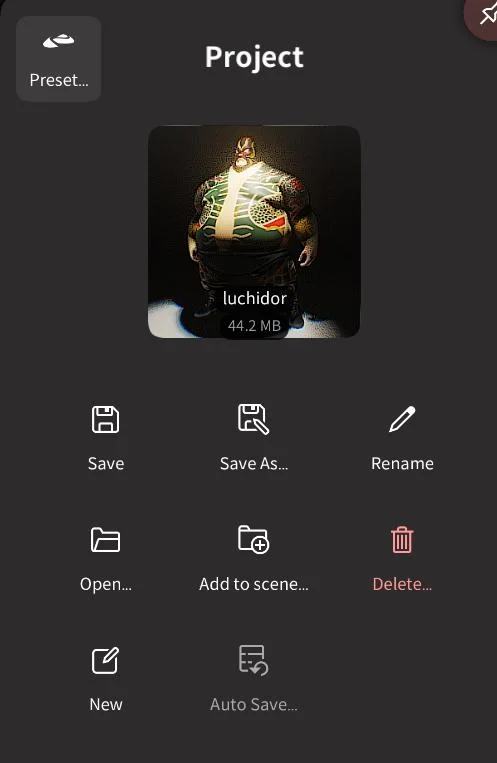
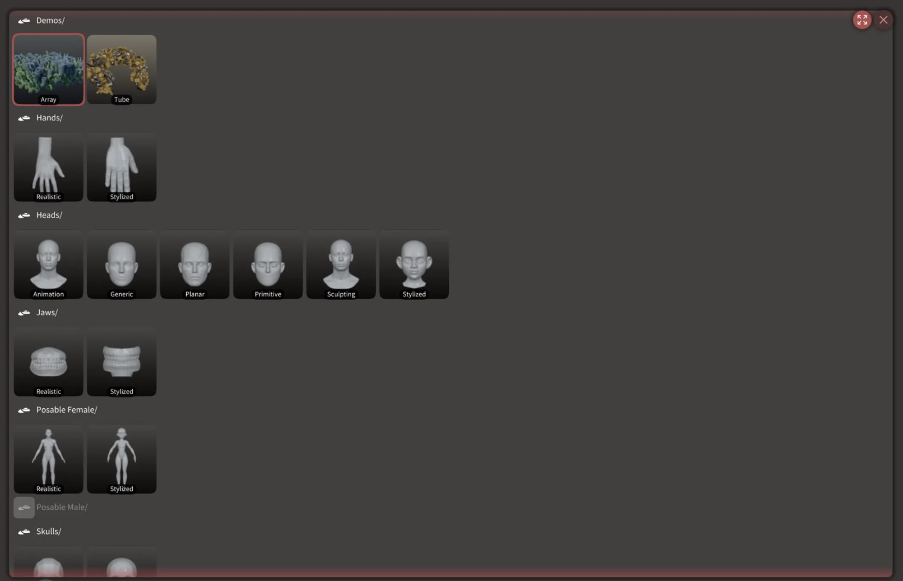
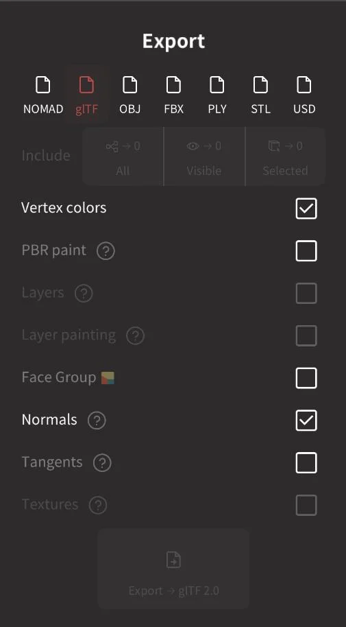
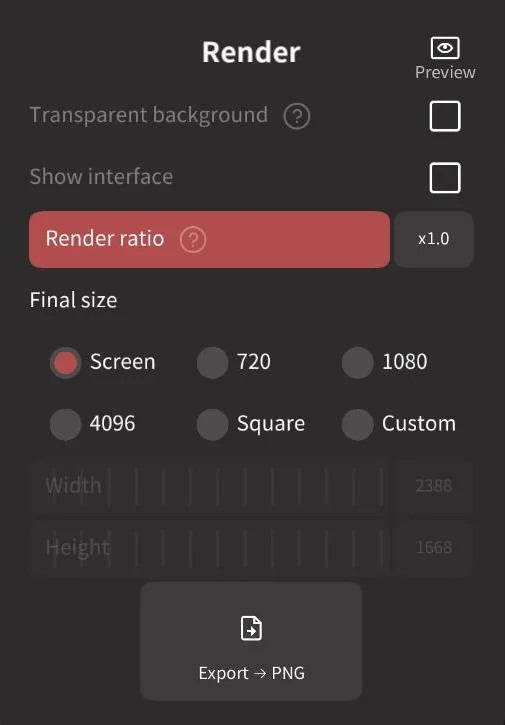

#  Files

The files menu allows you to save and load nomad projects, import and export 3d models, and export rendered images.

## Project

A thumbnail is shown of the last save at the top of this menu. Clicking this thumbnail brings up a mini browser, tap twice on another project to bring up a mini menu to open, add, save, clone, rename, delete that project.

###  Preset 
Access a collection of demos and character components. Select one, then select again to choose to Open, Add to Scene or Clone the entry into your projects folder.

###  Save
Save the Nomad project.

###  Save As...
Display the project browser to allow you to save the Nomad project with a new name.

###  Rename
Display a text box to rename the current project.

###  Open...
Display the project browser to open a project.

###  Add to scene...
Display the project browser, when a project is selected it's contents will be merged with the current scene.

###  Delete...
Display the project browser, any selected projects will be deleted from the file system.

###  New
Start a new project, if there are unsaved changes you will be asked if you want to save.

###  Auto Save...
Menu to control auto save options.

If you enable autosave, you can set up a timer so that a popup will appear at regular intervals.
The reason why Nomad doesn't save in background is because 3d files can be pretty big so it can induce a significant lag while you are sculpting.

Additionally, to avoid out-of-memory issues the scene is typically compressed before the saving operation.
This compression/decompression will slow down the save operation as well.

### Timer pop up
How frequently will the timer popup appear.

### Popup timeout
Enable popup timeout

### Discard autosave
If an auto save file exists for a project, it will automatically be loaded instead of the original project. If this isn't required, this button will delete the autosave. Loading the fill will then load the last manual save of the project.

## Import

###  Import
For importing 3d files that aren't Nomad projects.

When you import an external scene file to Nomad, you can either *import* or *add* it.

Adding a file will simply add the objects into the current scene.
Importing a file will create a new Nomad project with the new objects in it.

Nomad can import these formats:
- Nomad (.nom)
- glTF (.glb, .gltf)
- OBJ (.obj)
- STL (.stl)
- PLY (.ply)
- FBX (.fbx, experimental)

###  Advanced
Display advanced import options:

### Project/ glTF / OBJ / STL / FBX
#### Keep topology
Nomad by default will attempt to fix problem geometry on load. Enabling this will stop Nomad from vertex/face reordering, removal of vertex/face duplicates, removal of unused vertices.

#### Skip textures
Skip loading of textures for formats that support it like glTF

### Project / glTF
#### Keep gui settings
Enable savng of the gui and project settings within the Nomad .nom or glTF file.

### OBJ
#### Split OBJ by groups
Enable splitting OBJ groups into separate objects.

#### Color Space
Set the color mode interpreted from the obj as Linear, sRGB, or Auto.

### PLY
#### Color Space
Set the color mode interpreted from the ply as Linear, sRGB, or Auto.

### FBX
#### Color Space
Set the color mode interpreted from the obj as Linear, sRGB, or Auto.

## Export
Save to a 3d geometry format that can be used in other software. 

Different file formats support different features, the options available will change based on the selected file type.

<!-- https://www.tablesgenerator.com/markdown_tables# -->
<!-- http://markdowntable.com/ -->
|                                 | NOM    | GLTF/GLB             | OBJ  | USD | PLY  | STL   | FBX                    |
| :-----------------------------: | :----: | :------------------: | :--: | :--: | :--: | :---: | :--------------------: |
| [Vertex Colors](#vertex-colors) | ✅     | ✅                   | ✅   | ✅ | ✅    | ✅    | ✅                     |
| [Vertex PBR](#vertex-pbr)       | ✅     | Nomad ✅ Other ⚠️ | ❌   | ✅ | ✅    | ❌    | ❌                     |
| Quad                            | ✅     | Nomad ✅ Other ⚠️ | ✅   | ✅ | ✅    | ❌    | ✅                     |
| [Layers](#layers)               | ✅     | ✅                   | ❌   | ✅ | ❌    | ❌    | ✅                     |
| Objects                         | ✅     | ✅                   | ✅   | ✅ | ❌    | ❌    | ✅                     |
| Face Group                      | ✅     | ✅                   | ✅   | ✅ | ❌    | ❌    | ✅                     |
| Hierarchy                       | ✅     | ✅                   | ❌   | ✅ | ❌    | ❌    | ✅                     |
| Lights                          | ✅     | ✅                   | ❌   | ✅ | ❌    | ❌    | ✅                     |
| Textures                        | ✅     | ✅                   | ✅   | ✅ | ❌    | ❌    | Import ✅ Export ❌ |
| Primitives, Postprocess, etc    | ✅     | Nomad ✅ Other ❌ | ❌   | ❌ | ❌    | ❌    | ❌                     |

### All/Visible/Selected
The active button state will set which objects will be exported. The number next to the icons indicate how many objects will be exported for that option.

### Vertex colors
Export vertex colors if supported by the file format.

### PBR Paint
PBR vertex colors are exported as secondary vertex colors attributes.
The channels are packed in the following way:

|           | Channel  |
| :-------: | :------: |
| Roughness | R        |
| Metalness | G        |
| Masking   | B        |

### Layers
Layers are supported through glTF morph targets.
Nomad also exports per-layer colors, roughness and metalness but it will be ignored by other software.

### Layer painting
Export layer painting, usually ignored by other software.

### Face Group
Export facegroups, exporting can sometimes interfere with other software.

### Normals
Export normal information. Note that Nomad will always compute its own normals when importing other file formats.

### Tangents
Export tangent information, used if the model has normal maps. 

### Textures
If textures have been added to the material, they will be exported. Note that this will not bake textures, that is done via the bake options in topology.

### Export button
Click this to export the geometry using the selected settiings.

::: tip Tip: Import roughness and metalness to Blender

Blender can import glTF/glb, but doesn't automatically understand vertex attributes for metalness and roughness. To use them, in the material editor create a Vertex Color node, set its property to the next color attribute (usually Col.001). Connect a 'Separate XYZ' node, send X to roughness, and Y to Metallic.

This video shows the process:

::: 

::: tip Tip: USD feature support

USD is a complex format, it's specification supports many features, but not all 3d software will support them. OSX/iOS don't support vertex color for example.  The preset modes within the USD exporter attempt a best guess at  compatibility with OpenUSD, Apple, Procreate, Zbrush.

::: 

## Render

Export an image that is the combination of all the settings in the project (lights, materials, post processing etc). 

### Preview

The small preview button next to the menu title will dim the toolbars to help preview the final result.

### Transparent background
Enable an alpha channel for the render, useful to combine the render with other images in 2d programs. Note that partial transparency is not supported.

### Show interface
Enable including Nomad's UI in the render.

### Render ratio
A multiplier on the image resolution.

### Final size
The resolution to use for the render. When `Custom` is selected, the width and height sliders will be enabled. 

When the File menu is active, a dashed overlay will be drawn in the viewport to indicate the render region if it does not match the screen resolution (note that you must be in landscape mode for this to be correct).

### Export png
Click this button to start the render process. When complete you can then choose how to save or share the image.
