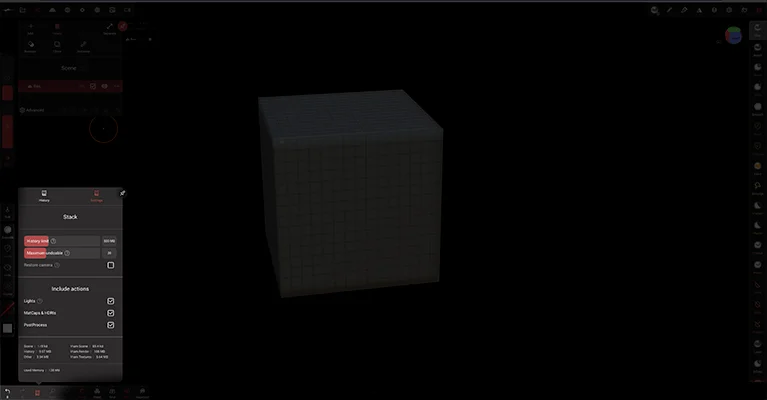
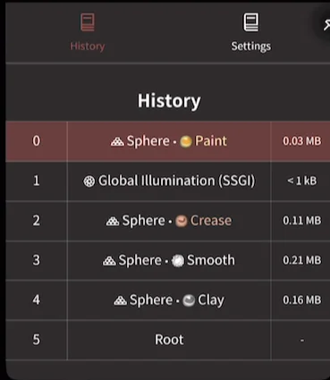
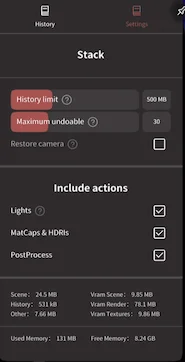

#  History

Like most content creation tools, you can undo/redo all editing in Nomad.
There is a limit to how many operations can be undoable, but you can control this behavior.

::: tip
You can use quick gestures to undo/redo:
- 2 fingers tap to undo
- 3 fingers tap to redo
:::

## History

This panel displays the history stack, showing the number of steps, the operation name, and the amount of memory that step is using.

## Settings

### History limit (Mb)
If the history stack exceeds this value, the older operations will be removed so that the memory budget fits into this limit.

### Maximum undoable
You can control the maximum number of operations.

## Restore camera
For each operation, the viewpoint of the camera is saved.
If you enable this option, undoing or redoing an operation will reset the camera to the saved viewpoint.

## Include actions

* `Lights` - When disabled, light operations (apart from gizmo moves) will be ignored by the history stack
* `Matcaps & HDRIs` - When disabled, changes to matcaps and hdri's will be ignored by the history stack
* `PostProcess` - When disabled, changes to the postprocess options will be ignored by the history stack

## Memory stats

This section gives a breakdown of memory used by Nomad.