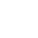

# Overview

<!-- [[toc]] -->

<!-- 
::: tip
This is a tip
:::

::: warning
This is a warning
:::

::: danger Error
This is a dangerous warning
:::

::: details
This is a details block, which does not work in IE / Edge
:::
-->

::: tip New to Nomad?
Read the [Getting Started](gettingstarted.md) guide.
:::

# Table of contents

| Menu                           | Icon                         | Description                                        |
| :----------------------------: | :--------------------------: | :------------------------------------------------: |
| [Files](files.md)              |         | Manage your projects, export, import, etc          |
| [Scene](scene.md)              |        | Add new primitive and manage your scene objects    |
| [Topology](topology.md)        |     | Edit the topology of the model                     |
| [Material](material.md)        |     | Material (object-level)                            |
| [Lighting](lighting.md)        |          | How to light your scene                            |
| [Post Process](postprocess.md) |  | Post Processing (screen-space visual effects)      |
| [Background](background.md)    |        | Change the background and add a reference image    |
| [Camera](camera.md)            |       | Camera control and interaction                     |
| [Stroke](stroke.md)            |       | Edit the current tool settings, stroke, falloff... |
| [Pressure](pressure.md)        |     | Manage the pressure of your pencil                 |
| [Painting](painting.md)	     |        | Painting settings for painting tools               |
| [Symmetry](symmetry.md)        |     | Manage the mirror plane of your current mesh       |
| [Layers](layers.md)            |        | Manage your current object layers                  |
| [Settings](settings.md)        |          | Customize the 3d viewport                          |
| [Interface](interface.md)      |    | Customize the interface                            |
| [Tools](tools.md)              |      | List of every tools/brushes                        |
| [History](history.md)          |      | Manage the undo/redo history stack                 |
| [FAQ](faq.md)                  |          | Frequently Asked Questions                         |
| [Tips](tips.md)                |       | Workflow tips                                      |

# Community resources

- [German manual (nomad-sculpting.de)](https://nomad-sculpting.de/nomad-sculpt/handbuch/)

## Videos

### Glen southern

<iframe width="560" height="315" src="https://www.youtube.com/embed/0Mj_yietOKI?si=-XhtDM-oZcMRAfnJ" title="YouTube video player" frameborder="0" allow="accelerometer; autoplay; clipboard-write; encrypted-media; gyroscope; picture-in-picture; web-share" allowfullscreen></iframe>

### Dave Reed

<iframe width="560" height="315" src="https://www.youtube.com/embed/Jm18bkWsAW0?si=Hnt3tdsRf_doFdZq" title="YouTube video player" frameborder="0" allow="accelerometer; autoplay; clipboard-write; encrypted-media; gyroscope; picture-in-picture; web-share" allowfullscreen></iframe>

###  Small Robot Studio

<iframe width="560" height="315" src="https://www.youtube.com/embed/vw3qpp81rF0?si=xs0Thy6kEGvHVi3q" title="YouTube video player" frameborder="0" allow="accelerometer; autoplay; clipboard-write; encrypted-media; gyroscope; picture-in-picture; web-share" allowfullscreen></iframe>

### ProcreateFX

<iframe width="560" height="315" src="https://www.youtube.com/embed/BPw16T6Ayck?si=q2WlYGp63OpukkuU" title="YouTube video player" frameborder="0" allow="accelerometer; autoplay; clipboard-write; encrypted-media; gyroscope; picture-in-picture; web-share" allowfullscreen></iframe>

### DM Art classes

<iframe width="560" height="315" src="https://www.youtube.com/embed/5VO0ZqyopGo?si=rtOLMvjwjCfPsdb4" title="YouTube video player" frameborder="0" allow="accelerometer; autoplay; clipboard-write; encrypted-media; gyroscope; picture-in-picture; web-share" allowfullscreen></iframe>

