# Interface Menu  

This menu controls many options to customise Nomad's interface. 

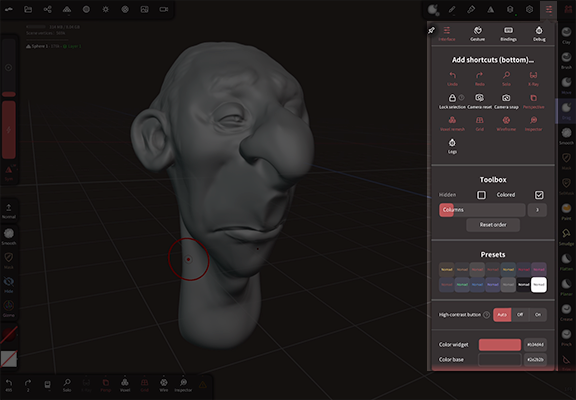

Nomad can be customized to quite a deep level, this menu is split across 4 sections; Interface, Gesture, Bindings, Debug.

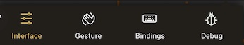

::: tip
This page is for the interface menu, not the interface itself! The overall interface is described in [Getting Started](gettingstarted.md).
:::

## Interface 

The interface menu controls shortcuts, and how menus appear in Nomad.

### Add shortcuts (bottom)
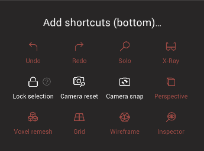

The bottom toolbar can have these shortcuts enabled:
* `Undo` - undo the previous operation
* `Redo` - restore the previously undone operation
* `Solo` - Temporarily hide every other object, leaving only the selected one visible. Press again to restore all the objects.
* `X-ray` - Temporarily make all other objects semi-transparent, leaving only the selected one solid. Press again to restore the default materials.
* `Lock selection` - When enabled, you cannot change the selection by tapping on a mesh. This relies on there being more than one object in the scene!
* `Camera reset` - Move the camera to where it appears when Nomad is first started.
* `Camera snap` - Snap the view to the closest orthographic view (ie Front/Back/Left/Right/Top/Bottom)
* `Perspective` - Toggle the camera between a perspective and orthographic rendering mode. A long tap or a swipe up will allow you to change the camera field-of-view.
* `Voxel remesh` - Remesh the current object using the last used voxel resolution. A long tap or a swipe up will bring up a resolution slider and sharp edges toggle.
* `Grid` - Toggle the view grid. A long tap or a swipe up will enable you to change the color and opacity of the grid.
* `Wireframe` - Toggle a wireframe overlay. A long tap or swipe up will enable you to change the color and opacity of the wireframe.
* `Inspector` - allow you to view properties of your mesh like uv's baked textures, other properties, overlaid on the background of Nomad.

### Toolbox

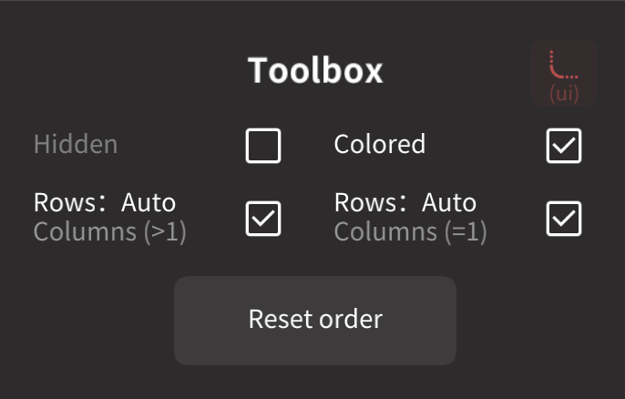

#### Hidden
Normally the toolbox icon in the top bar will toggle between a long single column, or a multi-column list of tools. This option will toggle between the multi column list, or being hidden.

#### Colored

Color code the icons by category, eg all mask tools are brown, split tools are red, flatten tools green etc.

#### Columns
Tapping on the toolbox icon will toggle between a single column, or the number of columns specified by this slider.

#### Reset order
Reset the default tools in the toolbox to the default order. Custom icons will remain in the toolbox at the end of the list.

### Presets

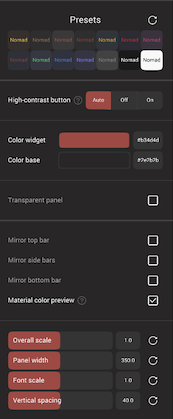

A collection of color presets for the interface.

#### High-contrast button
An alternative style for buttons that makes them more visible when they are enabled. If set on Auto, Nomad will use this mode when the UI color contrast between enabled/disabled is low.

#### Color widget/Color base
The primary colors used in the interface.

#### Transparent panel, Color panel, Blur strength
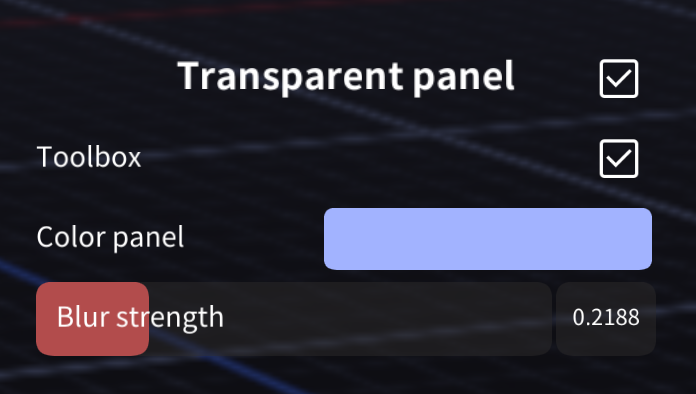
When `transparent panel` is enabled, extra options will appear to control how menus and panels look in nomad. Their color, transparency and blur amount can be adjusted.

::: tip
On small devices it can be useful to make the color panel nearly white, transparent, and low blur strength, so menu's won't obscure the scene.
:::

----

### Mirror top bar
Reverse the order of menus in the top bar.

### Mirror side bars
Swap the side bars so that the toolbox is on the left, tool options on the right.

### Mirror bottom bar
Move the bottom bar to the bottom right corner, and reverse the button order

### Material color preview
When you select a color for a material, a preview of this material is displayed on the currently selected object.

----
### Overall scale
A size multiplier on all the UI elements.
### Panel width
The width of the menus and panels.
### Font scale
Scale the fonts.
### Vertical spacing
The spacing between elements in menus and panels.
## Edge offset
You should change these values only if you have issues interacting with the buttons on the screen edges. If these sliders are disabled, Nomad will use the safe area values returned by the device itself.

::: tip
When migrating Nomad to a new device (eg replacing an iPhone 12 with an iPhone 15), make sure to reset edge options to defaults!
:::

### Reset style
Reset all the UI elements to their default values.

## Gesture
The gesture menu controls how stylus and finger presses control Nomad.

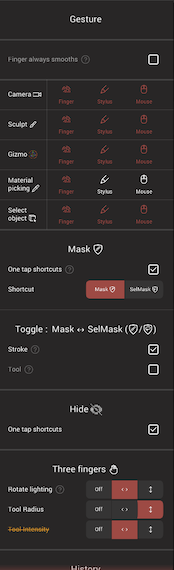

### Gesture options
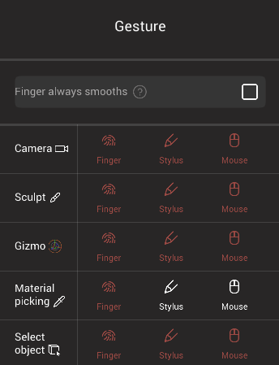

Nomad can limit operations based on the input device. For example a finger drag could only move the camera, while a stylus drag can only sculpt. If you have a mouse or trackpad, that can also be assigned to control specific operations.

Nomad currently lets you set these modes to be controlled on any combination of finger, stylus or mouse gesture:

* Camera
* Sculpt
* Gizmo
* Material picking (via a long press)
* Select object

Smooth can also be set to be assigned to only work with a finger drag.

### Mask

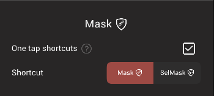

Allow the mask shortcut by tapping the screen once, without having to hold the mask button shortcut. It will allow the following gestures:
* tap on the background to invert the mask
* tap on a masked area to blur the mask
* tap on an unmasked area to sharpen the mask

### Toggle Mask <-> SelMask
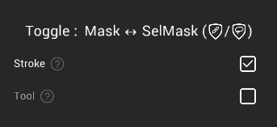
* `Stroke` - Long press will toggle between Mask and SelMask and start a new stroke. At the end of the stroke, the previous tool is reselected. 
* `Tool` - Long press and release without moving to switch between Mask and SelMask. 

### Hide
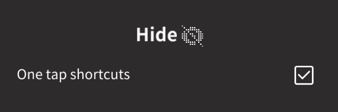

`One tap shortcuts` will enable the following shortcuts with the hide tool:
* Tap on a face group to hide it
* Tap in empty space to invert the hidden polygons

### Three fingers

If your device recognizes 3 finger gestures, they can be configured so that a 3 finger drag will rotate all the lights, or adjust the tool radius and intensity. The option matrix allows you to define vertical and horizontal drags as separate shortcuts. Note that if the same gesture is chosen for 2 options, one will be disabled.

* `Rotate lighting` - Rotate the environment, lights, and Matcap.
* `Tool Radius` - Edit the tool radius.
* `Tool Intensity` - Edit the tool intensity. 

### History
When `History shortcuts` is enabled, the following gestures are active:
* Undo - tap with 2 fingers
* Redo - tap with 3 fingers
* Undo/Redo - hold 2/3 fingers down (continuous)

### Accessibility 

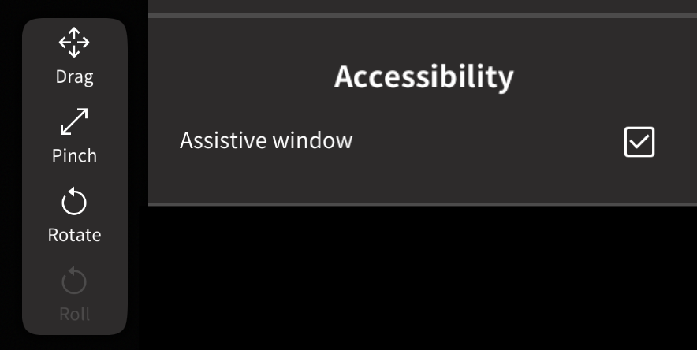

`Assistive window` will bring up a floating toolbar to control drag, pinch, roll and camera operations.

### Camera
A shortcut to go to the `Camera` menu (camera options used to be here in Interface, but were moved to the camera menu)

### Pencil buttons

If your stylus has buttons, you can set their function by enabling `Pencil button 1` and `Pencil button 2`. Options are
* None
* Smooth
* Mask
* Gizmo
* Add/Sub

## Bindings
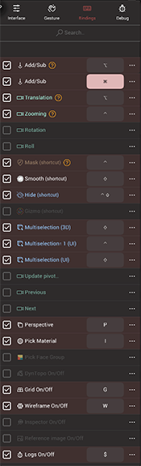
Nearly all functions in Nomad can be bound to keyboard shortcuts (if your device has a keyboard). To create a binding, click the rectangle next to the function, and press the key. 

Individual bindings can be disabled via the checkbox next to the binding name, and the search function at the top of this menu can be used to find functions.

### Advanced

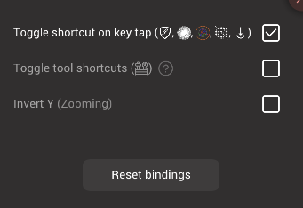

At the bottom of the bindings menu is a gear menu for advanced options:

* `Toggle shortcut on key tap` - A tap of the standard shortcuts for mask, smooth, gizmo, hide, sub will toggle to that mode, but holding the key down will switch tot hat mode, then when the key is released, the mode will revert to the previous mode. Sometimes called 'sticky keys' in other 3d apps.
* `Toggle tool shortcuts` - When using one of the tool shortcuts, if the same shortcut is pressed twice, it will toggle to the previous tool. In this way you can keep swapping between two tools with the same hotkey.
* `Invert Y (Zooming)` - Will invert the zoom
* `Reset bindings` - reset all the bindings to their defaults.
## Keyboard shortcuts

Keyboard is supported on iOS, you can hold ⌘ to display a list of shortcuts.

For Android, support is a bit experimental.

## Debug
Some experimental and debug options are stored in this menu. Many of these options should be left at their defaults, and only altered after contacting Nomad support.

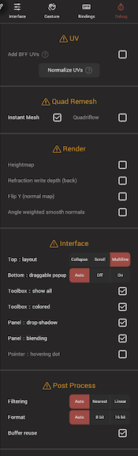
### UV
* `Add BFF UVs` - Add an alternative unwrapping method (boundary first flattening). Note that BFF will produce overlaps if your mesh topology is different than a disk or sphere.
* `Normalize Uvs` - Nomad will normalize the UVs inside the [0-1] tile.

### Quad Remesh
* `Instant Mesh` - Enable the instant remesh algorithm
* `Quadriflow` - An alternative quad remesh method, but it might crash!

### Render
* `Heightmap` - Change the viewport to render the depth of the scene. This can be used to create alpha maps to use for brushes.
* `Refraction write depth (back)` - The backface of refraction meshes will be written into the depth buffer.
* `Flip Y (normal map)` - Invert the y channel when baking normal maps, required for certain game and render engines.
* `Angle weighted smooth normals` - An adjustment to how smooth shading works that can avoid creases in certain cases.

### Interface
* `Top: layout` Collapse: On small devices the top bar will collapse into more sub menus. Scroll: If you're used to Nomad on large displays and prefer the normal layout, enabling this will use the standard wide top bar, and it can be scrolled. Multiline: Display the entire top menu over several lines.
* `Bottom: draggable popup` - The bottom toolbar has several buttons that pop up a dialog. If this options is enabled, those dialogs can be moved elsewhere on screen.  

* `Toolbox: show all` - Nomad will hide tools that aren't relevant for the current selection, eg all sculpt brushes are hidden on primitives that aren't validated. This option will dim disabled tools rather than hide them.
* `Toolbox: colored` - Colour code the toolbox icons based on their type.
* `Panel: Drop shadows` - Draw drop shadows around menus and panels. On some older devices this can impact performance.
* `Panel: Blending` - Debug option
* `Pointer: hovering dot` - For devices that support stylus hover, display a dot when the stylus is hovering over menus and panels.

### Gif turntable
Nomad can export an animated gif turntable. Note that due to limitations of the gif format quality is low. Screen recording is usually a better method.

* `Duration` - how long in seconds the turntable will be
* `Rotation center` - where the camera pivot is, therefore what part of the scene the camera will rotate around
* `Transparent background` - Use the transparent option for gifs. Note that gif's only support 1bit transparency, so edges can be badly aliased.
* `Max frame sampling` - Many of Nomads high quality rendering effects come from combining several frames together. This slider sets how many frames to combine.
* `Gif export` - start the gif export process.

### Post Process
* `Filtering` - Debug option
* `Format` - Debug option
* `Buffer reuse` - Debug option

### Performance
* `Partial Drawing` - Experimental feature! Use if you are sculpting a relatively small part of a high poly mesh. It should make the sculpting smoother, but you should not enable wireframe! Also it might add visual artifacts during brush strokes.
* `Multicore sculpting` - Debug option

### Dev
* `Flip quad split (on tap)` -  Debug option
* `App review popup` - Debug option
* `Join: merge radius` - Vertices will be automatically welded if they are close enough when meshes are joined. You can adjust the radius with this slider.

