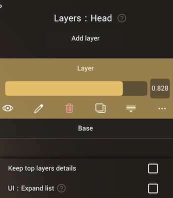
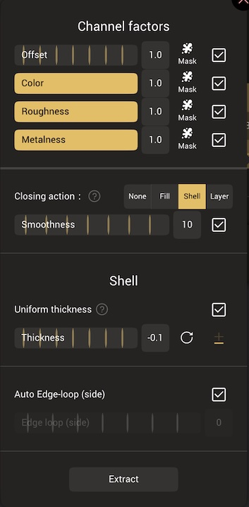

# Layers

 

## Overview

Nomad layers serve multiple purposes.

When used with paint information (Color, Roughness, Metalness) layers work similar to 2d paint applications. A layer can be created and paint applied to a model. The layer can be toggled on or off, have its opacity adjusted, the layer can be duplicated, its order can be changed in the layer stack.

Nomad also users layers for sculpting, which can function like layers for detail, and they can also store large changes to a model, allowing layers to function like blendshapes in 3d applications. For example you could sculpt different facial expressions on different layers, and blend them together.

In this case the changes stored in a layer are purely additive, so layering in the stack doesn't matter like it does for paint.

Layers can be partially erased via the [Delete Layer](#delete-layer) tool, and layers can also be used to create masks based on the different information stored in the layer.

::: tip
Unlike many sculpting softwares, changing the topology of a mesh will not discard the layers. You can use the [Voxel Remesher](topology.md#voxel-remesher), the [Multiresolution](topology.md#multiresolution) or the [Trim](tools.md#trim)/[Split](tools.md#split) tools, but note that when using [Voxel Remesher](topology.md#voxel-remesher), the quality of the layer will be impacted.
:::

----

Press `Add layer` to create a new layer.

Each layer has a name, a slider to control it's strength/factor, and option buttons.

## Options

| Action       | Icon                             | Description  |
| :---:        | :---:                            | :---:        |
| Visible      |    | Show/hide the layer influence |
| Edit Name    |      | Edit the layer name |
| Delete       |       | Delete the layer |
| Duplicate    |       | Duplicate the layer |
| Merge Down   |  | Merge the layer with the lower layer (or base mesh) |
| More         |        | [More...](#more) options |

To move a layer to another part of the layer stack, press and hold on its name, then drag.

## More...

The 'More...' button will show extra options for the current layer:

 

### Channel factors

These controls let you change how much of the sculpt/color/roughness/metalness are shown. These values are multiplied against the layer factor slider, so for example if the layer strength is 1, but the color channel factor is 0.5, then the color displayed will be at 0.5 strength.

`Offset` is a slider for the layer sculpt strength. While color/roughness/metalness are clamped between 0 and 1, offset can be any value, both positive and negative. 

This can be used to turn a layer of bumps into a layer of cavities, or a smile into a frown:

A symmetrical layer can be cloned and then split into left/right shapes with del layer:

Layers with negative offset factors can be baked down to empty layers to make new positive shapes.

Layers with positive offset factors above 1 can be used to experiment with more extreme blendshapes.

::: warning
At the moment layers only share a single opacity channel for all 3 channels (color/metalness/roughness).
If you merge multiple layers with per-channel intensity that aren't at full intensity, it's possible that the final result will look different.

Maybe in the future, each channel will have its own alpha channel to remove this limitation.
:::

### Mask
The mask button next to each slider will create a mask from that channel. Similar to using layers to make selections in painting applications, this allows you to reuse work you have done in a layer for other operations.

### Extract

The `Extract` button will duplicate the contents of the layer into a new object. The options under 'Closing action' determine how the duplication is done.

* None - Simply extract the part, do not try to generate sides or fill any holes.
* Fill - Hole is filled and smoothed with triangles. Do not use this option for flat surfaces.
* Shell - Close the extracted shape with the thickness value and direction options.
* Layer - Extract the layer difference.

Smoothness - If the edges of the region to be extracted are jagged, this slider will attempt to blur the edge into a smoother shape. 

### Shell
This section is visible when the closing action is 'Shell'. 

Thickness - The depth of the shell extrusion. 

The plus/minus next to this value will set the direction of the extrusion:
* Minus ( - ) will start from the current surface and extrude down. 
* Plus ( + ) will start from the current surface and extrude up.
* PlusMinus ( ± ) will push the top and bottom of the extrusion away by equal amounts, so it will be halfway embedded in the original surface.

Auto Edge-loop (side) and Edge loop (side) control the sides of the shell extrusion. Auto will calculate the number of edge loops along the shell sides to create square polygons. If disabled, the Edge loop slider will set the number of divisions on the sides.

