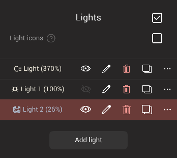
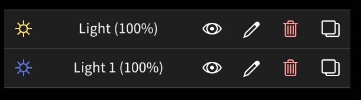
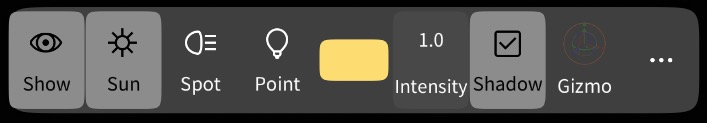
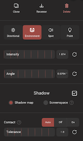
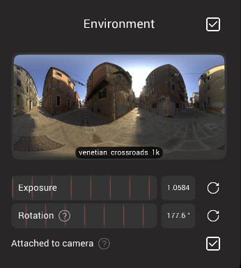
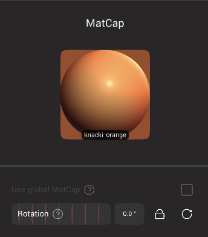

# Lighting 

---

You can choose between several rendering modes:

| Mode              | Meaning                    | Description                         |
| :---:             | :---:                      | :---:                               |
| [Lit(PBR)](#pbr)       | Physically Based Rendering | Painting with metalness/roughness   |
| [Matcap](#matcap) | Material Capture           | Using during sculpting with lower gpu/cpu use than PBR |
| [Unlit](#unlit) | Surface Color           | Surface color only with no shading or lighting |
| [Id](#id) | Object ID          | A random color per object, useful for painting applications |

If you want to learn more about metalness and roughness, see the [Vertex Paint](painting.md) section.

---

### Use textures

Nomad allows for textures to be assigned to objects from the materials menu. If textures are assigned they be toggled globally with this checkbox.

### Show painting

Nomad can store color, roughness, metalness in the verticies of your sculpt. You can toggle the display of these properties globally with this checkbox.

Note that if you have both vertex properties and textures, and both are enabled, the values will be multiplied together.

### Face Group
Overlay facegroup colours. Facegroups are coloured selections of polygons that can be created with the [Face group](tools#facegroup) tool, and are made automatically with some of the primitives.

Some tools will automatically filter by facegroups when facegroups are visible.

### Show mask

Toggle the grayscale mask overlay of the [mask tools](tools#mask). When this is disabled, the mask is also disabled, useful for making quick changes without the mask, then you can enable it again and not lose your mask.

## Lights

### PBR and lights
This manual won't dive into the details about Physically Based Rendering.

One important thing to keep in mind is that lighting and material are fully separated.
It means you can paint your object color, roughness and metalness while the lighting is handled independently.
It allows you to paint your object and then tweak the lighting later, without breaking the overall look of your model.

Lights are only available with [PBR mode](#pbr).
For performance reasons, you are limited to only 4 lights.

::: tip
You can load a glTF file with more than 4 lights in it and Nomad will keep all of them.
However it won't necessarily perform well.
:::

### Light types

Here are the type of lights currently supported:

| Mode                        | Description                      | Can cast shadows |
| :---:                       | :---:                            | :---: |
| [Directional](#directional) | Infinitely far away sun light    | yes   |
| [Environment](#environment) | A distant light that is matched to the environment  HDR | yes   |
| [Spot](#spot)               | Cone shaped lights				 | Yes   |
| [Point](#point)             | Omni-directional point of light  | No    |

### Directional
It emits light from infinitely far away, with a uniform intensity.
It's 3d position in the scene doesn't matter, only its orientation does.

You can attach this light to the camera, that way it has consistent lighting.  
For example you can use it to make a rim light (a strong light that emits from the back of your model, pointing towards the camera) that always lights the back of your model.

### Environment light
Using a [environment hdr](#environment) works well for overall soft lighting, but if there is a strong sharp light visible in the HDR, the shadow created by it will be very soft, often not visible at all. Using a directional light in combination with the environment HDR can help, but it can be difficult to get them aligned.

This light does the work for you. The light will automatically be rotated to align with the brightest part of the HDR, then you can control its intensity and angle (shadow softness) separately. 

### Spot
Spot light emits light in a single direction, restricted by a cone shape.

### Point
Point light will emit light in every direction.  
At the moment, point light doesn't support shadows.

### Shadows
The option `normal bias` can be used to reduce common shadow artifacts (acne/peter-panning).

The quality of the shadows depends on the size of the objects relative to the entire scene.  
If you have a big object in your scene that doesn't need to cast shadows (for example a big plane), make sure to disable shadow casting in its [material settings](material.md#cast-shadows).

### Lights

Toggle all the direct lights in the scene.

### Light icons

Toggle the display of light icons in the viewport

### Add light

Add a light to the scene, to a maxiumum of 4. When a light is added, the light lister is displayed with buttons, and a light toolbar is added to the top of the viewport.

 

* The light icon will bring up a full light editor. Most of this functionality is available from the toolbar that appears in the viewport. 
* The text shows the name of the light and the brightness.
* The eye icon toggles visibility.
* The pencil icon allows you to rename the light.
* The trash icon will delete a light
* The copy icon will duplicate a light. 

### Light toolbar
 

This toolbar will appear at the top of the viewport when a light is selected.

* Show will toggle the light visibility.
* Sun/spot/point will change the light type.
* The color swatch when clicked will bring up a color selector. Nomad offers several ways to choose color, for lights the kelvin control offers a natural way to select warm/cool lighting.
* Intensity controls light strength, value can go above 1.0 for very intense lights, useful when used with Global Illumination in Post Process
* Shadow will toggle shadows
* Gizmo will toggle the transform gizmo
* ... will bring up extra controls.

### Light extra controls

 

* Clone will duplicate the light.
* Recenter will move the light back to the origin.
* Delete will delete the light.
* Directional/Environment/Spot/Point allow you to change the light type.
* Intensity is the same control for light strength.
* Angle is the apparent size of distant and spot lights. High angles will make bigger highlights and softer shadows.
* Shadow will toggle shadows for the current light
* Shadow map and screenspace are different ways to calculate shadows, generally shadow map is more reliable.
* Contact adjust how shadow are calculated. Shadows are a difficult problem in computer graphics, and can cause artifacts in rendering. More accurate shadows can be selected for the most important light in a scene, this control determines if the most important light is selected automatically by nomad, or if the user selects.
* Tolerance if shadow artifacts are visible (either shadows don't appear to contact surfaces, or there's noise and patterns within shadows), adjusting tolerance can help fix those issues.

## Environment

Light in the real world comes from all directions; the blue of the sky, the green of the grass, the red of a building all this light from the 'environment' can be simulated with an environment map. This is usually created with a panoramc photo at various exposures, and can used to create soft lighting effects on rough surfaces, but also simulated reflections and refractions on shiny surfaces.

Nomad comes with several example environment maps for indoor and outdoor areas, with differnt tints and brightness levels, try different maps to see which brings out the most detail in your sculpts.

Tap on the image to see the available environment maps. From that dialog choose 'Import...' to load your own. It's best to use High Dynamic Range (HDR) images, in the latlong or equirectangular format, as either .hdr or .exr files. [www.polyhaven.com](https://polyhaven.com/hdris) has a good collection of free environment maps to use, generally the 1k hdr maps are a good size and good quality.

### Exposure
Adjust the brightness of the environment map. Often the maps can be too bright when used with regular lights, turning the exposure down can help balance, especially when used with Global Illumination in the Post Process settings.

### Rotation

Becaue environment maps are usually 360 images, you can rotate them relative to your sculpt to get the reflections and overall lighting to combine well with your sculpt.

### Attached to camera
Attach the environment to the camera.

It will force the lighting to be consistent, whcih can be useful during sculpting.

## Matcap

As the name suggests (MATerial CAPture), a matcap takes care of both the lighting and material information in a single image.
Since the material itself is already present in the matcap, roughness and metalness painting channel will be ignored.
The painting color will be multiplied against the matcap, meaning if you have a black/gray matcap, using white paint won't make it brighter.

Artists tend to favor this mode for sculpting purposes since they allow them to focus on the shape and geometry itself.

Tapping on the sphere will bring up an image browser. You can also add your own matcap, generally any photo, render, even a painting of a sphere that has been cropped tightly into a square can be used. Many matcap libraries are available online, a useful resource is the [nidorx matcap library](https://github.com/nidorx/matcaps).

### Use global Matcap

Usually artists will use a single matcap for the entire sculpt, but if this togle is disabled, each object can have its own matcap. This can be used artistically to get striking results.

### Rotation
A matcap is a specialised form of an environment map, so like an environment map, it can be rotated. You can also do this at any time in the viewport by dragging with 3 fingers left and right.

## Unlit

This mode will only show the surface color. It can be useful for checking the surface color of your objects are what you expect, without being distracted by lights, shadows, reflecton, transparency. 

This mode can also be used for non-photoreal renders, achieving a flat, cartoony look.

## Id

All lighting and surface information is ignored, and each object is shaded with a unique flat color. If this is rendered alongside a PBR render, this can be used in a painting program to select by color, and thus be able to do color corrections on specific objects.

### Randomise id

Generate a new set of random colors. 