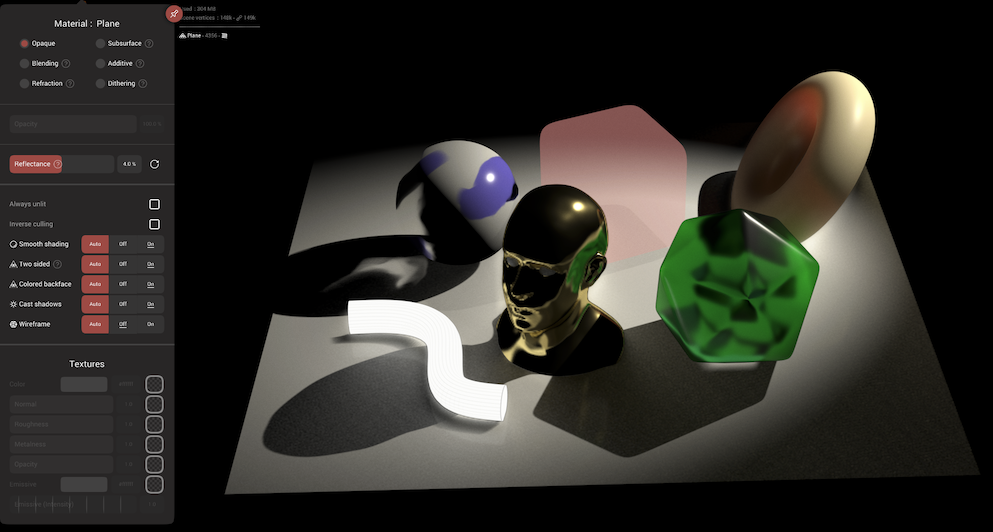
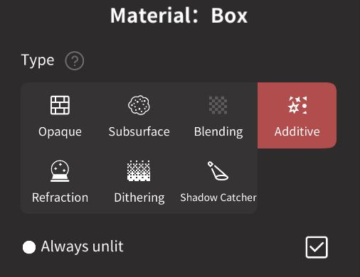
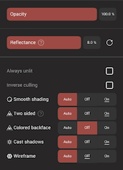
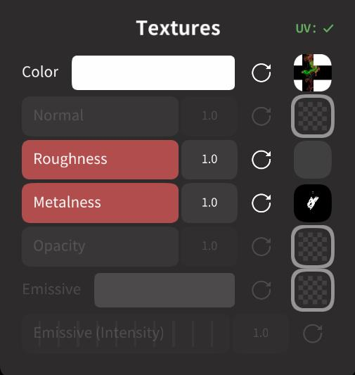
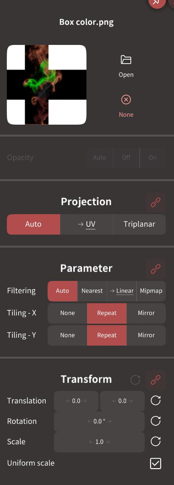

# Material 

This menu allows you to change the material of the current object, various render properties of the object/material, and assign textures to the material.

Materials define the how an object looks, by controlling how it reacts to light and to other objects.

The look of an object is controlled by these properties:

* `Material type`
* `Color`
* `Roughness`
* `Metalness`
* `Opacity`
* `Reflectance`
* `Emissive/unlit`

Combinations of these properties can achieve a wide variety of results, from a variety of photorealistic materials, to cartoony and experimental.

Color, roughness, metalness and opacity can be painted, see [Vertex Paint options](painting.md) for more information.

Material type, reflectance, emssive/unlit are material properties explained below.

Note that currently each object has its own material, two objects cannot share the same material.

Also note that Nomad's renderer is a realtime renderer; while it can get great results quickly, the nature of realtime means visual artifacts can appear in some cases.

## Material types

Nomad material types are Opaque, Blending, Refraction, Subsurface, Additive, Dithering.

### Opaque
The default mode that treats surfaces as a simple material that supports painted color, roughness, metalness, opacity.

### Blending

Similar to Opaque, but supports the opacity slider to allow the material to mix between solid and transparent. This is a simple single slider for opacity, vs the paintable opacity supported by the opaque material. 

::: warning
Blending mode can cause flickering and popping in complex or intersecting shapes.
:::

### Refraction
This mode can be used to simulate glass material. Because of real time constraints, self-refraction and multi-layered refraction is somewhat limited.

The roughness painting of the model impacts how blurry the refraction is.
By default, every object created in Nomad has a roughness slightly around 25%, thus the refraction won't be perfect but a bit blurry.
You can use the `paint glossy` button to repaint your model with a roughness and metalness of 0 (the colors won't be affected).

There are 2 different roughness at play, the one driving how blurry the reflection is on the surface, and the other one driving the interior (refraction).  
However, since there is only one painting roughness channel in Nomad, both interior and exterior roughness will share the same value.  
In order to have different values (for example a lollipop with sharp surface but blurry interior) you use the sliders `Surface glossiness` and `Interior roughness` to override the painted roughness.

### Subsurface
This mode can simulate material that allows light to bleed through it, like skin, wax, jade.

To get the best result, switch to PBR shading mode and use at least one directional light, ideally with a dim environment.

`Depth` controls how far light scatters from the front, to under the surface, then out the front surface again. This has the effect of softening hard shadows, and blurring surface detail.

`Translucency` controls how light scatters from the front to the back of a shape, like like scattering through the underside of a leaf, or when ears are strongly backlit. 

### Additive
You can make your mesh semi-transparent with this material. It is similar to the blending material, but while blending will mix with its surroundings, additive will always be brighter than objects behind it, good for bright effects like light rays, fire, explosions.

You can set an opacity value higher than 1, which means the object will be brighter.  
It can be useful if you want to use [bloom](postprocess.md#bloom) and the `threshold parameter` to only make this object glow like an emissive object.

This mode tends to have less artifacts than [Blending](#blending) (order independent transparency).

### Dithering
Make the object semi-transparent by discarding some pixels in a random fashion.

## Controls

### Opacity
How solid or opaque an object will appear; 100% is solid, 0% is transparent. You can also paint opacity for finer control.

### Reflectance
Controls the amount of reflection the material will receive for non-metallic materials. Most of the time the default value should be used (which corresponds to the standard 4% reflected light at normal angle), but can be increased to boost reflections and highlights in a characters eyes, for example.

### Always unlit
If enabled, the object will ignore PBR and Matcap and simply display its color painting without shading.
Note that if you use [Additive](#additive), you can paint transparency directly by using black color.

### Inverse culling
Reverse the normals of a surface. Usually not required, but can be used if a model appears inside out, or in combination with `Two sided` disabled, can be used to make interiors where the wall nearest the camera is always hidden.

### Smooth Shading
See the [global option](settings.md#smooth-shading).  
`Auto` value will use the global option.

### Two sided
See the [global option](settings.md#two-sided).  
`Auto` value will use the global option.

### Coloured backface
See the [global option](settings#two-sided).
`Auto` value will use the global option.

### Casts shadows
For now `Auto` is the same as `On`.
Transparent objects also cast shadows (in a dithering pattern to emulate blended shadows).  
Make sure to disable shadow casting if you have a big object in your scene that doesn't need to cast shadows (for example a big floor).

### Wireframe
See the [global option](settings.md#wireframe).  
`Auto` value will use the global option.

## Textures

If an object has UVs, then textures can be applied to the material in addition to the vertex color/roughness/metalness/opacity. Usually these are the result of a texture bake, but images created outside of Nomad can also be used.

Textures can be applied to

* Color
* Normal
* Roughness
* Metalness
* Opacity
* Emissive

Clicking on a texture slot will bring up a selector. After a texture has been assigned to a material slot, clicking again will bring up a texture panel:

### Texture panel options

### Open
Select another texture

### None
Remove the texture

### Filtering
The texture filter method to use, `Auto` is the default, methods are `Nearest`, `Linear`, `Mipmap`. Nearest does no filtering, so textures can get jagged artifacts when viewed up close. Linear and Mipmap do better filtering, so textures appear blurred rather than jagged up close.

### Tiling-X
If the Scale parameter is greater than 1, making the texture smaller than the object UVs, how will the texture be tiled along the X axis. `None` means no repeats. `Repeat` will do copies of the texture. `Mirror` will do copies of the texture, with every second copy reversed, which can help hide tiling artifacts.

### Tiling-Y
Same as Tiling-X, but for the Y axis.

### Transform
Extra 2d transformations applied to the texture in UV space. The reset button resets to defaults, the chain icon (when textures other than color are selected) will link or unlink the transform to be the same as the color texture.

#### Translation
The X and Y offset of the texture

#### Rotation
The rotation of the texture

#### Scale
The scale of the texture, bigger numbers will make the texture smaller on the object, use the Tiling-X and Tiling-Y sliders to control what happens.

### Uniform scale
When turned off Nomad will show separate controls for Scale-X and Scale-Y.

::: tip

Further information about transparency and blending modes can be found at https://support.fab.com/s/article/Transparency-Opacity

:::