#  Painting  

Control the color, roughness, metalness of paint strokes, allow for flood filling of paint attributes, and how paint tools interact with layers, masks, hidden selections.

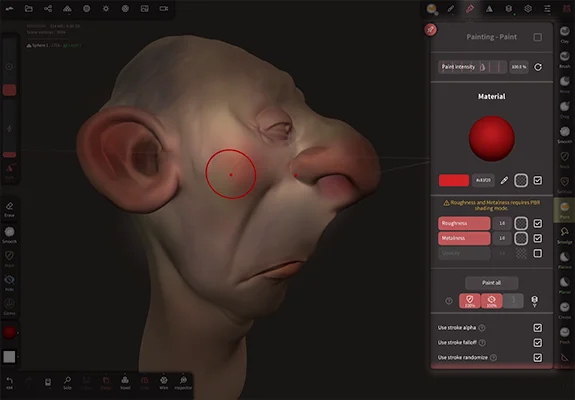  

## Overview

Nomad uses PBR vertex painting. What does this mean?

### PBR
PBR, or Physically Based Rendering is a popular computer graphics technique for film, television, games and mobile. By basing lights on physical properties, and defining surfaces through color, roughness, metalness, a wide variety of photoreal looks can be achieved.

### Vertex painting

Vertex painting means that the paint information is stored in the vertices of the model, rather than in textures. Because Nomad can handle models with hundreds of thousands, often millions of vertices, your models should be able to have highly detailed surface paint; if you can sculpt the detail, you can also paint that detail.

This also means that painting in Nomad doesn't require UV mapping, often a slow and technical process in other 3d applications. Many other 3d applications don't support the high vertex counts that Nomad can, however Nomad also has good texture baking and decimation tools to help.

### Texturing

Nomad supports textures, but they have to be present in an imported model, or via baking vertex painting to textures. 

A texture is simply an image, but in the 3d context it usually refers to an image assigned to an object.
In order to wrap an image around a model, the model needs texture coordinates (UV).

Nomad can compute [them automatically](topology.md#uv-unwrap) but you don't have much control on the overall quality.

::: tip
One example of workflow:
- Sculpt on Nomad, then [UV unwrap](topology.md#uv-unwrap)
- If you already started to paint in Nomad you can [transfer the vertex painting to textures](topology.md#bake-vertex-colors-to-texture)
- Export to Procreate
- Texture in Procreate
- Export back to Nomad for rendering purpose
:::

That's the overview, now lets explore the sections of the painting menu:

## Stroke painting
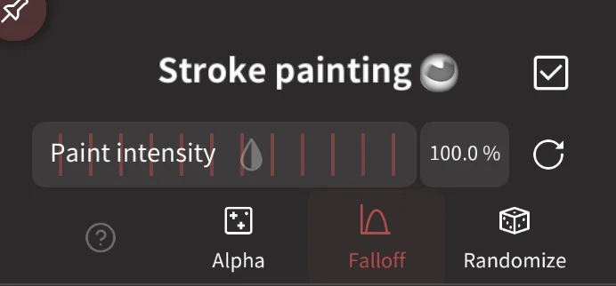  

Enable painting for this tool, useful if you need to sculpt and paint at the same time.

For tools where painting is the primary function (eg Paint, Smudge, Mask), this checkbox doesn't exist.

### Paint intensity

A slider to allow you to ise a different intensity to the primary tool intensity.

The `Alpha`, `Falloff` and `Randomize` checkboxes determine if those features will affect painting. Eg you could have randomize enabled for the clay tool, but color won't be randomized.

## Material
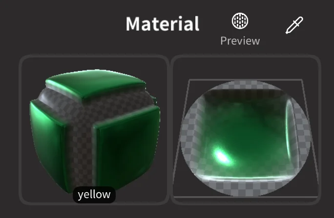 

The first icon is a material preview shape. Dragging on the 3d material preview will rotate it. 

The second icon is a preview of the paint stroke with the selected alpha and falloff options.

The preview button next to the Material title lets you swap between none, Material or Triplanar. This determines what will happen when you interactively change paint properties:

* `None` - No preview will be shown on the model when you adjust properties
* `Material` - The material values will be previewed on the obejct when you adjust properties. If you use textures and the model has uv's, the uv's will be used.
* `Triplanar` - The material will be previewed as a Triplanar projection. 

The eydropper can be used to sample all the properties from an object in your scene.

## Material Presets
Tapping the 3d preview shape will bring up a preset menu of materials, these can be cloned to define your own presets.

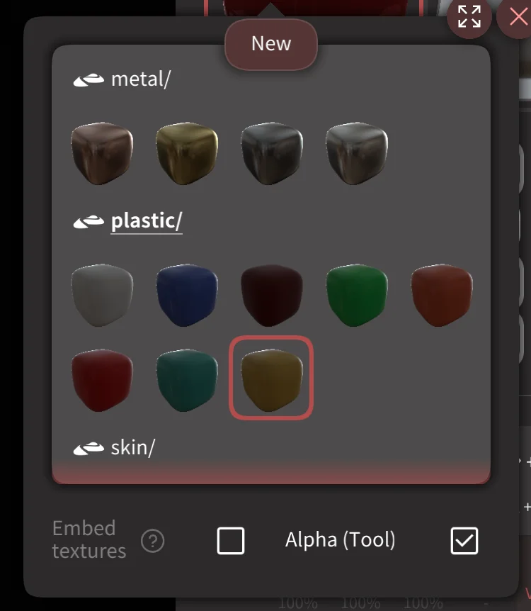 

The `Embed Textures` and `Alpha` toggles when enabled will store any textures used by this material within the preset. This is explained more below.

## PBR sliders
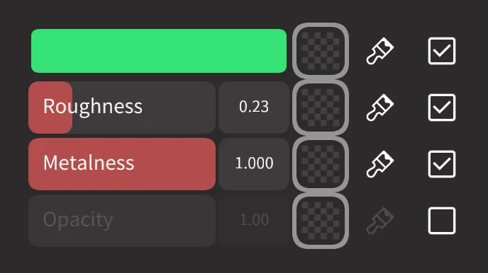 

[PBR](shading.md#pbr) painting uses 4 channels:
- `Color` The color that will be painted. The eyedropper can be used to select color from other parts of the model, or from reference images.
- `Roughness` It tells how "rough" or "smooth" a surface is. A low value for the roughness means that the reflections will be sharp.
- `Metalness` It simply tells if the surface is metallic or not. The value should be either 0% or 100% most of the time, in-between values should be exceptional.
- `Opacity` How much the material can be seen through. Strictly speaking it is not part of the PBR specification, but it is useful in many situations. 1 is fully opaque, 0 is transparent. Note that  opacity and refraction are different things, refraction in nomad is handled via the refraction material. 

If you select a material preset, 3 channels are painted simultaneously (opacity is often intentionally excluded). This means that instead of just painting 'red', you can be painting 'a red rough metal' or 'a white smooth plastic'.

The square is a texture slot, click it to to use a texture for that property instead of a solid value.

The brush icon next to the sliders will flood fill that property over your object.

The checkbox will enable or disable that particular property, so you could only paint colour, or only paint roughness and opacity, for example. 

Here are some examples of different roughness and metalness properties:

|                | Metalness 0%                      | Metalness 100%               |
| :------------: | :-------------------------------: | :--------------------------: |
| Roughness 0%   | 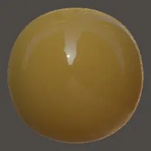   | 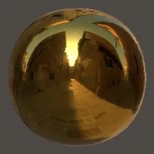   |
| Roughness 50%  | 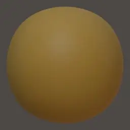  | 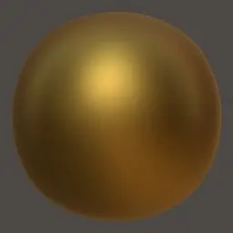  |
| Roughness 100% | 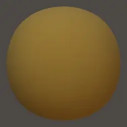 | 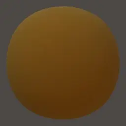 |

::: warning
Only color is supported in [Matcap rendering](shading.md#matcap) mode, metalness and roughness are ignored.
:::

::: tip
When using textures for pbr painting, it's often useful to swap to something like the `Stamp` tool, or use the stroke menu to use a mode other than dot, which can smear the texture.

  
:::

::: tip
You might consider turning on `Smooth Shading` [globally](settings.md#smooth-shading) or [per-object](material.md#smooth-shading) if you are painting a metallic surface on on object with a lower polycount.
:::

## Paint all

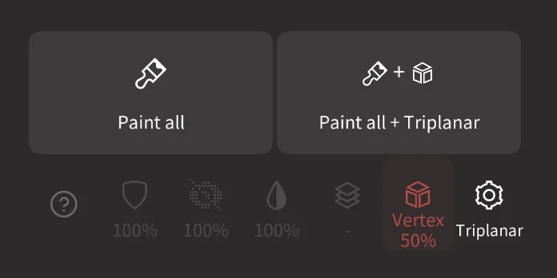

Apply the current material to the object, either in standard mode with 'Paint All', or as a Triplanar projection.

The checkboxes next to the color/metalness/roughness/opacity sliders are respected, any disabled properties will no be filled.

The extra buttons control how the paint all can be further affected:

| Icon                        | Description                                   |
| :-------------------------: | :-------------------------------------------: |
|  | Masked areas won't be affected.               |
|  | Hidden areas won't be affected.               |
|    | use the tool painting factor above.           |
|      | Unpainted areas of a layer won't be affected. |
|  | Indicator of triplanar settings               |
|        | Open the Triplanar settings                   |

### Triplanar settings
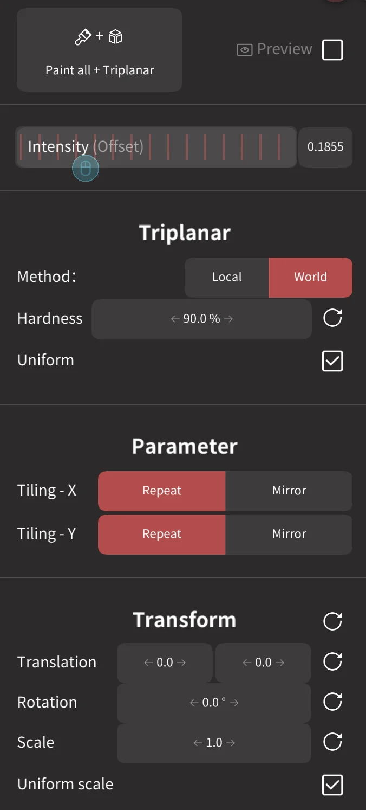

Similar to the [triplanar settings in the material menu](material.md#triplanar), you can control the blending of the projections, tiling and offsets. 

Use the preview checkbox at the top of this menu to enable a persistent preview while adjusting values.

## Global material
If this option is enabled, the selected material will be the same as the other tools. Note that it only takes into account roughness, metalness and color settings.