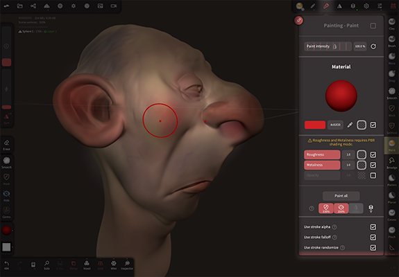
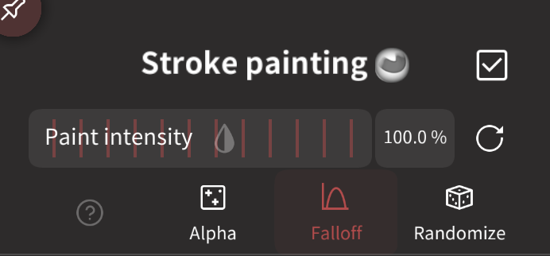
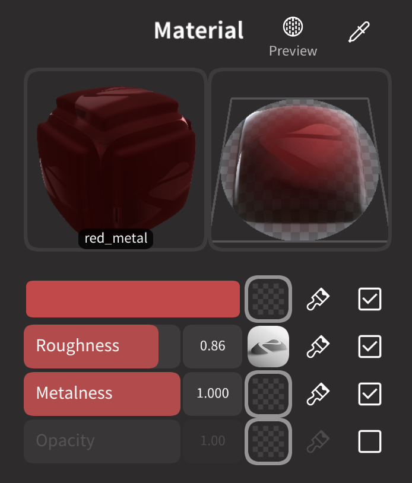
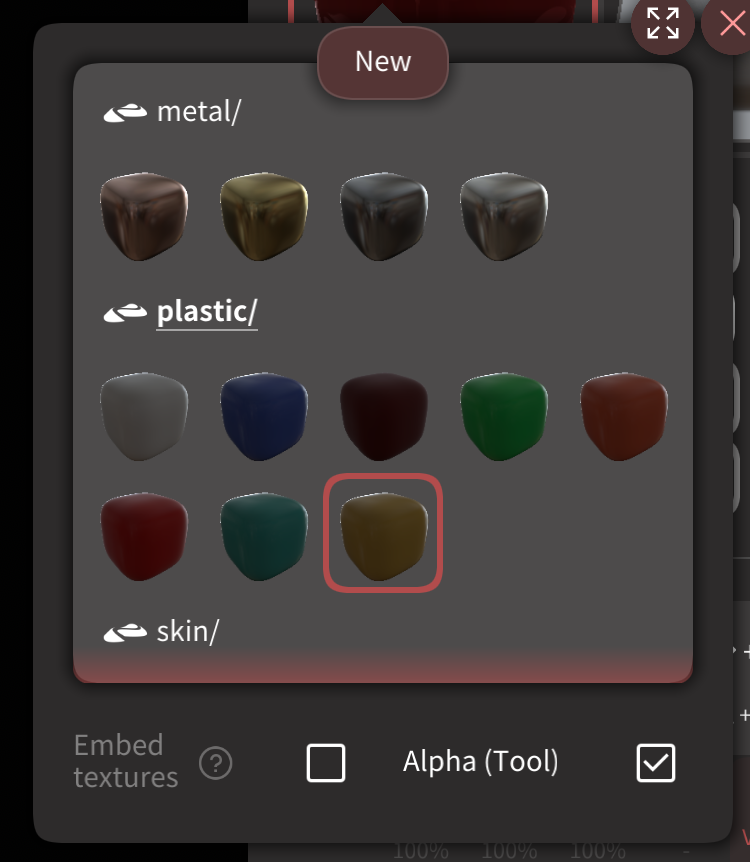
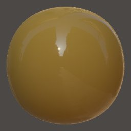
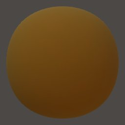
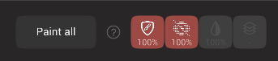
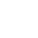

#  Painting  

Control the color, roughness, metalness of paint strokes, allow for flood filling of paint attributes, and how paint tools interact with layers, masks, hidden selections.

  

## Overview

Nomad uses PBR vertex painting. What does this mean?

### PBR
PBR, or Physically Based Rendering is a popular computer graphics technique for film, television, games and mobile. By basing lights on physical properties, and defining surfaces through color, roughness, metalness, a wide variety of photoreal looks can be achieved.

### Vertex painting

Vertex painting means that the paint information is stored in the vertices of the model, rather than in textures. Because Nomad can handle models with hundreds of thousands, often millions of vertices, your models should be able to have highly detailed surface paint; if you can sculpt the detail, you can also paint that detail. This also means that painting in Nomad doesn't require UV mapping, often a slow and technical process in other 3d applications. Many other 3d applications don't support the high vertex counts that Nomad can, however Nomad also has good texture baking and decimation tools to help.

### Texturing

Nomad supports textures, but they have to be present in an imported model, or via baking vertex painting to textures. 

A texture is simply an image, but in the 3d context it usually refers to an image assigned to an object.
In order to wrap an image around a model, the model needs texture coordinates (UV).

Nomad can compute [them automatically](topology.md#uv-unwrap) but you don't have much control on the overall quality.

::: tip
One example of workflow:
- Sculpt on Nomad, then [UV unwrap](topology.md#uv-unwrap)
- If you already started to paint in Nomad you can [transfer the vertex painting to textures](topology.md#bake-vertex-colors-to-texture)
- Export to Procreate
- Texture in Procreate
- Export back to Nomad for rendering purpose
:::

That's the overview, now lets explore the sections of the painting menu:

## Stroke painting
  

Enable painting for this tool, useful if you need to sculpt and paint at the same time.

For tools where painting is the primary function (eg Paint, Smudge, Mask), this checkbox doesn't exist.

## Paint intensity

A slider to allow you to ise a different intensity to the primary tool intensity.

The `Alpha`, `Falloff` and `Randomize` checkboxes determine if those features will affect painting. Eg you could have randomize enabled for the clay tool, but color won't be randomized.

## Material
 

The first icon is a material preview shape. Dragging on the 3d material preview will rotate it. 

The second icon is a preview of the paint stroke with the selected alpha and falloff options.

## Material Presets
Tapping the 3d preview shape will bring up a preset menu of materials, these can be cloned to define your own presets.

 

The `Embed Textures` and `Alpha` toggles when enabled will store any textures used by this material within the preset. This is explained more below.

## PBR sliders
[PBR](shading.md#pbr) painting uses 3 channels:
- `Color` The color that will be painted. The eyedropper can be used to select color from other parts of the model, or from reference images.
- `Roughness` It tells how "rough" or "smooth" a surface is. A low value for the roughness means that the reflections will be sharp.
- `Metalness` It simply tells if the surface is metallic or not. The value should be either 0% or 100% most of the time, in-between values should be exceptional.

By default when you paint, all 3 channels are painted simultaneously. This means that instead of just painting 'red', you can be painting 'a red rough metal' or 'a white smooth plastic'. If you need to, you can use the checkboxes to toggle the channels, so that you are only painting, color, or only painting roughness, for example. 

|                | Metalness 0%                      | Metalness 100%               |
| :------------: | :-------------------------------: | :--------------------------: |
| Roughness 0%   |    |    |
| Roughness 50%  |   |   |
| Roughness 100% |  |  |

::: warning
Metalness and roughness can't be supported if you are using [Matcap rendering](shading.md#matcap), so if you paint you will only see the colors.
:::

Each channel also supports loading a texture, so you can paint with a color image. When using this feature, it's often useful to swap to something like the `Stamp` tool, or use the stroke menu to use a mode other than dot, which can smear the texture.

  

::: tip
You might consider turning on `Smooth Shading` [globally](settings.md#smooth-shading) or [per-object](material.md#smooth-shading) if you are painting a metallic surface on on object with a lower polycount.
:::

### Paint all

Apply the current material to the object. If the checkboxes next to color/material/roughness/opacity are disabled, they will not be applied.

The buttons control how the paint all can be further affected:

| Icon                       | Description                                   |
| :------------------------: | :-------------------------------------------: |
|  | Masked areas won't be affected.               |
|  | Hidden areas won't be affected.               |
|    | use the tool painting factor above.           |
|      | Unpainted areas of a layer won't be affected. |

### Use stroke alpha
Use the tool alpha to modulate the painting intensity.

### Use stroke falloff
Use the tool falloff to modulate the painting intensity.

### Use stroke randomize
Use the tool randomization to modulate the painting intensity.

### Global material
If this option is enabled, the selected material will be the same as the other tools. Note that it only takes into account roughness, metalness and color settings.