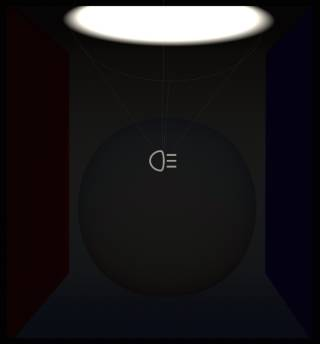
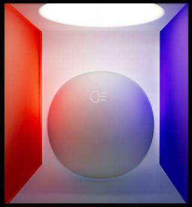
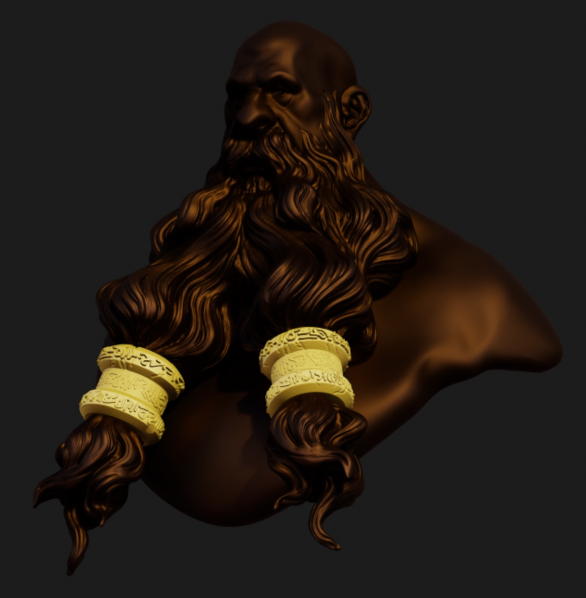
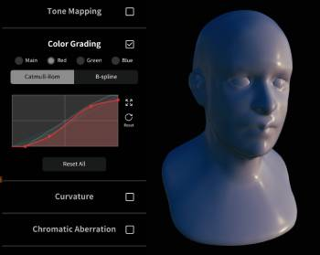
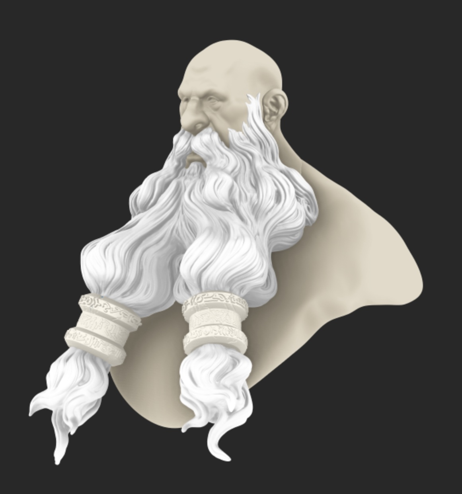
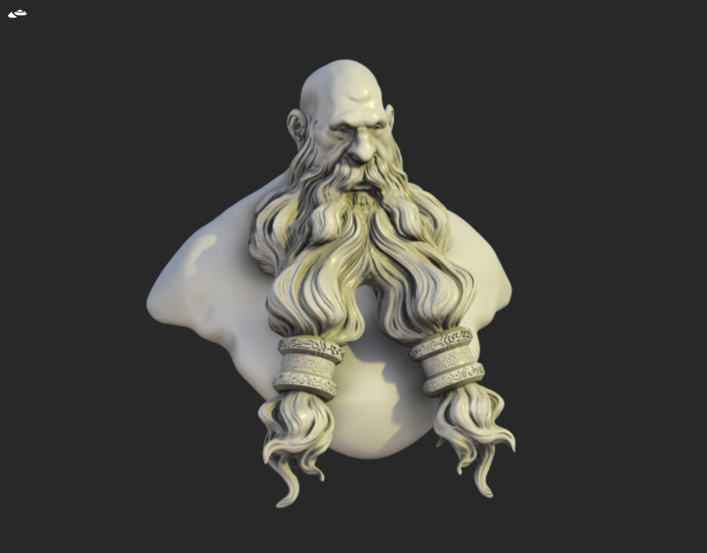
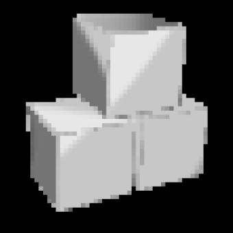
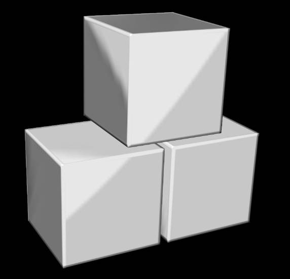
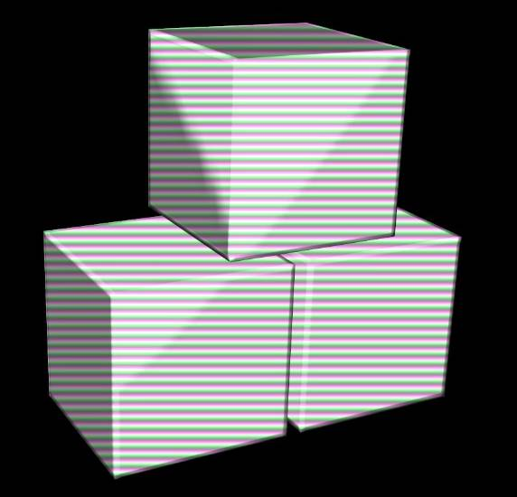

# Post process  

---

Using post processing can dramatically improve the final look of your scene.

Post process can impact the performance by a lot depending on your device.
There's a global checkbox to disable all the postprocess, so that you can quickly go back to sculpting/modeling without losing your presets.
For PBR rendering, [Ambient Occlusion](#ambient-occlusion-ssao), [Reflection](#reflection-ssr) and [Tone Mapping](#tone-mapping) should be enabled.

However, most of the time you want the post process to be disabled when you are sculpting, to focus on the shape itself of the rendering.

## Quality
### Max frame sampling
Nomad will calculate a certain amount of post processing for a single frame render, which can look noisy. This control determines how many frames will be rendered, then blended together, which can remove most noisy artifacts. Some effects require no extra samples (eg color grading), while others like global illumination can require hundreds of samples to be noise free. 

In the viewport this can be seen whenever nomad is left alone, the image quality will gradually refine up to the max samples, then stop. This number of calculations is also used in the render section of the File menu, when 'export png' is clicked.

### Resolution multiplier
This slider controls the resolution of the post processing. A value of x1.0 will mean the render's are done at the pixel resolution of the device. A value of x0.5 will render at half resolution, then scale up to the device resolution, which will be fast but low quality. A value greater than 1 will render at a bigger size, then scale down. This result in higher quality, less noise, but longer render times.

### Max samples

### Full resolution
When enabled will force the resolution multiplier to x1.0

## Preset browser
Clcking on the image will display a collection of post processing presets. To define your own presets, select one, click 'clone', make changes. To save, click the preset image, click again inside the preset browser, and choose 'save'.

## Reflection (SSR)
With this option, objects can reflect other objects in the scene, as long as the objects are visible on the screen.
If you have metallic and shiny objects in your scene, then this option should probably be used.
This effect is only effective with PBR mode.

| SSR off                    | SSR on |
| :---:                      |:---:                    |
|   |  |

## Global Illumination (SSGI)

Global illumination simulates how light bounces between surfaces, eg a red wall will cast red onto a nearby white object. This can hugely enhance the realism of a render along with ambient occlusion and reflections. 

### Tolerance
The accuracy of the global illumination. A high value will do more accurate lighting, but will require high max frame sample values to remove noise.

| SSGI off                    | SSGI on |
| :---:                      |:---:                    |
|   |  |

## Ambient Occlusion (SSAO)
Ambient occlusion will darken areas where the light has less chance of reaching (corners, etc).
The effect only depends on the model geometry.

| Mode           | Description            |
| :---:          | :---:                  |
| Strength       | Intensity of the effect         |
| Radius         | How widespread the effect is    |
| Curvature bias | How sensitive the effect is relative to the surface variation |

| SSAO off                   | SSAO on |
| :---:                      |:---:                      |
|  |  |

## Depth of Field (DOF)
Add a blur effect on the region that is outside the focus.

Simply tap on your model to change the focus point.

| DOF off                   | DOF focus on far ring     | DOF focus on close ring  |
| :---:                     |:---:                      |:---:                     |
|  | | |

## Bloom
Blooms will make the bright area of your scene glow.

| Bloom off                  | Bloom with radius 0       | Bloom with radius 1  |
| :---:                      |:---:                      |:---:                     |
| | | |

## Tone Mapping
`Tone Mapping` is an operation that will remap HDR values to the `[0, 1]` range.
If you don't use it (or select `none`), any color component higher than 1 will be clamped.
Any color variations above this range will then be lost.

You can adjust the overall image with `exposure`, `contrast` and `saturation`.

Notice that with `Tone Mapping` disabled, some details disappear because the pixels are too bright.

| Tone Mapping off           | Tone Mapping on   |
| :---:                      |:---:                    |
| | |

::: tip
Tone mapping can enhance the effect of global illumination. If you turn the instensity of the environment map down, the primary light source up, can increase the tone mapping `exposure` to see more of the bounce lighting effects.
:::

## Color Grading
Similar to the curves tool in Photoshop, this allows you to control the balance and distribution of color in the image. The `main` control affects the entire color balance, the `red`/`green`/`blue` controls allow for fine control. 

| Color Grading off           | Color Grading on   |
| :---:                      |:---:                    |
| | |

## Curvature
Sharpen the edges of the model.

| Curvature off              | Curvature on   |
| :---:                      |:---:                    |
|  | |

## Chromatic Aberration
Simulate the lens artifacts with light being decomposed around the screen edges.

| Chromatic off              | Chromatic on   |
| :---:                      |:---:                    |
|  | |

## Vignette
Simulate the lens artifacts by darkening the screen edges.

| Vignette off              | Vignette on   |
| :---:                      |:---:                    |
|  | |

## Grain
Add a grain effect, it can help make the image a bit less artificial.

| Grain off                  | Grain on   |
| :---:                      |:---:                    |
|  | |

## Sharpness
Sharpen the model edges.

| Sharpness off                  | Sharpness on   |
| :---:                      |:---:                    |
|  | |

## Pixel Art
Simulate retro game pixel art.

| Pixel off                  | Pixel on   |
| :---:                      |:---:                    |
|  | |

## Scanline
Simulate the look of old CRT monitors.

| Scanline off                  | Scanline on   |
| :---:                      |:---:                    |
|  | |

## Temporal Anti-Aliasing (TAA)
This effect is enabled by default, this is not an artistic effect but a quality one.

When the camera doesn't move, Nomad re-uses the previous frames to improve the quality of the overall image.
TAA tries to do the same thing when the camera is moving, by reprojecting the previous frames onto the new view point.
Most of the time it should be ok, but it can introduce some artifacts when the reprojection is a bit off (ghosting artifacts).

The effects that benefits the most from the accumulation are [Ambient Occlusion](#ambient-occlusion-ssao), [Reflection](#reflection-ssr) and [Ambient Occlusion](#ambient-occlusion-ssao), [Depth of Field](#dof) and [Bloom](#bloom).

## Dithering

Dither pixels to reduce banding artifacts. Usually this should be enabled, but can be turned off for specific operations (eg exporting depth maps or other data specific operations).