#  Scene 

This menu lets you manage objects, lights, cameras and repeaters in Nomad. It displays the scene hierarchy as a tree-view, allowing you to modify many aspects of your objects. It also lets you create new objects, as well as combine and split objects in various ways.

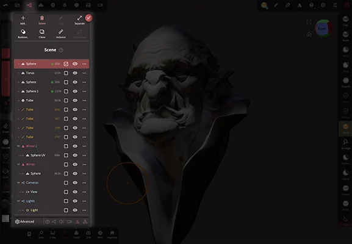

## Shortcut bar
| Action                 | Icon                              | Description                                                                                                         |
| :--------------------: | :-------------------------------: | :-----------------------------------------------------------------------------------------------------------------: |
| [Add...](#add-menu)    |             | Display the [Add Menu](#add-menu) to add an object to the scene                                                     |
| Delete                 |            | Delete the object                                                                                                   |
| Lock                   |             | Make the object unselectable in the viewport. It can still be selected from the tree view.                          |
| Join                   | 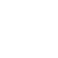           | Join the selected objects into a single object with no geometry changes                                             |
| Separate               |         | If an object is made up of unique polygon shells, break it into separate objects. The reverse of the join operation |
| [Boolean...](#boolean) |  | Display the [Boolean](#boolean) menu                                                                                |
| Clone                  |            | Duplicate the object into a new object                                                                              |
| Instance               |             | Duplicate the object as an instance, so modelling changes to one are made to all instances.                         |
| Un-instance            |           | Convert an instance to a unique shape, so modelling changes are no longer copied to other instances                 |
| Sync                   |             | If instances have children, ensure all instances share the same child hierarchy                                     |

## Tree view
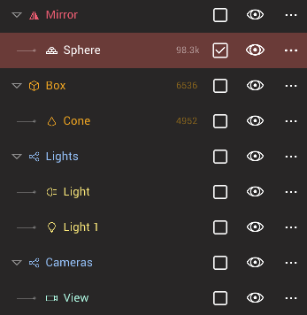 

| Action       | Icon                       | Description              |
| :----------: | :------------------------: | :----------------------: |
| Select       |   | Toggle select/unselected |
| Visible      |  | Toggle visibility        |
| Menu         |      | Display object menu      |

::: tip TIP: Quickly select or hide many objects

Tap the select icon to toggle a single object, or drag vertically on the select column to select many objects. The same can be done with the visible column.

:::

### Tree view manipulation

Long press on an item in the tree view until it turns yellow. You can then move it up or down in the tree view, as well as drag it over another item to make it a child of that item.

When many items are selected, most will be a dark yellow, one will be a lighter yellow. Long press and drag on the lighter item to move all the objects at once.

When you select a parent item, by default all the child items will also be selected. Tapping the parent icon will toggle between selecting just the parent, or the parent and children.

### Object menu

Clicking the ellipsis button (...) for an object in the tree view will show the object menu. 
Many of these options are similar to the shortcut bar at the top, repeated for convenience.

|       Action        |                        Icon                        | Description                                                                                                                                                             |
| :-----------------: | :------------------------------------------------: | :---------------------------------------------------------------------------------------------------------------------------------------------------------------------- |
|      Instance       |                           | Duplicate the object as an instance, so modelling changes to one are made to all instances.                                                                             |
|        Clone        |                          | Duplicate the object into a new object                                                                                                                                  |
|        Name         |                         | Change the name of the object                                                                                                                                           |
|       Delete        |                          | Delete the object                                                                                                                                                       |
|       Delete+       |            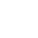         | Delete the object and its children                                                                                                                                      |
|     Un-instance     |                         | Convert an instance to a unique shape, so modelling changes are no longer copied to other instances.                                                                    |
|  Separate Topology  |             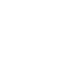          | If an object is made up of unique polygon shells, break it into separate objects. The reverse of the join operation.                                                    |
| Separate Face Group |                      | If an object has multiple face groups, break the mesh into separate objects.                                                                                            |
|   Separate Layers   |                          | If an object has layers, split each layer into a separate object. Useful for sending blendshapes to other applications.                                                 |
|   Join -> Layers    |  ->  _________ | If multiple objects are selected and have matching topology, merge those objects into layers for the primary object (the other objects will be deleted). Again, useful for blendshapes coming FROM other applications.   Note that the layers will be disabled by default. Enable them if you need to adjust their sliders. |

### Multiselection
You can select multiple objects to help achieve two things:
- using the gizmo tool to move several objects at once
- merge objects using join and boolean operations.

You can do that by using the `Multiselection` checkbox, and then by clicking on the object in the list.

::: tip Quick multiselection
You can also multiselect in the viewport by holding the `Smooth` shortcut and tapping on another mesh.

You can deselect an object by tapping on it again (only if your selection has more than one object).
:::

::: warning Limited gizmo feature
When using multiselection, the gizmo tool will always ignore masking.
Also, X/Y/Z scaling is removed.

The reason is that multiselection only allows whole mesh transformation, not per vertex transformation.
This might be improved in the future.
:::

## Join
This option will simply make one single object entry from multiple selected objects.

You can see an example in video in the [Separate](#separate) section.

## Boolean
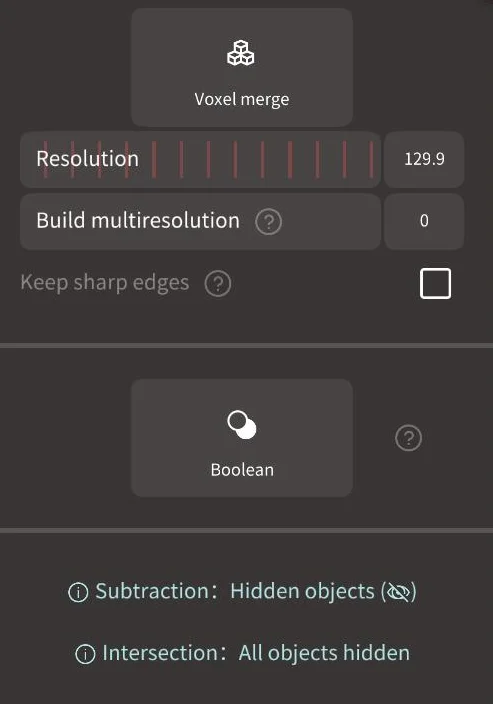 
Combine objects into a single surface.

`Voxel merge` will retain the volume of the objects, and calculate new evenly spaced polygons on the surface. Because of the calculation step a voxel merge can handle complex geometry, but can lose fine detail if the target resolution isn't high enough.

`Boolean` will attempt to leave the polygons in their original layout, and stitch the polygons where objects overlap. This can make much cleaner and sharper results than a voxel merge, however it requires 'watertight' meshes; there cannot be holes or malformed shapes in the objects. If this fails, usually a voxel merge will work.

### Boolean operations
Both Voxel Merge and Boolean will use object visibility to control the operation:

#### Union
Both objects visible will create a boolean **union**, the outer skin of the objects are combined, with no interior surfaces. 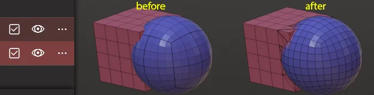

#### Subtract
One object invisible = boolean **subtract**, the invisible object will be subtracted from the visible object. 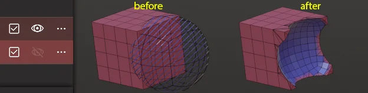

#### Intersect
Both objects invisible = boolean **intersection**, create a new shape only where the two objects overlap. 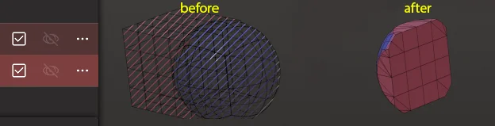

### Voxel Merge Button
Pressing this button will do a voxel merge operation on the selected objects. When done on a single object it will retopologize into evenly spaced polygons, useful for when an object has stretched polygons.

### Resolution
The resolution of the voxel 3d grid used to do the calculation. When this value is changed, a checkerboard pattern is overlayed on the object to preview the size of the polygons.

### Build multiresolution
Create multiresolution levels below your target resolution. So if your resolution is 400 and build multiresolution is 3, you will get a new mesh with say 296,000 polygons, but there will 3 subdiv levels lower at 74,000, 18,000, 4,000k.

### Keep sharp edges
Enable snapping the voxel mesh to edges. This works best on simple shapes.

### Boolean button
Pressing this button will do a polygon boolean operation using the Manifold library by Emmett Lalish. 

## Separate
If you have a single object based on several disconnected parts, you can split this object into several objects. 
This can be seen as the opposite of [Simple Merging](#simple-merge).

## Add menu

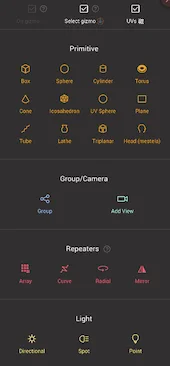

This menu will create primitives, groups, cameras, repeaters, and lights.

Primitives are basic shape types that can be adjusted using parameters. Once you have the primitive adjusted to your needs, you then 'validate' it, which bakes those parameters down into a polygon mesh that can be sculpted and painted. A primitive cannot have its parameters adjusted after it has been validated.

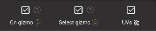

### On gizmo
Enable putting the new primitive where the current selected shape or gizmo is. When disabled, the primitive will be placed at the center of the scene.

### Select gizmo
Enable automatically switching to the gizmo tool when a new primitive is created. 

### Advanced

This menu allows you to set your preference for where new primitives, groups, repeaters will be created. They can be on the selected object, at the world origin, or at the location of the gizmo.

### UV's
Enable UV's on primitives. UV's (often called texture coordinates), are extra data used in 3d to allow textures to be applied to surfaces. They take up more memory, but for most devices this shouldn't be a concern unless you're getting into very high poly counts (eg 10 million polys or more). 

### Primitives

| Primitive      | Icon                                      | Description                                                                                                     |
| :------------: | :---------------------------------------: | :-------------------------------------------------------------------------------------------------------------: |
| Box            |                     | It's a simple cube, you can control the division in X, Y and Z                                                  |
| Sphere         |                   | For convenience this is named a Sphere but it is actually a subdivided box, with the `Project on sphere` forced |
| Cylinder       |                 | You can add a center hole for the cylinder primitive, for example to make an hollow pipe                        |
| Torus          |                    | The torus can be a good starting point for rings                                                                |
| Cone           |                     | -                                                                                                               |
| Icosahedron    |              | -                                                                                                               |
| UV-sphere      |                   | A sphere with uneven poly layout, see [Warning below](#uv-sphere)                                               |
| Plane          |                | It's a simple plane, note that this is the only primitive that is not closed                                    |
| Tube           |                | see [Tube](tools#tube)                                                                                          |
| Lathe          |               | see [Lathe](tools#lathe)                                                                                        |
| Triplanar      |                | see [Triplanar](#triplanar)                                                                                     |
| Shadow Catcher |  | see [Shadow Catcher](#shadow-catcher)                                                                           |
| Head           |                     | A simple head with a layer to blend between male/female                                                         |

::: tip
If you wonder what is the base mesh when you launch Nomad: this is a subdivided box as well.
However the base mesh in Nomad doesn't use `Project on sphere`, meaning it is not perfectly round.
:::

### Primitive Toolbar

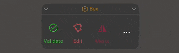

Once a primitive is created, a toolbar will appear to control it's parameters.

* `Validate` Bake the primitive into a standard object so it can be sculpted and painted.
* `Edit` Toggle displaying the primitive gizmo. This is shown directly on the primitive to control its parameters, eg the cube width, or a cylinder hole radius.
* `Mirror` Toggle placing a mirror repeater above the primitive.
* `...` Displays the primitive menu.

Different primitives will have extra options on the toolbar:

* `Project` The sphere is constructed as a subdivided cube, as this is better for sculpting, but this means it is not perfectly round. This option option will force the shape closer to a perfect sphere. The icosahedron shares this option.
* `Cap` Toggle end caps on a shape, eg a cylinder can have caps on top, or bottom, or both, or none.
* `Hole` Toggle a hole to be created through the center of a shape. This will cycle through no holes, hole with a single radius, or hole with different radius at top and bottom.
* `Radius` Toggle if a cylinder should have a single radius, or a different radius at its top and bottom.
* `Disk` Toggle if a plane should be a 4 sided shape, or a circle shape.

The small toolbar below the main toolbar will let you toggle between the primitive gizmo and the transform gizmo.

::: tip

Clicking on the title of the toolbar will toggle it to the top or bottom of the display. Clicking on the arrow in the corner will collapse it.

:::

### Primitive menu

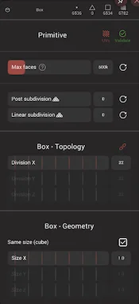

This contains all the parameters for the selected primitive. Parameters are the basic descriptions for a shape. To describe a ring, for example, you would describe it's outer, radius, its inner radius, and the number of polygons.

Most primitive parameters should be self-explanatory, and there are some common parameters shared across all primitives:

* `UVs` The small UVs button at the top of the menu will toggle the creation of UV coordinates
* `Validate` The small validate button will bake the primitive into a standard object so it can be sculpted and painted.
* `Max faces` Set an upper limit on the amount of polygons in the object to avoid crashing your device.
* `Post subdivision` Enable the chosen number of subdivisions from the multiresolution section of the topology menu. This can be used to make smoothed, soft cornered primitives in combination with low topology divisions. For example, setting a box topology divisions to 2, and post subdivisions to 4, will make a box with smooth corners.
* `Linear subdivision` Set how many levels of linear subdivision to use before using regular smooth subdivision. This can be used to control how sharp or soft the corners are on the subdivided surfaces. Eg, set a box topology divisions to 2, post subdivisions to 4, then try changing the linear subdivisions between 0 and 4. The corners of the box will go from soft to sharp.

### Topology

This controls the number of polygons in a primitive. Usually the controls are linked, so changing the one active slider will adjust all the polygons evenly. You can tap the unlink button, and control the X/Y/Z divisions on a shape separately.

### Geometry

This controls the overall size of a primitive, in X/Y/Z units for square shapes, and in radius for round shapes.

### UV Sphere
::: warning
The UV Sphere is not well suited for sculpting, especially on the poles.

Please prefer the [Sphere](#sphere), [Box](#box) or [Icosahedron](#icosahedron) primitive, along with the `Project on sphere` option.

Note that the topology can be acceptable for sculpting if you use a very low value for the `Division` sliders.
You can then use the `Overall Subdivision` slider to raise the number of polygons.

While not suitable for general sculpting, it is useful for eyes; if you rotate the sphere so that the poles sit at the pupil, the polygon layout will naturally fit to paint and sculpt the iris and pupil.
:::

### Triplanar
This primitive is special in that you should use the [Masking tool](tools.md#mask) on it to shape the geometry.

::: tip
Double-tap on a plane and the camera will focus on this particular plane.
This won't work if you rotate the primitive with the gizmo though.
:::

Triplanar is using the mask information from 3 planes to fill a voxel grid that is then polygonized (thanks to the [Voxel Remesher](topology.md#voxel-remeshere)).

Each plane has its own symmetry plane.

::: warning
Each time you update the size of the Triplanar primitive, the quality of the mask painting will degrade.

For now there is no option to 'lock' the painting on a single plane, but maybe it will come in the future.
You can use the [Connected Topology](stroke.md#connected-topology) to help a little bit, in that if your cursor lies precisely on one plane it won't impact the other planes.
:::

### Shadow Catcher
Add a plane with the shadow catcher material. See [Shadow Catcher material](material.md#shadow-catcher) for more details. 

## Group/Camera
### Group
Create an 'empty' object, that you can parent other objects underneath. This can be used to simply organise the hierarchy by putting many objects under a group, then closing it. A group can also be used as a helper for moving objects; many objects can be placed under a group, and then the group moved, rotated, scaled with the gizmo tool.

### Add view
Create a camera.

## Repeaters

Repeaters are nodes that make instances of objects below it. 

### Array
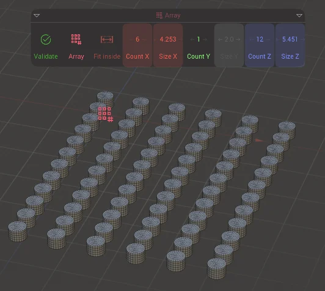

When objects are made children of this node, they can be instanced into a grid layout. When selected, it has controls for:
* Fit inside - toggle between controlling the size of the grid/box of the array, or controlling the space between the array instances
* CountX/Y/Z - the number of instances on each axis
* OffsetX/Y/Z - distance between the instances when fit inside is toggled
* SizeX/Y/Z - the width/height/depth of the total array grid when fit inside is toggled.

### Curve
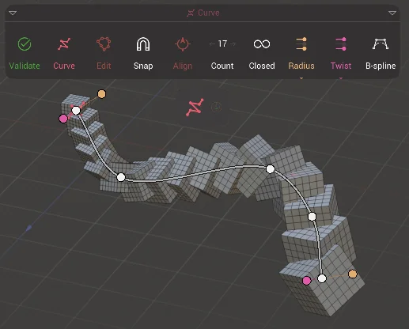
This will create a curve, children of this node will be repeated along the curve. When selected, it has controls for:
* Edit - allow adding of points to the curve, and moving points on the curve.
* Snap - will snap curve points to other geometry
* Align - will rotate child shapes to align in the directon of the curve
* Count - the number of instances
* Closed - Toggle the curve to join the start and end, or to be an open curve
* Radius - Toggle controls on each curve point to control the scale of the instances
* Twist - Toggle controls on each curve point to control the twist rotation of the instances 
* B-spline - Toggle the instances to follow the curve exactly, or use b-spline interpolation which has smoother results. 

### Radial
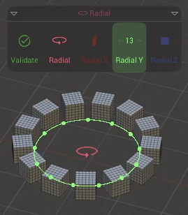

Children of this node will be instanced into a circle. Move the child object to alter the radius of this repeater. When selected, it has controls for:
* RadialX/Y/Z - selecting these buttons will set the radial axis, and set the number of instances.

### Mirror
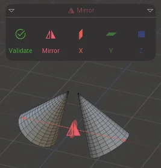

Children of this node will be mirrored across an axis. When selected it has controls for:
* Gizmo - enable the transform gizmo to set the center of the mirror. This can also be rotated and scaled. When done, tap gizmo again to reveal the standard controls.
* X/Y/Z - set the mirror plane

All the repeaters have a `Validate` control, which will bake the results of the repeater, and will ask how to perform the bake:
* Join children - the instances are joined into a single object
* Keep instances - the instances remain as instances, but are no longer have the repeater 'parent'
* Un-instances - the instances are converted into unique objects

::: tip Tip: Combine repeaters
Repeaters can be parented under each other, and several objects can be made children of repeaters, leading to complex effects.

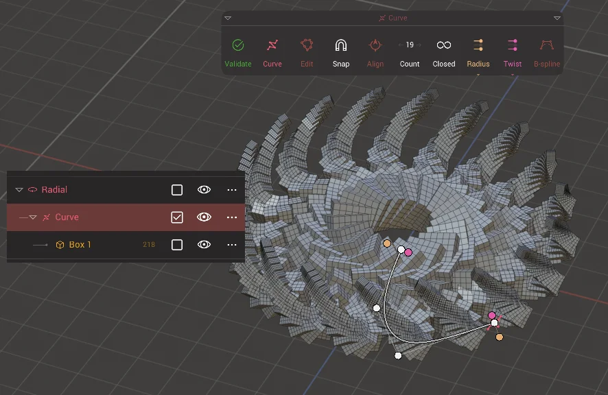
:::

::: tip Tip: Repeater pivots

Some repeaters will try to auto-pivot the child objects, so even if you move or rotate them with the gizmo tool, they won't move. If you need to override this behavior, insert a group in between the repeater and the child. Now you can move the child shape independently of the repeater.
:::

## Light

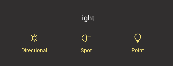

### Directional
Create a directional light, an infinitely far away light source like the sun.

### Spot
Create a spot light, with controls over the cone width, softness

### Point
Create a point light

## Advanced
### Focus on item
Double clicking an item in the Scene list will center the camera on that item in the 3d view.

### Sync visibility
Using the eye icon will impact all the selected items. 

### Instance: Show
Display a colour capsule on the left of the scene list to show instances.

### Icons
Set the size and opacity of the group, light, camera, mirror icons in the viewport

### Hierarchy lines
Display a line between parent and its children in the viewport

## Bottom toolbar
These icons will toggle visibility of Group, Light, Camera, Repeater and Hierarchy lines in the viewport.

