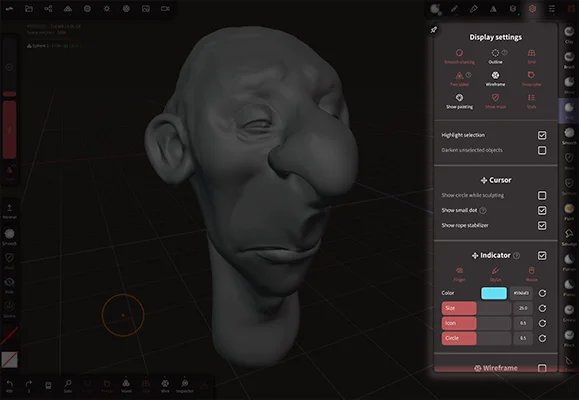
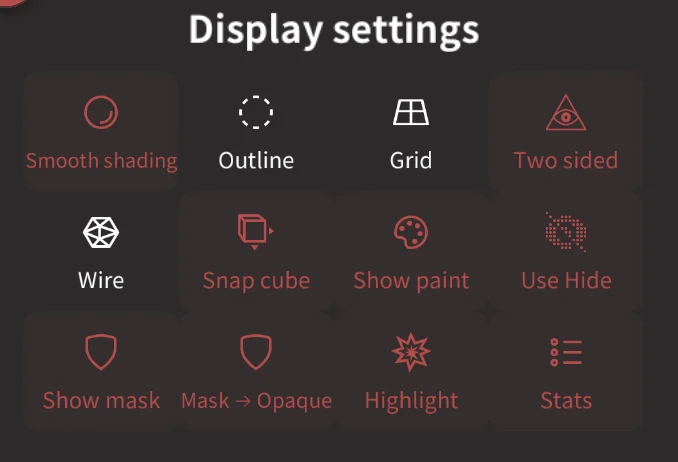
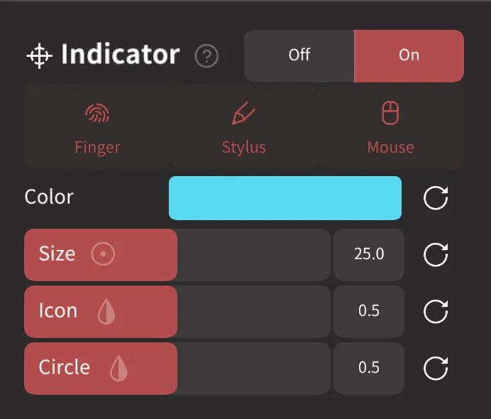
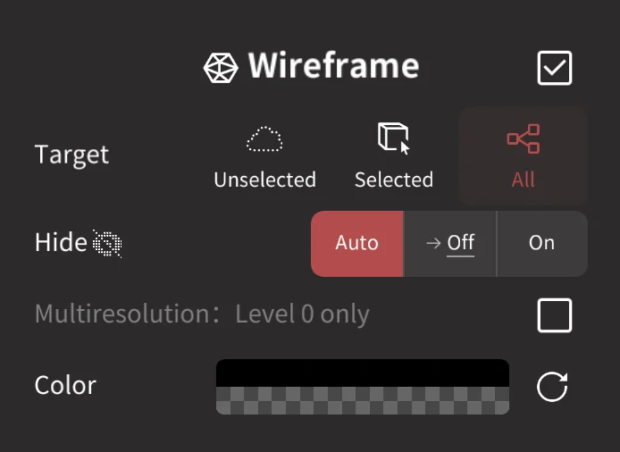
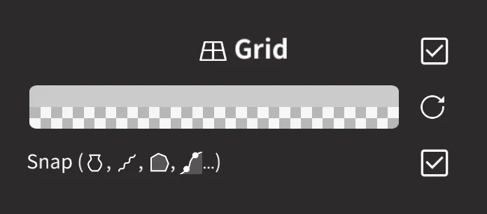
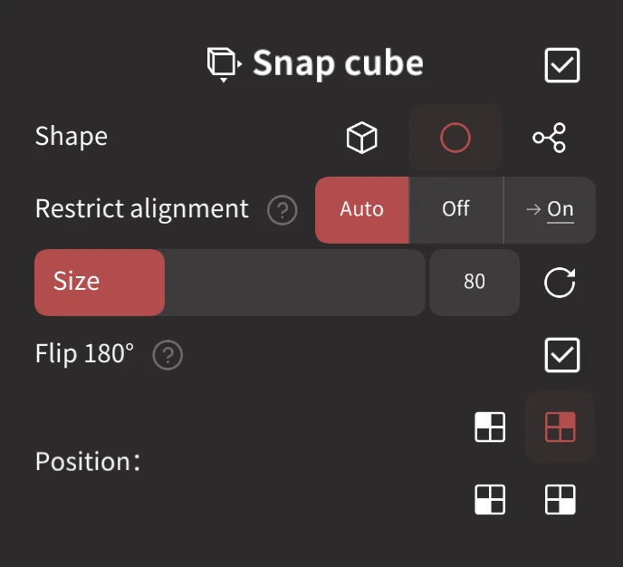
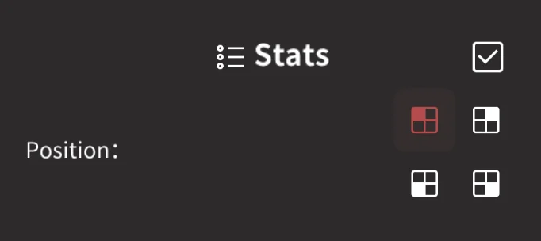

#  Settings 

The settings menu contains many options to control the appearance and behavior of Nomad.

## Display settings
This section contains quick launch shortcuts for most of the settings further down this menu.

### Smooth Shading 
Toggle smooth and faceted shading. When faceted the polygons are shaded independently, so you can see the underlying topology.
It can be useful to see faceted shading during the sculpting stage, then change to smooth shading for rendering.

Disabling Smooth Shading improves performance a little bit.

### Outline
Toggle an outline on your current selection.

This is useful to get visual feedback on your current selected mesh(es) in case [Darken Unselected](#darken-unselected-objects) is disabled.

From a performance point of view, using [Darken Unselected](#darken-unselected-objects) is much better than using the outline solution.

### Grid
Toggle a background grid, useful for understanding object placement and scale.

### Two sided
Toggle two sided polygon display. All faces point in a certain direction.
Faces that are considered *backface* are the ones that point "away" from the camera viewpoint.

For example the startup simple sphere will have its faces point towards the outside.
If you move the camera inside the sphere you'll then see the backface of these faces.

Most of the time you shouldn't see the backface part of faces, so coloring them can help you detect potential issues or incorrect topology.

Disabling `two sided` rendering can improve rendering performance a bit.

### Wireframe
Toggle a wireframe overlay. 

Note that enabling wireframe will lower performance.

### Snap cube
Toggle a helper icon in the corner of the scene, useful to orient yourself in space and quickly switch between front/back/left/right/top/bottom views.

### Show Painting
Toggle paint display. The default paint used is a white non-metallic material, at 25% roughness.

### Use Hide
Toggle the hide mode. When turned off it is still there, just deactivated. This button is disabled if you are currently using the hide tool.

### Show Mask
Toggle the mask mode. When turned off it is still there, just deactivated. Press this button again to re-enable it.

If you need to hide the mask AND still have it be active, use the mask color below and set it to white. Remember to change it back to a gray when you're done!

Note that this button is disabled if you are currently using a mask tool. 

### Mask -> Opaque
Mask -> opaque will ignore transparent vertices for masked mask. This is only relevant for vertex and texture opacity, face hidden by “hide” will still be hidden.

### Highlight
Toggle the selection highlight flash. When selecting objects, temporarily flash the selected object hot pink for 500 miliseconds. The color and length of the flash can be customised below.

### Stats
Toggle the status display text in the 3d viewport. This displays information about your system memory, total scene vertex count, and the current selection vertex count.

----- 

### Darken Unselected objects
The objects that are not selected will be darkened so that the current selection can stand out.

### Mask
The colour used for masking, by default a mid gray, multiplied against your object color. Set this to white to make the mask invisible, but remember to change it back to to a gray when done!

##  Cursor

### Show circle while sculpting
Continue to show the brush radius when sculpting.

### Show small dot
Display a dot at the center of the brush stroke while sculpting, or when the camera pivot is changed.

### Show rope stabilizer
Draw a line to indicate the rope length when lazy rope stablizer is active in stroke settings.

##  Indicator

Display visual indicator(s) for tutorials and screen captures.

The `Finger`, `Stylus` and `Mouse` buttons will enable displaying an icon when that type of input is detected.

### Color
The color of the indicator.

### Size/Icon/Circle
Controls to adjust the size of the indicator and shapes within the indicator.

##  Wireframe

Activate the wireframe overlay.

### Target
Set if unselected objects will show wireframe, or only selected objects, or all objects.

### Hide
Set if the wireframe will still be shown for hidden polygons.

### Multiresolution: Level 0 only
Multiresolution will show wireframes for level 0 darker, and higher levels progressively lighter. When enabled, this option will only show the level 0 wireframe.

### Color
Set the color and opacity for wireframe.

##  Grid

Activate the grid.

### Color
Set the grid color and opacity.

### Snap
Enable snapping for curve based tools to the grid.

## Two sided
Enable seeing polygon faces from both sides.

### Color Backface, Backface Color
Enable tinting of the backfaces, and the tint color.

## Outline
Enable an outline around the active object.

### Outline color, Thickness
Set the color and thickness of the outline.

##  Highlight
Enable a short flash when the active object is changed.
### Color, Duration
Set the color and length of time of the flash in milliseconds.

##  Snap cube

Display a helper icon in the corner of the scene, useful to quickly switch between front/back/left/right/top/bottom views. Tap on the sides of the cube to swap between orthographic views.

### Shape
Choose between a cube, a sphere, or a gnomon shape for the snap cube.

### Restrict alignment
Enable camera rotation locking when dragging on the snap cube. When active, a drag motion on the snap cube will only go left/right or up/down.

### Size
Set the size of the snap cube.

### Flip 180
Enable a tap behavior so that if the view is snapped, tapping on the center of the cube will rotate the view 180 degrees. For example if the view is snapped to the front, tapping the view cube will rotate to the back view.

### Position
Set which corner the snap cube will be in.

##  Stats

Display information about your system memory, total scene vertex count, and the current selection vertex count.

### Position
Set which corner the stats will be in.

## Primtive/Repeaters
## Numerical input
Allow numerical input when tapping the gizmo widgets.

## Multiresolution
### Max vertices count
Set a threshold to now allow a multires subdivide operation higher than this poly count, which would likely crash Nomad. The default is 10 million.
### Low resolution threshold
A lower resolution of the mesh can be displayed when you move the camera. You can increase this value if you want to display a higher resolution of the mesh.

## Settings
### Reset to default
Reset all the settings to their default values.
