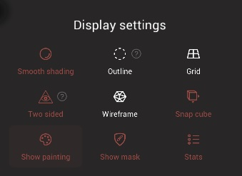

# Settings

Most of the options in this section concern the viewport display.

## Display settings
This section is quick launch shortcuts for most of the setting below.

### Smooth Shading
If Smooth Shading is disabled, the faces are shaded independently, so you can see the underlying topology.
This is the reason why disabling it is preferred during the sculpting stage.
However for rendering purposes, sometimes you might want to enable it.

Disabling Smooth Shading improves the performance a little bit.

### Outline
You can display an outline on your current selection.

This is useful to get visual feedback on your current selected meshes in case [Darken Unselected](#darken-unselected-objects) is disabled.

From a performance point of view, using [Darken Unselected](#darken-unselected-objects) is much better than using the outline solution.

### Grid
Display a planar grid so that you can get a better understanding of how your scene is positioned on the scene.

### Two sided
All faces point in a certain direction.
Faces that are considered *backface* are the ones that point "away" from the camera viewpoint.

For example the startup simple sphere will have its faces point towards the outside.
If you move the camera inside the sphere you'll then see the backface of these faces.

Most of the time you shouldn't see the backface part of faces, so coloring them can help you detect potential issues or incorrect topology.

Disabling `two sided` rendering can improve rendering performance a bit.

### Wireframe
Display the topology of the scene.

Note that showing the Wireframe will lower the performance.

### Snap cube
Display a helper icon in the corner of the scene, useful to quickly switch between front/back/left/right/top/bottom views.

### Show Painting
You can check this option if you want to ignore the object's painting.
The default paint used is a white non-metallic material, at 25% roughness.

### Stats
Display information about your system memory, total scene vertex count, and the current selection vertex count.

----- 

### Highlight selection
Temporarily flash object(s) in the hightlight colour (pink by default) when selected by tap or with the select tool.

### Darken Unselected objects
The objects that are not selected will be darkened so that the current selection can stand out.

## Cursor

### Show circle while sculpting
Continue to show the brush radius when sculpting.

### Show small dot
Display a dot at the center of the brush stroke while sculpting, or when the camera pivot is changed.

### Show rope stabilizer
Draw a line to indicate the rope length when lazy rope stablizer is active in stroke settings.

## Indicator
Display visual indicator(s) for tutorials and screen captures.

The `Finger`, `Stylus` and `Mouse` buttons will enable displaying an icon when that type of input is detected.

### Color
The color of the indicator.

### Size/Icon/Circle
Controls to adjust the size of the indicator and shapes within the indicator.

## Wireframe
Activate the wireframe overlay, and set the wireframe colour and opacity.

## Grid
Activate the grid, and set the grid color and opacity

## Two sided
Enable seeing polygon faces from both sides.

### Color Backface, Backface Color
Enable tinting of the backfaces, and the tint color.

## Outline
Enable an outline around the active object.

### Outline color, Thickness
Set the color and thickness of the outline.

## Highlight
Enable a short flash when the active object is changed.
### Color, Duration
Set the color and length of time of the flash in milliseconds.

## Snap cube
Display a helper icon in the corner of the scene, useful to quickly switch between front/back/left/right/top/bottom views. Tap on the sides of the cube to swap between orthographic views.

### Shape
Choose between a cube, a sphere, or a gnomon shape for the snap cube.

### Restrict alignment
Enable camera rotation locking when dragging on the snap cube. When active, a drag motion on the snap cube will only go left/right or up/down.

### Size, Bottom, Left
Set the size and location on screen of the snap cube.

### Flip 180
Enable a tap behavior so that if the view is snapped, tapping on the center of the cube will rotate the view 180 degrees. For example if the view is snapped to the front, tapping the view cube will rotate to the back view.

## Stats
Display information about your system memory, total scene vertex count, and the current selection vertex count.
### Right
Enable the stats information to be placed on the right side of the screen.

## Multiresolution
### Max vertices count
Set a threshold to now allow a multires subdivide operation higher than this poly count, which would likely crash Nomad. The default is 10 million.
### Low resolution threshold
A lower resolution of the mesh can be displayed when you move the camera. You can increase this value if you want to display a higher resolution of the mesh.

## Settings
### Reset to default
Reset all the settings to their default values.
