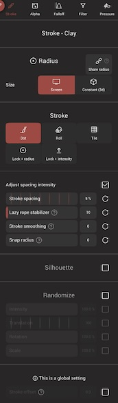
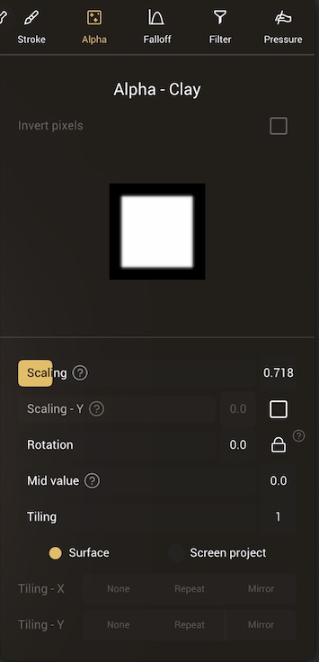
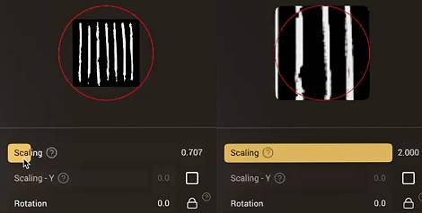
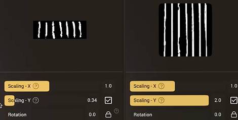
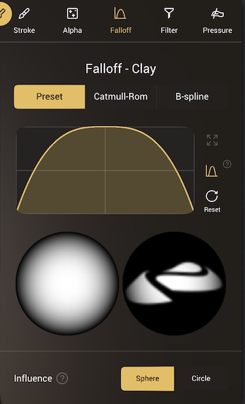
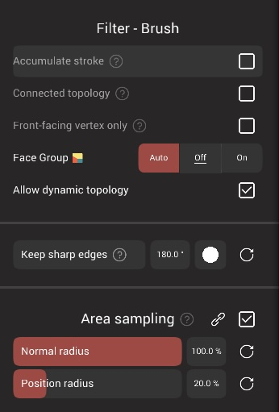
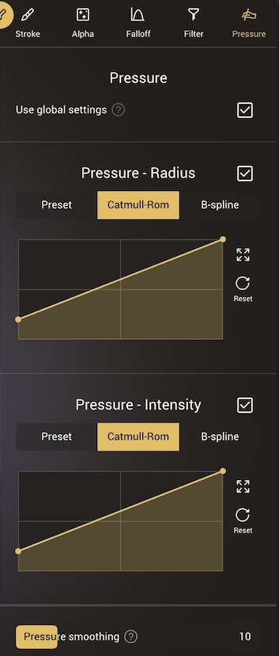

# Stroke

---
 

You can customize the stroke behavior of most tool brushes.
The settings should be fairly similar to the ones present in 2d painting applications, however some options are specific to the sculpting and 3d field.

The options are extensive enough to be split across 5 sub-menus:

| Name      | Icon                             | Description  |
| :---:       | :---:                            | :---:        |
| Stroke |  | Control how the stroke gets applied to the model |
| Alpha |  | How a greyscale texture is used for the brush stamp |
| Falloff |  | Control how the brush strength changes from the center to the edge |
| Filter |  | How the brush is affected by the model geometry |
| Pressure |  | Control stylus pressure response  |

::: tip
Nomad has many different tool types. Stroke options that aren't used by the current tool will be disabled or hidden. 
:::

## Stroke

### World-space radius
When enabled, the brush radius is set in world units. For example if you create a sphere, use the clay tool, and make the radius be half the sphere, if you zoom out or zoom in, the radius will still be half a sphere.

When disabled, the radius is set in screen units. So if you make the radius 100 pixels wide, when you zoom out or zoom in, the radius will remain 100 pixels wide.

### Share radius

When enabled, all tools will use the same radius, the default is for each tool to have its own radius.

## Stroke behavior

Strokes can act in 3 ways:

###  Dot  
Drag like a regular paint stroke. 
 

 ### Lock + radius  
 Stamp a brush stroke with fixed height. Drag will set the scale and rotation.
 

### Lock + intensity   
Stamp a brush stroke with fixed radius. Drag will set height and rotation.
 

The `Move` and `Drag` tools have their own 3 options:

###  Drag  

Will keep updating what is inside the brush radius during the stroke. A fast stroke will leave the surface behind, while a slow stroke will hold onto material, making longer shapes. This is the default mode for the `Drag` tool. With `Dynamic Topology` this can be used to make snake like extrusions. 
 

### Grab  
Will select what is inside the brush radius when the brush is started, and keep that selection. This is useful for more precise move operations, as you can carefully adjust the distance of the move and not accidentally move more than you originally selected. This is the default mode for the `Move` tool.
 

### Lock + radius (drag)   
The user radius is ignored, and is set dynamically based on how far the stroke is dragged away from the starting point. A small distance=small radius, a larger distance = bigger radius. Use the intensity slider to control the shape of the falloff. Useful for blocking in organic rubbery shapes.
 

### Adjust spacing intensity
Strokes with a low spacing (lower than 50%) can accumulate quickly, making more intense strokes than higher spacing values. This toggle will compensate for this, so strokes will be of approximately the same intensity regardless of spacing.

### Stroke spacing
How far apart to apply each brush stroke during a drag operation. Values lower than 100% will overlap, giving the appearance of a continuous stroke. Values greater than 100% will start to leave gaps, useful for sculpting detail like stitching or zippers.

### Lazy rope stabilizer
Strokes will lag behind the pointer position by a certain distance. This can be used to draw smooth lines.
 

### Stroke smoothing
Average multiple pointer position to get a smoother stroke.
With high values, the stroke will lag behind the pointer but will eventually catch up.

It can also be useful for drawing smooth lines.

### Snap radius
Snap the start of the stroke to the end of the previous stroke. The radius determines how far to look for the end of the previous stroke. This can be useful when drawing long continuous lines, while doing frequent pauses.

### Silhouette
By default strokes will only affect the model surface within the brush radius. When silhouette is enabled, the stroke will be projected through the entire model. This can be very useful when doing the initial blocking out of a model, or for shapes that require the sides to remain perpendicular.

The projection direction can be set explicitly, the default 'Closest' method will detect the best angle relative to the view. 

 

### Randomize

The intensity, translation, rotation and scale of the stroke can each be randomized. This can be used to create a range of effects, eg mottled color with the paint tool, or the crease tool can be used to create skin detail.

 

### Stroke Offset

Apply a constant offset on the stroke. This is useful for small screens where your finger would cover the stroke. 

## Alpha
 
The `Alpha` is a texture that will modulate your brush behavior.
It's a grayscale image, where black pixels mean no deformation and white pixels full deformation.

For now the texture is never resized, so beware that huge image can slow down the performance a bit.

### Invert value
This will reverse the values of the image, so black pixels will become white, and white pixels will become black. This only works for user-imported textures.

### Scaling

The brush size in Nomad is a circle with a user defined radius. Textures are often square or rectangular, the `Scaling` parameters let you decide how the texture should fit within the circle. For a square texture, a value of 0.7 will fit within the circle. A value of 1 will do the opposite, and fit the circle within the texture, clipping the edges.

 

Enabling `Scaling - Y` will allow you to stretch the texture vertically.

 

### Rotation

The alpha texture will be rotated to follow the direction of the stroke. You can add a rotation offset, and if the lock icon is enabled, the texture will stay locked to this rotation relative to the screen.

### Mid value

By default black pixels will mean no deformation, and white pixels will mean full positive deformation, so for example, a clay brush with a alpha texture of rocks will only pull the surface out where the alpha is not black.

If you want the brush to push the surface in, or both push in AND pull out, you can modify the mid value. So if you set the value to 0.5, a middle gray in the alpha will do nothing, a black value will push in, a white will pull out.

### Tiling

How often the texture repeats within the brush profile. The tiling can be calculated from the mesh surface, or from the screen projection, allowing for a range of effects. In screen project, where you start the brush stroke is treated as the center of the screen projection. When screen project is active, and values are changed, an overlay will be shown to preview the results.

The tiling modes allow you to limit to a single texture within the stroke, or repeated textures, or mirrored where every second texture is flipped to create patterns or help make seamless textures.

 

## Falloff

 

This is similar to the [Alpha](#alpha), except that you drive the intensity with a single curve.
when the curve is on the top, this is full deformation, when it's at the bottom the brush has no effect.

::: tip Symmetrical curve
The curve is always symmetric, but if you go in the [Interface](interface.md) menu, you can choose to only display the left part of the curve.

It doesn't change the behavior of the falloff, this is mostly for convenience.
:::

You can think of the curve as a cross section through the tip of the brush. The bottom section gives a preview of a what a single 'stamp' of the brush would look like on the model surface, and if there is an alpha texture for the brush, this will be shown too to preview how the falloff and alpha will interact.

### Preset
With this selected, clicking on the curve graph will bring up a menu of presets. Rounded curves will give softer results, angular curves will have sharper results. The `Sub` button in the left toolbar will effectively reverse the falloff, so the top of the curve will push into the surface instead of pulling out, or vice versa.

### Catmull-Rom
When selected, the user can draw their own falloff curves. The curve editor works the same as curves in the rest of Nomad:

* Click on the curve to create a new point
* Drag a point to reposition it
* Click on a point to toggle between sharp and smooth
* Drag a point into a neighbor point to remove it

### B-spline
When selected, the user can draw their own falloff curves. The editor works the same as Catmull-Rom, but curve points influence the curve instead of being directly on the curve, which can help in creating smoother curve shapes.

The curve editor has 3 extra buttons:

| Item                     | Icon | Description  |
| :---:                    | :---: | :---:        |
| Maximize                      |  | Expand the curve editor    |
| Symmetry   |  | Display the curve as a symmetric 'brush tip' |
| Reset |   | Revert the curve to the default state |

### Influence

* Sphere (3d) - Influence is computed by taking the distance from the vertex to the brush's center.
* Circle (2d) - The vertex is first projected on the area plane, before taking its distance to the brush's center. This is similar to how alphas are sampled. 

## Filter
 

### Accumulate stroke
Enable no limit to how much matter can be added/removed per stroke. Eg the `Clay` tool has this enabled, so material can keep building up, while the `Brush` tool has this disabled, so strokes will stop adding material if you keep moving the same stroke over the same region of the mesh. 

### Connected topology
Enable only sculpting the vertices that are linked to the picked surface. For example when used with the `Move` tool, will alow you to exclusively move a part that self intersects with another part.

### Front-facing vertex only
This option will ignore back facing vertices.
It can be useful if you want to paint part of a thin geometry without impacting the other side.
It also works for sculpting but you might experience some artifacts.

### Allow dynamic topology
This option is only available if your mesh is in [Dynamic Topology](topology.md#dynamic-topology) mode.
You can disable or enable the refinement for a specific tool.

### Keep sharp edges
Exclude points whose normals differ too much from the surface normal.

It will change how the plane area is computed (Area sampling).

This option can be useful for flatten-based tools, or if you want to color a planar surface without over-spill.

### Area sampling
Some brushes or stroke options require a plane normal and a plane position to the surface in order to work.

You can control how to compute this average plane by setting the sampling area as a ratio of the tool radius.

At 100%, every point inside the selection circle is taken into account.

At 0%, only the nearest vertex or triangle is taken into account. These values can be linked for both `Normal radius` and `Position radius`, or unlocked and set independently.

### Depth masking
Exclude points that are above or below a certain distance of the computed plane (Area sampling).

This can be used to paint only on bumpy regions, or only on cavity regions.

The graph represents a cross section of the surface; the horizontal line is where the surface is, the circle represents the paint falloff radius relative above and below the surface. `Height offset` is a percentage above or below the surface to start the masking calculation. `Top area` and `Bottom area` allow you to scale the falloff above and below the offset point.

#### Example: Paint in cavities
To paint only cavity regions, set the height offset to -100%, and adjust the top area slider so that it is away from the horizontal line. This means the first click sets the 'zero' depth, and then only areas below this depth will get affected.

#### Example: Paint on bumps
To only paint in high regions, se the height offset to +90%, so that the bottom of the circle intersects the horizontal line by a small amount.  When you click on the top of a 'high' zone, this will set the depth, so that anything at that depth, plus a little below it, and anything higher than it, will be painted. Deep cavities will be skipped.

## Pressure 
 

Control how the stylus/pen pressure affects the brushes.

By default `Use global settings` is enabled, meaning all brushes will share the same pressure values.

### Pressure - Radius

This curve controls how the brush radius is affected by pressure. The default is a linear relationship, so if your stylus has a smooth response, then the radius change should also feel smooth. That said, many stylii have a non-linear response, which you can compensate for with this curve. For example, if the radius doesn't like it gets to its maximum value at high pressure, use a curve preset like 'out-pow3', with a bend that aims up, to increase radius earlier.

This dialog is similar to the falloff curve display, you can use preset by tapping on the curve window, or draw your own curve responses with the Catmull-Rom and B-Spline modes.

If you want constant radius, disable this section.

### Pressure - Intensity

Similar to the radius slider, but for controlling intensity. If you want constant intensity, disable this section.

### Pressure smoothing

Average the pencil pressure events for smoother results.