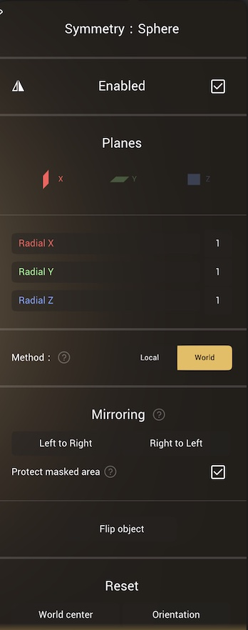
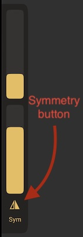

# Symmetry

 

## Overview 
You can use symmetry to mirror sculpting operations in several ways:

* Mirroring can work across the X Y Z planes either independently or in combination
* Radial symmetry can be set on X Y Z with a number of repeats
* The mirror can operate as a helper for sculpting tools, or as a repeater at the object level
* Mirrors can operate at the origin, or can operate relative to a user defined location
* Sculpts that started non-symmetrical can be forced to be symmetrical

A shortcut to enable/disable symmetry can also be found on the left quick panel (*"Sym"*).

 

Note that this is a global option, so the state will carry over the different tools.
The only exception are the transforms tool ([Move](#translate), [Rotate](#rotate), [Scale](#scale) and [Gizmo](#gizmo)) which have their own symmetry state.

## Enabled
Toggle the mirror operation, this is the same as the `Sym` button in the left quick panel. 

## Planes

Enable plane(s) of symmetry, and number of repeats for radial symmetry. Note that you don't have to just chose a single plane, you can have all 1, 2 or 3 planes enabled for complex symmetry.

The axis and repeat count for radial symmetry. Note that these also aren't restricted to a single axis, and can even work in combination with plane symmetry to generate detailed results very quickly. (The number of total repeats is limited to 150)

 

## Method
The mirror can either be 'Local', and move with the object, or be 'World', and not move. If you're not sure which mode you need, observe the mirror plane and radial indicators that are overlaid on the object. When in local mode, if you use the transform gizmo and move the model, the mirror indicators will move as well. When in world mode, the mirror indicators will stay fixed, and the object will slide through them.

## Mirroring
When sculpting near the symmetry planes, some brushes will have imperfect symmetry behavior.

In that case you can use the 'Left to Right' or 'Right to Left' button to force symmetry again.

This operation only succeeds if the algorithm detects that the mesh is symmetrical.
In case the detection fails, you will be asked if you want to force the mirroring.

The main difference is that forcing the mirroring will change the topology, thus you might lose the [Multiresolution](topology.md#multiresolution).

::: tip
'Left' and 'Right' are calculated from your current point of view, so 'Left to Right' will copy the detail on what is currently on the left side of the screen, to the right side of the screen, while 'Right to Left' will do the opposite.
:::

### Protect masked area
Keep masked area intact. This option will be ignored with non-symmetric topology, or for disconnected surfaces, eg a pair of eyes.

### Flip object
Make the left side the right side, and vice versa. Similar in appearance to if you used the gizmo tool menu and set the scale to -1 on X.

## Reset

It is possible to edit the symmetry location and orientation (but not recommended!). If needed, 'object center' and 'orientation' will reset the symmetry location and orientation to their default values.

## Advanced
'Show line' and 'Show plane' will toggle a viewport overlay of the symmetry locations. Note that turning off these options will only take effect when the symmetry menu is closed.

### Gizmo edit
Enable a gizmo to move and rotate the symmetry location. Using this can get symmetry out of alignment very quickly and difficult to recover from, so use with caution!

Note that the behavior of these options will change depending on what space (*Local/World*) you are in.
So if it doesn't work as you would expect, make sure to check if you are in the correct space.

