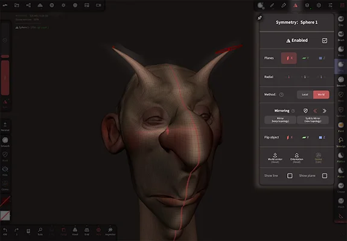
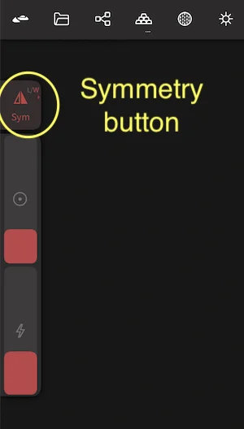
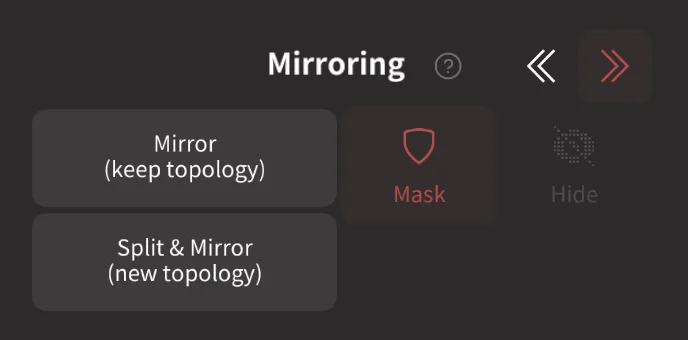
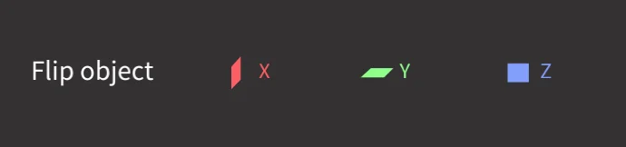
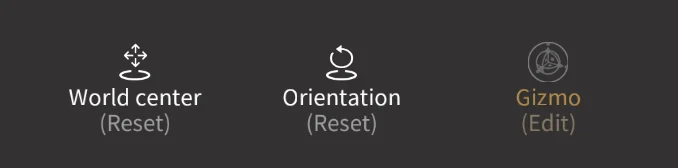

#  Symmetry

This menu controls how strokes will be repeated acroos a mirror plane or radially, and ways to restore symmetry on non-symmetrical objects.

 

## Overview 
You can use symmetry in several ways:

* As a mirror, flipping work across X (left/right), Y (top/bottom), Z(back/front), or a combination. 
* Radial symmetry can be set on X Y Z with a number of repeats, eg sculpting a starfish. 
* Mirrors can operate around the origin (called world mode)  or around the center of an object (called local mode).
* Sculpts that started non-symmetrical can be forced to be symmetrical.

A shortcut to enable/disable symmetry can also be found on the left quick panel (*"Sym"*). The small 'L/W' indicates if Nomad is in Local or World symmetry mode. You can also long press or swipe to the center of screen to bring out a menu.

 

This is a global option, so the state will carry over the different tools.
The only exceptions are the transform tools ([Move](#translate), [Rotate](#rotate), [Scale](#scale) and [Gizmo](#gizmo)) which have their own symmetry state.

::: tip
The symmetry menu is mainly for controlling stroke symmetry. You can also mirror and repeat objects via [repeaters found in the scene menu](scene#repeaters). 
:::

## Enabled
Toggle the mirror mode, this is the same as the `Sym` button in the left quick panel. 

## Planes

Enable plane(s) of symmetry, and number of repeats for radial symmetry. Note that you don't have to just chose a single plane, you can have all 1, 2 or 3 planes enabled for complex symmetry.

The axis and repeat count for radial symmetry. Note that these also aren't restricted to a single axis, and can even work in combination with plane symmetry to generate detailed results very quickly. (The number of total repeats is limited to 150)

 

## Method
The mirror can either be 'Local', and move with the object, or be 'World', and not move. If you're not sure which mode you need, observe the mirror plane and radial indicators that are overlaid on the object. When in local mode, if you use the transform gizmo and move the model, the mirror indicators will move as well. When in world mode, the mirror indicators will stay fixed, and the object will slide through them.

## Mirroring

When sculpting near the symmetry planes, some brushes will have imperfect symmetry behavior. This section allows you to restore symmetry by copying one side of your sculpt to the other. 

`Direction` - The `<<` and `>>` buttons determine which side will be copied to the other. Nomad calculates this from your current viewport, so setting it to `<<` for example will always copy from screen right to screen left.

 `Mask` - The mask button lets you isolate what will be mirrored; masking the destination side will protect that region, masking the source side will stop that area from being mirrored to the destination. 

 `Hide` - When active, areas that are hidden on the source side will not be mirrored to the destination. 

`Mirror` will try to identify if the topology is the same on both sides of the mirror, and if so, just move vertices. This is the more common scenario.

`Split & Mirror` will essentially cut the object along the mirror, copy one side, mirror it to the other, and weld vertices along the mirror. It is a more destructive option, and will delete multiresolution, but sometimes this method is required if the model is very different across the mirror.

### Flip object

Make the left side to the right side, and vice versa. Similar in appearance to if you used the gizmo tool menu and set the scale to -1 on X.

## Reset and Edit

It is possible to edit the symmetry location and orientation (but not recommended!). If needed, `World center` and `Orientation` will reset the symmetry location and orientation to their default values.

Nomad usually knows where to put the symmetry plane. It is not recommended to adjust this manually, but the `Gizmo (Edit)` button allows this for advanced users. When this button is clicked, a gizmo is shown to let you translate and rotate the symmetry plane. If you want to restore the default center and orientation, the `object center` and `orientation` buttons will do this.

The behavior of these options will change depending on what space (*Local/World*) you are in.
So if it doesn't work as you would expect, make sure to check if you are in the correct space.

::: tip
The `Gizmo (Edit)` button is intentionally grayed out as a reminder that you probably shouldn't use this!
:::

## Show options

`Show line` and `Show plane` will toggle a viewport overlay of the symmetry locations. Note that turning off these options will only take effect when the symmetry menu is closed.

