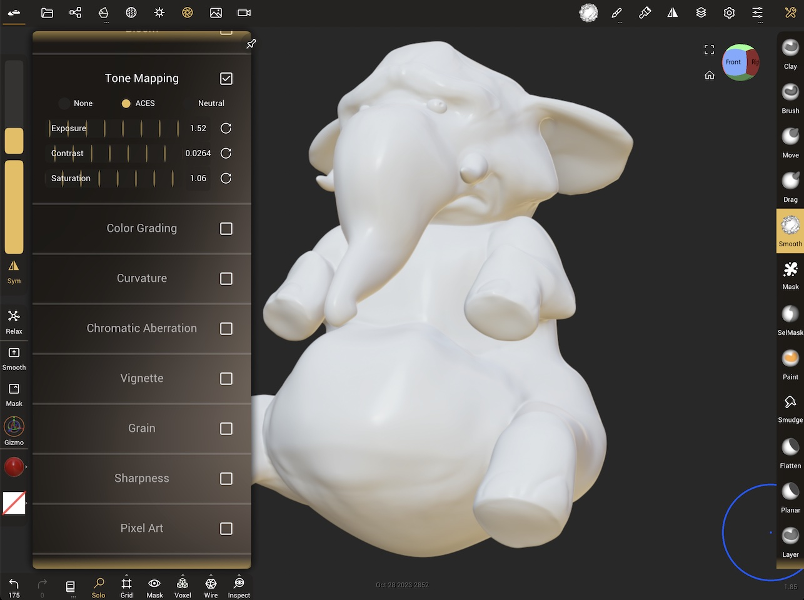
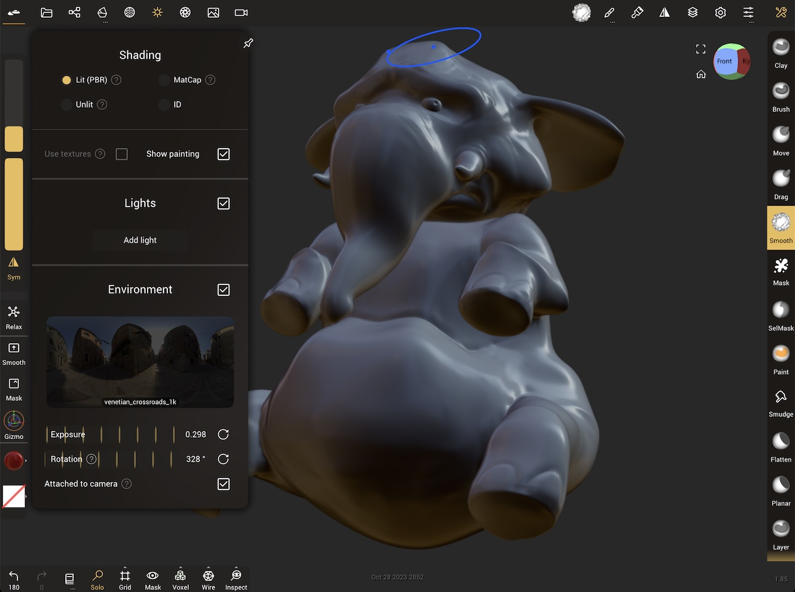
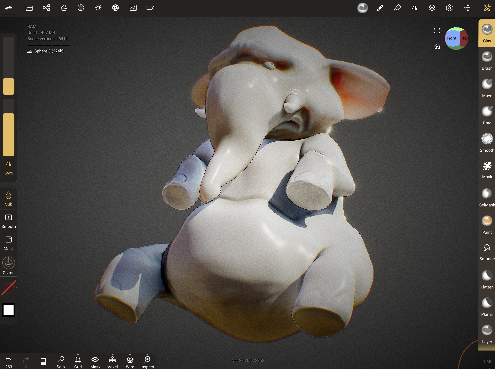

# Tips

[[toc]]

## Working on small screens

Nomad is designed to work on tablets, but works well on phones as well. Sculpting on a small screen like a phone can be made easier with a few UI and workflow tweaks:

* A 4 finger tap will toggle the entire UI, giving you more room to sculpt.
* A 3 finger drag up and down will change the brush radius
* The UI scale can be made smaller to fit more buttons if you have good eyesight, or bigger if you have bad eyesight!
* The wider menus can get in the way of the sculpt sometimes, you can make them transparent and non-blurred to allow you to see the sculpt beneath the menu.
* If sculpting with a finger, use the offset option to move the brush center a little away from your finger.
* These and many more options can be found in the [Interface menu](./interface.md). 

## Inflate or peak deformer

Many 3d apps feature an inflate deformer, that will push all vertices along their normal by a controllable amount. While Nomad currently lacks deformers, it is possibe to emulate this behavior wtih the inflate brush:

* Select the inflate brush
* From the [Stroke menu](./stroke.md#stroke) change the stroke method to `Lock + Radius'
* Make the brush radius larger than your sculpt, zoom the camera back away from the sculpt if needed.
* Click then drag a stroke on the surface of your object; when the radius is bigger than the object, the entire shape will be inflated evenly by a fixed amount.
* Adjust the brush intensity to control the amount of inflation
* Use masking if needed to protect or reduce the effect of the inflate in certain areas.

## Remove lumps or 'pimples' from a voxel remesh operation

Voxel remesh is great for making evenly spaced polygons, but sometimes creates topology that will cause small lumps or pimples when smoothed. For example:

* Use the crease brush on the default sphere and make a swirl
* Voxel remesh with 'build multiresolution at 3'
* Smooth with high intensity
* artifacts appear (easier to see with a high contrast matcap material):

To fix via sculpting, try the `Stable smoothing` option in the smooth settings. This can handle the uneven topology layout of the voxel remesh, and get clean results.

To fix the topolgy itself, use a new primitive, or the quad remesh tools, or an external 3d modeller, and project detail from the original mesh to the new one via `Topology -> Misc -> Reproject`. 

## Daylight lighting

The default PBR render is, as its name suggests, physically based, which like an unprocessed digital photo can look a little washed out and flat. Nomad's lights and post processing can be used to make renders look more vibrant.

Enabling post processing and tonemapping can add brightness and contrast:

To focus on the lights, the default environment light is good for sculpting, but can be improved for a final render. One way to think about this is to separate direct light (eg the sun) vs environment light (eg light from the blue of the sky, the ground). By reducing the environment light and rotating it, this starts to capture what the lighting should look like if the subject were in a shaded area:

A direct light can be added, and its intensity boosted to simulate harsh sunlight. Balancing this with the environment light will achieve a pleasing result:

Characters can benefit from swapping their material to subsurface, and placing a spotlight behind the character aiming at the ears to make them glow:

Then experiment with the rest of the post process settings! Global Illumination and Ambient Occlusion help with more realistic lighting. Curvature and Sharpen can help bring out more detail in the sculpt. Chromatic Aberration, Depth of Field, Grain, Bloom, Vignette help simulate camera effects. Note that as features are enabled, the lighting and other post processing values need to be adjusted to compensate.

