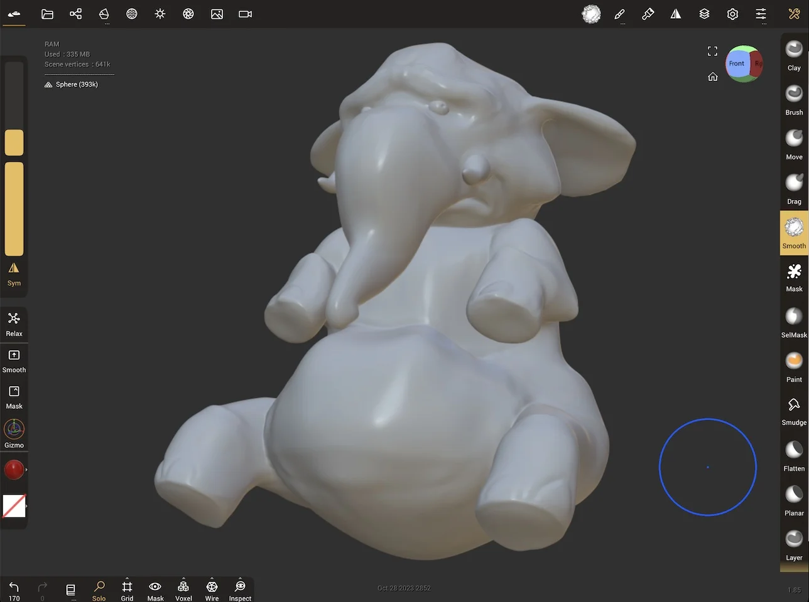
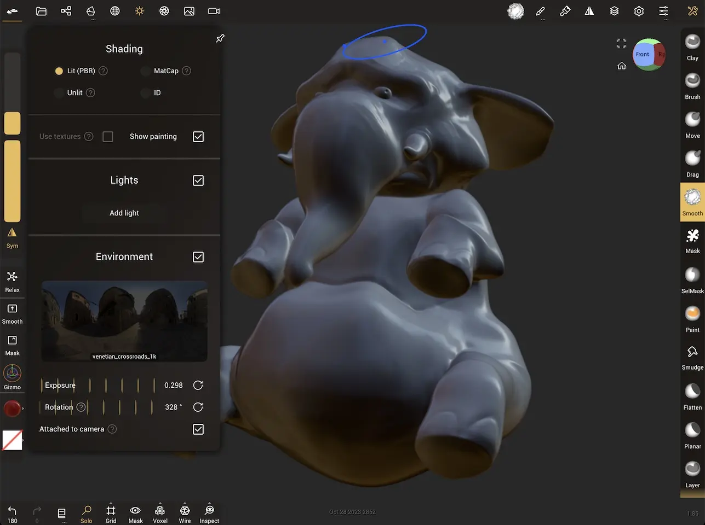
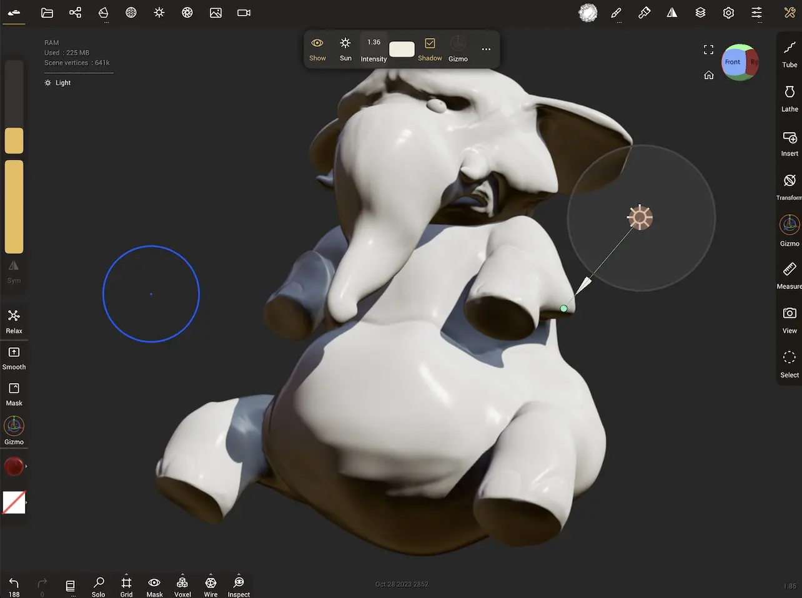
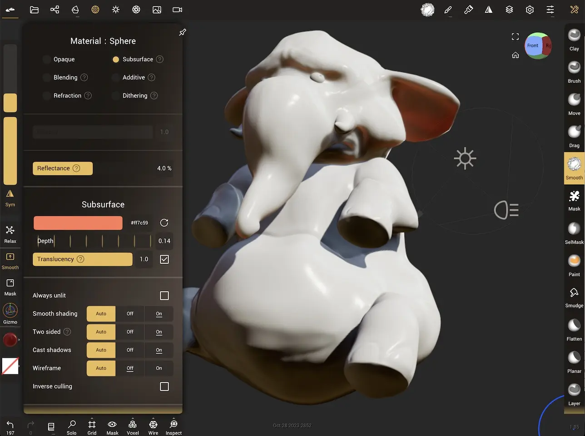
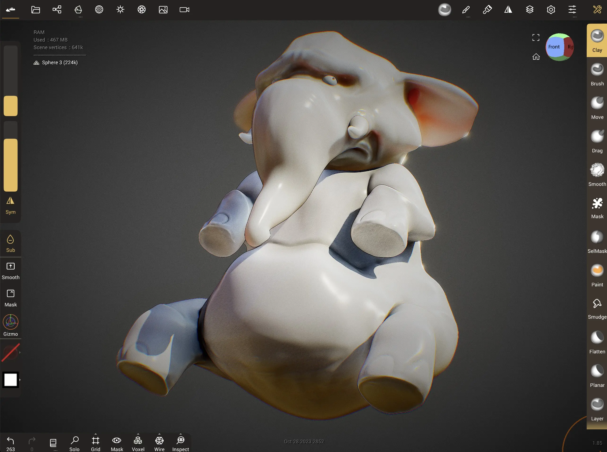

#  Tips

[[toc]]

## How to start a model

Beginners in 3d sculpting often ask which is the best way to start a model. There is no best way, different people have different preferences. Here's some of the more common approaches.

### Sculpt on sphere, multires

The default model when Nomad launches is the most common way. Use the move, clay, crease tools to push and pull the sphere into shape, use the lower subdivision levels when you want to make big changes quickly, user higher subdivision levels for detail work.

A common issue is you'll often run out of polygons where you need them, while you have too many polygons elsewhere. Eg if you push the default sphere into a full body, its likely you won't have enough detail to do the fingers, while you'll have lots of wasted polygons on the back of the head. For mostly spherical shapes like a head though, this can be fine.

### Dyntopo

Enabling Dyntopo will adaptively add and remove polygons as you sculpt. These polygons will be triangles, and beginners often don't like the messy layout compared to the clean look of multires. It's worth persisting! If you turn on smooth shading, turn off wireframe and stop worrying about the layout, this mode can give a very clay like feel. Don't forget that if you use a large brush, or a smooth brush, this mode can also remove polygons, so the tool always feels fast and responsive. Once you have a first pass of the sculpt finished, you can clone it and run it through quad remesher to get a nice layout, and reproject the original details onto a high subdivision level.

### Voxel remesh

Voxel remesh will apply a mostly quad based topology on your sculpt. This operation is quick at lower resolutions, and can be used to quickly replace stretched polygons or overly dense polygons with an evenly spaced layout. This can be a great way to start a full body from a sphere; say you start with a head, you can stretch out a neck, voxel remesh. Stretch out a body, voxel remesh, arms, voxel remesh, and so on, until you have the basic forms.

### Use multiple objects

Many anatomy guides will represent a body out of simple spheres, cylinders, cubes. You can also sculpt this way in Nomad. This has the advantage of allowing you to parent objects together in the scene hierarchy, so you can rotate the neck and the head will follow, for example. Being able to use the gizmo tool for precise translation/rotate/scales is also very useful, and you can also set pivots per shape so they move exactly as you expect. When the basic blocks are in the right place, you can select them all and voxel remesh or boolean them into a single surface for more detailed sculpting.

A handy tip for this way of working is to start with a sphere, scale it into a stretched sausage, press pivot, click 'bottom', press pivot again. You now have a body part that can be cloned, translated along the length of the first sphere, cloned, rotated, cloned, slid, clone etc.. to layout a body quickly.

### Tubes

The tube tool is a great way to start a sculpt. Reptile tails, arms, legs, fingers, eyebrows, they can all be quickly sketched out with the tube tool, then easily edited afterwards. It also allows you to modify the cross section profile, allowing for fast shape changes. You can validate the shape to start sculpting on it, and voxel remesh it along with other objects to get a full body mesh.

### Use other apps

Some people prefer to start a model in other apps, thats also fine. Tools like Blender or Valence allow models to be started using low poly techniques, they can then be imported into Nomad for sculpting.

### Use the built in presets

From the project menu click `Preset...` in the top right. Here you will find several head and body shape presets from the Blender foundation. Select one you like, tap it again, add to your scene. 

### Use online models

There are many free models available online, eg polyhaven, sketchfab, turbosquid. Usually these models can be imported to Nomad, and ether sculpted on directly, or used as reference.

### No rules!

Ultimately you can use any combination of these techniques, or none at all! Nomad is very flexible in this regard, advanced users might use tubes to start with, then dyntopo, then combine with a downloaded foot, then quad remesh it all, then multires for final detail. Whatever works for you.

## Facegroups

The facegroup tool can be used for many things, as explained in this youtube video: https://youtu.be/qtjYcxS8f9s?si=HGWTG-NqXGstWehx

This is a text summary of the features covered in that video.

### Why facegroups?

Facegroups let you organise and select faces ('faces' and 'polygons' are used interchangeably in this manual). This is easier to explain compared to Nomad's other selection and organization tools. Nomad lets you create objects, name them, parent them, it's easy to create a structure of objects to define a room made up of floor, walls, chair, table and so on.

For a character you might do an initial block-out using separate objects for head, arm, leg, but once you merge all the pieces into a single mesh, this structure is lost. You can work on sub-sections of a character with masks, but it can get tiresome to keep painting a mask for the hands, then the nose, then the hands again.

This is where facegroups are useful. It lets you tag polygon faces with a color, and then be able to select and manipulate polys that have the same color. Note that facegroup colour and vertex colour are different things.

The closest analogy would be painting colors on a map, then later on being able to select countries or regions based on color.

For character heads you could paint zones to mark the eye sockets, nose, lips, chin, ears, then easily select those zones later. For hard surface and mechanical sculpting it can be useful to define panels and sections.

### Creating and editing facegroups

Facegroups can be applied with a brush, where each new stroke creates a new facegroup, or they can select the facegroup under the cursor and extend it. They can also be created using shapes.

* Dot, auto-pick enabled - a single drag will define a new facegroup colour and assign it to the faces you drag over. Every new drag will define a new facegroup. A tap will flood fill a new facegroup.
* Dot, auto-pick disabled - when the auto-pick button is in its 'sub' mode, nomad will select the facegroup under the cursor, and apply it during the rest of the drag. This is useful to refine facegroups without having to manually select them.

### Masking

When the mask tool is active, and the facegroup button is active on its toolbar, tapping a facegroup will mask it.

### Hiding

When the hide tool is active, and the facegroup button is active on its toolbar, tapping a facegroup will hide it.

### Organizing

As mentioned earlier facegroups can be used to organise your mesh without requiring you to make separate objects. You may not want to split a head into separate objects for nose, chin, ears, but it is very useful to have them defined via facegroups.

### UV regions

The UV Atlas tool will attempt to define seams automatically, but will sometimes put seams where you don't want them to. If facegroups exist on an object, and the facegroup option is active in the UV Atlas options, it will use the facegroup borders as UV seams instead.

### Quad remesher

The quad remesher plugin will usually flow edges nicely on your model, but you can use facegroups to help steer it when the facegroup option is enabled. This can make it easy to define a clean edge flow around eyes, a eyebrow ridge, lips, cheek fold for example.

### Filter with other tools

Many tools will have options to be facegroup aware, either from their primary tool menu, or via the stroke -> filtering menu. For example the smooth tool at strengths above 100% can aggresively smooth away detail within a facegroup, but keep the facegroup border relatively intact.

### Relax and smooth facegroup borders

The relax option within the facegroup tool does an excellent job of smoothing facegroup borders while keeping other features intact. This can be a great way to define smooth facegroup border regions before quad remeshing.

## Limitations on tablet/mobile

Current tablets and mobiles are very powerful, but have important differences to desktop computers and laptops:

### No active cooling

Computers have fans and/or large heatsinks to keep them cool, and are designed to run at high temperatures. Mobile hardware is usually designed for thinness first, not for helping to keep the internals cool. If Nomad is pushed to its highest quality settings (PBR lighting mode, complex materials, many objects, many post processing options enabled), this can both overheat the device and drain the battery very quickly. 

A better approach is to use a matcap lighting mode, and use a lower render multiplier (top of the post process menu). These choices will keep the device cool and allow you to sculpt for longer.

### Limited memory

Nomad can achieve results equal to most desktop sculpting apps, but it can't bend the laws of physics! Most desktop computers have double the memory of mobile devices, workstations built for 3d animation often have 4x or 8x the memory. Because of this, it is good to be aware of how many polygons you're using, run some tests on your device to see when it starts to get laggy. Nearly all devices that can run Nomad can handle 1 million polygons pretty easily. An M2 Ipad Pro can handle 8 million comfortably, people have tested on the latest Ipads going well above that.

That said, only the most detailed of sculpts need more than 4 million polys; if you're making relatively simple objects and find yourself often going above 500,000, 1 million, 4 million, you're using too many polygons! Make sure you have smooth shaded mode enabled in the options.

### OS is less forgiving with intensive apps

Apple and Android expect apps will save and load small files very quickly. They also assume apps can task switch very quickly. Again Nomad does some clever tricks to keep file sizes relatively small and save them very quickly, but if the mobile OS decides Nomad is taking too long, it will simply kill it before it's finished it's task. This is another reason to keep files on the smaller side; it's possible to work with 37 million poly sculpts as one user reported on discord, but it's not recommended!

## Working on small screens

Nomad is designed to work on tablets, but works well on phones as well. Sculpting on a small screen like a phone can be made easier with a few UI and workflow tweaks:

* A 4 finger tap will toggle the entire UI, giving you more room to sculpt.
* A 3 finger drag up and down will change the brush radius
* The UI scale can be made smaller to fit more buttons if you have good eyesight, or bigger if you have bad eyesight!
* The wider menus can get in the way of the sculpt sometimes, you can make them transparent and non-blurred to allow you to see the sculpt beneath the menu.
* If sculpting with a finger, use the offset option to move the brush center a little away from your finger.
* These and many more options can be found in the [Interface menu](./interface.md). 

## Inflate or peak deformer

Many 3d apps feature an inflate deformer, that will push all vertices along their normal by a controllable amount. While Nomad currently lacks deformers, it is possibe to emulate this behavior wtih the inflate brush:

* Select the inflate brush
* From the [Stroke menu](./stroke.md#stroke) change the stroke method to `Lock + Radius'
* Make the brush radius larger than your sculpt, zoom the camera back away from the sculpt if needed.
* Click then drag a stroke on the surface of your object; when the radius is bigger than the object, the entire shape will be inflated evenly by a fixed amount.
* Adjust the brush intensity to control the amount of inflation
* Use masking if needed to protect or reduce the effect of the inflate in certain areas.

## Remove lumps or 'pimples' from a voxel remesh operation

Voxel remesh is great for making evenly spaced polygons, but sometimes creates topology that will cause small lumps or pimples when smoothed. For example:

* Use the crease brush on the default sphere and make a swirl
* Voxel remesh with 'build multiresolution at 3'
* Smooth with high intensity
* artifacts appear (easier to see with a high contrast matcap material):

To fix via sculpting, try the `Stable smoothing` option in the smooth settings. This can handle the uneven topology layout of the voxel remesh, and get clean results.

To fix the topolgy itself, use a new primitive, or the quad remesh tools, or an external 3d modeller, and project detail from the original mesh to the new one via `Topology -> Misc -> Reproject`. 

## Daylight lighting

The default PBR render is, as its name suggests, physically based, which like an unprocessed digital photo can look a little washed out and flat. Nomad's lights and post processing can be used to make renders look more vibrant.

Here is a default render, lets see if we can make it look better:

Enabling post processing and tonemapping can add brightness and contrast:

To focus on the lights, the default environment light is good for sculpting, but can be improved for a final render. One way to think about this is to separate direct light (eg the sun) vs environment light (eg light from the blue of the sky, the ground). By reducing the environment light and rotating it, this starts to capture what the lighting should look like if the subject were in a shaded area:

A direct light can be added, and its intensity boosted to simulate harsh sunlight. Balancing this with the environment light will achieve a pleasing result:

Characters can benefit from swapping their material to subsurface, and placing a spotlight behind the character aiming at the ears to make them glow:

Then experiment with the rest of the post process settings! Global Illumination and Ambient Occlusion help with more realistic lighting. Curvature and Sharpen can help bring out more detail in the sculpt. Chromatic Aberration, Depth of Field, Grain, Bloom, Vignette help simulate camera effects. Note that as features are enabled, the lighting and other post processing values need to be adjusted to compensate.

Here's the render with a full set of post processing tweaks:
