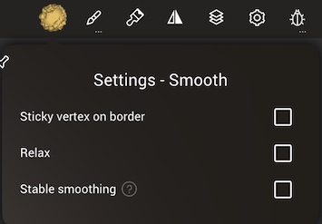
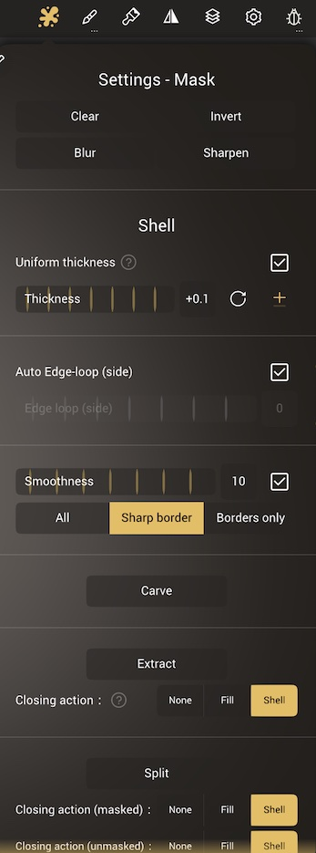

#  Tools

## Overview
Nomad has many tools that can be broadly categorized as follows:

* Brush tools that directly affect the surface of an object, eg [Clay](#Clay)
* Mask tools that will protect the surface from changes, eg [Mask](#Mask)
* Selection based tools where a 2d mask is drawn first, then an operation happens, eg [Trim](#Trim)
* Special tools with their own interaction methods, eg [Tube](#Tube)

Many of these tools can be customized with different brush behavior, pressure, textures etc via the [Stroke](stroke.md) menu. 

### Tool controls

The panel on the left side of the screen controls the tool radius and intensity, and hotkeys specific to certain tools, explained in each tool's help section below.

::: tip
The intensity slider for many tools can go above 100%, worth experimenting with!
:::

### Shape selector

The [Trim](#trim), [Split](#split), [Project](#project), [Facegroup](#facegroup) and [Hide](#hide) tools all use similar controls for selecting areas of the mesh, and are chosen with the shape selector panel on the left of the screen. 

* `Lasso` - A freehand drawn shape
* `Polygon` - An enclosed shape defined by a combination of curves and/or straight lines. See [Shape editing](#shape-editing) below for more info.
* `Curve` - (Project only) - A freehand curve for the projection
* `Path` - (Project only) - A curve defined by points. See [Shape editing](#shape-editing) below for more info.
* `Line` - Drag a line to define a planar segment. By default it will operate on the mesh immediately, turn off auto validate if you don't want this (long press or swipe on the line icon)
* `Rect` -  Drag a diagonal line, this will define the corners of a rectangle shape. Long press or swipe to reveal options for auto validate, force to a square shape, and for the first click to be the center of the rectangle.
* `Ellipse` - Drag a diagonal line, this will define the size of an ellipse. Long press or swipe to reveal options for auto validate, force to a circle shape, and for the the first click to be the center of the ellipse.
* `Flip` - invert the shape mask, or the direction of the project tool.

Most tools have an option to auto validate, meaning the operation will happen as soon as you have finished drawing the shape. When auto validate is off, A green button will be drawn next to the shape which will execute the operation. This allows you to edit the shape, adjust the view, when you're ready to use the shape, press the green button.

### Shape editing
Polygon editing and curve editing behave in similar ways:

* To start, drag a line to define 2 points, then drag out from the middle of the line to define a polygon or curve.
* Click on the points to toggle between smooth and sharp. 
* Click and drag on the curve or line sections to create new points.
* To delete a point, drag a point into its neighbor until it turns red.
* The trash icon in the corner of the polygon or path icon will delete the shape.

## Tool context menu

A right click or long press on a tool will bring up a context menu. This menu has the following options:

* `Save` - save any changes you made to the tool
* `Clone` - duplicate the tool into a new tool shortcut
* `Last save` - revert to the previously saved version of the tool
* `Icon` - change the icon for the tool
* `Reset` - reset the tool to its defaults

## Tools

|                                                                |                                                               |                                                                    |                                                   |
| -------------------------------------------------------------- | ------------------------------------------------------------- | ------------------------------------------------------------------ | ------------------------------------------------- |
|        [Clay](#clay)                 |    [Brush](#brush)                 |          [Move](#move)                   |     [Drag](#drag)       |
|      [Smooth](#smooth)             |     [Mask](#mask)                   |  [Selector Mask](#selector-mask) |    [Paint](#paint)     |
|      [Smudge](#smudge)             |  [Flatten](#flatten)             |        [Planar](#planar)               |    [Layer](#layer)     |
|      [Crease](#crease)             |     [Trim](#trim)                   |         [Split](#split)                 |  [Project](#project) |
|     [Inflate](#inflate)           |    [Pinch](#pinch)                 |         [Nudge](#nudge)                 |    [Stamp](#stamp)     |
|  [Delete Layer](#delete-layer) |     [Tube](#tube)                   |         [Lathe](#lathe)                 |   [Insert](#insert)   |
|   [Transform](#transform)       |    [Gizmo](#gizmo)                 |     [FaceGroup](#facegroup)         |     [Hide](#hide)       |
|     [Measure](#measure)           |   [Quad Remesher](#quad-remesher) |        [Select](#select)               |     [View](#view)       |

###  Clay
The Clay tool is useful for building up your sculpture. `Sub` will remove material from your sculpture.

###  Brush
The standard brush. `Sub` will remove material.

###  Move
The area under the brush will stick to the brush, allowing for elastic deformation. The selection is maintained during the move, so if you move the brush away, then move it back where you started, you will see no deformation.
`Normal` will move the area under the brush along the surface normal.

This brush is good for both large scale deformation and careful small deformation.

###  Drag
The area under the brush will stick to the brush, allowing for elastic deformation. Unlike the move brush, the selection is continuously updated during the stroke, so it is possible to make longer, snake like objects, especially when Dynamic Topology is activated.
`Normal` will move the area under the brush along the surface normal.

This brush is good for more loose, gestural shape changes.

###  Smooth
Smooth the area by average the point positions. This tool is highly dependent on the polygon density.
So if you have many polygons, the smoothing will be less effective.

The alternate mode is the `Relax` mode, which only smooths the wireframe but tries to retain the geometric details.

#### Smooth settings

* `Sticky vertex on border` - For meshes with open edges, eg a plane, it is possible to smooth out the corners. Enabling this option will lock the open edges.
* `Relax` - the same as the relax alternate mode in the left hand toolbar.
* `Stable smoothing` - Tries to make the smoothing topology independent. This works best with varying topology density and with a high smoothing intensity value.

::: tip
Higher polygon densities can require raising the intensity above 100%. Very high values (300%, 500%) can also work well as a sculpting tool, forcing areas to go flat and smooth quickly under the brush, like hitting clay with a mallet!
:::

###  Mask
This tool lets you mask points.
Masked vertices can't be sculpted or painted afterwards, this is a way to "protect" areas. `Unmask` will erase where the mask has been painted.

#### Mask settings

 A toolbar will appear at the top of the viewport with extra controls:

| Action  | Description           |
| :-----: | :-------------------: |
| Clear   | Clear the mask        |
| Invert  | Invert the mask       |
| Blur    | Blur the mask edge    |
| Sharpen | Sharpen the mask edge |

##### Shell/Extraction

Masks can also be used to extract geometry. The `Carve`, `Extract` and `Split` buttons will create new shapes from the masked region. The following settings offer more control:

* `Uniform thickness` - Sets the height of the extraction. When disabled, the mask strength is multiplied by the thickness slider, allowing for varying height. This can be useful if you have custom made [Alphas](stroke.md#alpha) and you are using the `Grab - dynamic radius` [stroke type](stroke.md#stroke-type). 
* `Thickness` - The distance of the extraction. Use the ± button to set the distance to be positive, negative, or centered from the surface.
* `Auto Edge-loop (side)` - Will calculate the amount of divisions on the sides of the extracted shape to make square polygons that match the polygons of the masked area. When disabled, you can set the number of edge loops yourself with the edge loop slider.
* `Smoothness` - Will smooth the border of the extracted shape, it works better with higher polygon counts. 
* `All/Sharp border/Borders only` - Smoothing can work in all directions, smoothing both the sides and top of the extracted shape, or smooth the top and sides but maintain a sharp edge, or only smooth the border, leaving the top surface unaffected.
* `Carve` - In default mode, behave a if you had trimmed into the surface by the 'thickness' amount, like cutting a section of orange peel. 
* `Extract` - In default mode 'shell' mode, behave like an extrude in other 3d apps, pulling the mask section out from the surface.
* `Closing action` - How extract should behave. 'None' will duplicate the masked polys into a new shape. 'Fill' will do the same, and try and patch the back surface. 'Shell' will extrude to the amount set in 'thickness'.
* `Split` - Will extract the masked region into a new shape, but also apply an operation to the unmasked region. By default ths operation is 'shell', resulting in a fat extruded mask and a matching unmasked shape.
* `Closing action` - Control what the masked and unmasked zones will do, identical to the closing actions explained earlier.
* `Sync border` - Ensure the border between the masked and unmasked extracted shapes stay close together. When disabled, because the shell operation will extrude each face along its normal, a gap can form between the shapes.

##### Quick gesture
You can perform zbrush-style gestures while holding the quick masking button:
| Action  | Gesture (hold lower-left shortcut) |
| :-----: | :--------------------------------: |
| Invert  | Tap on the background              |
| Clear   | Drag on the background             |
| Blur    | Tap on masked area                 |
| Sharpen | Tap on unmasked area               |

###  Selector Mask
This tool is mostly similar to the [Masking tool](#mask), the main difference is that you don't use stroke to paint mask, but instead use the shape selector.

Selector mask shares the same tool settings as the `Mask` tool.

###  Paint
To learn more about material you can visit the [Painting](painting.md) section. `Erase` will remove paint.

#### Paint settings
* `Layer fitering` - This functions like the alpha lock in photoshop or procreate. If you're painting on a layer, when this is enabled, you can only modify where paint already exists; unpainted areas will be protected.

###  Smudge
The smudge tool is only active on painting. It's settings menu contains a `Quality` slider, lower values mean faster strokes.

###  Flatten
Flatten the area by projecting the points onto the average plane. `Fill` will define a plane set by the highest point, and tend to pull points up.

#### Flatten settings

* `Lock plane direction` - Use the plane direction calculated at the first click. By default this is disabled.
* `Lock plane origin`- Use the first click as the center of the plane. By default this is disabled.

When either or both of these are disabled, the flatten can be gradually deepened or the plane angle altered by using long strokes that move over different depths and curvatures. This in conjunction with the area sampling options of the brush menu can offer very precise control.

###  Planar
Make points planar by projecting onto the average plane, but with less buildup than the flatten brush. This creates cleaner hard-edge surfaces. Quick strokes will push and pull on the surface more, slower strokes that start from already planar areas and work out will maintain the plane more. `Fill` will define a plane set by the highest point, and tend to pull points up.

Planar is actually the same tool as `Flatten`, but with `Lock plane direction` enabled, meaning it will tend to make more stable, hard edged surface, while flatten can be more sculptural and used to create semi-flat areas.

###  Layer
Sculpt by limiting the maximum height displacement, this tool is more useful when a layer is active. `Sub` will use a minimum depth displacement, creating grooves.

###  Crease
Crease tools can be useful to sculpt small cuts or dents. `Sub` will create a raised crease.

#### Crease Settings

* `Pinch factor` - How much to pull vertices sideways towards the brush. If pinch is at 1, and offset at 0, the surface won't have any depth changes, just topology changes, pulling edges towards the stroke.
* `Offset factor` - How much to push/pull vertices in depth. If pinch is at 0, and offset at 1, deep creases or raised dents will be made, but will look jagged because not enough geo is pulled towards the crease to define the sides or the bottom of the crease accurately.

###  Trim
The Trim tool works by removing a chunk of your mesh, and gives options for how to process the gap left behind.

#### Trim settings

* `Fill holes` - If the trimmed area should be patched or not.
* `Stroke painting` - If paint is enabled in the paint menu, the patched region will be filled with the selected color.
* `Fill/Boolean/Legacy` - Fill will use a triangulated patch, similar to a soap bubble surface. Boolean will create a quad poly region, projecting the trim shape from the camera. Legacy will create a triangulated region, projecting the trim shape from the camera.
* `Detail` - The approximate size of the triangles or polys used during the trim operation.

###  Split
Similar to the [Trim](#trim) tool, except that it produces two different objects instead of one.

#### Split settings

* `Fill holes` - If the split areas should be patched or not.
* `Stroke painting` - If paint is enabled in the paint menu, the patched region will be filled with the selected color.
* `Fill/Boolean/Legacy` - Fill will use a triangulated patch, similar to a soap bubble surface. Boolean will create a quad poly region, projecting the split shape from the camera. Legacy will create a triangulated region, projecting the split shape from the camera.
* `Detail` - The approximate size of the triangles or polys used during the split operation.

###  Project
The Project tool will project the points on a shape that you draw, but unlike the [Trim](#trim) tool, the topology is kept intact.

###  Inflate
Move the vertices along their own normals. `Sub` will move vertices along their inverted normal.

###  Pinch
This tool can be used to sharpen edges. `Sub` will spread vertices apart.

###  Nudge
Move points along the stroke.

###  Stamp
This is simply the [Brush tool](#brush) with a stroke type set to `Grab - dynamic radius`. `Sub` will push the stamp in rather than pull it out from the surface.

###  Delete Layer
This tool can reset layers locally, you need an active layer otherwise nothing will happen.

###  Tube
Create a tube by drawing a curve. 

Once the tube is created, the path can be edited in 3d space using similar controls to the standard [Shape editing](#shape-editing) and curve editing tools. A toolbar will appear at the top of the viewport with extra controls:

* `Validate` - bake the curve into regular polygons so it can be sculpted.
* `Edit` - display the curve points so they can be manipulated
* `Mirror` - add a mirror repeater as a parent of this curve
* `Snap` - snap curve points to nearby surfaces
* `Closed` - Join the start and end of the curve to form a loop
* `Radius` - Cycle between a uniform radius, a radius at the start and end, or a radius per curve point. These are edited with orange handles on the curve.
* `Twist` - Cycle between no twist, a uniform twist, a twist at the start and end, or a twist per curve point. These are editing with pink handles on the curve.
* `Profile` - Cycle between no profile (so a circle profile), a uniform profile, a profile at the start end end, or a profile per point.
* `Profile edit` - Display a profile editor. This functions similar to the [Shape editing](#shape-editing) tools, can save and load profile presets, and has a toggle to allow you to edit the profile in 3d space.
* `B-spline` - Toggle between Catmull-rom and B-spline interpolation.
* `...` - Advanced options for the tube polygon density, spiral controls, if the snap should be offset from nearby surfaces, and to clone the tube's curve as a repeater curve.

###  Lathe
Create a revolution surface by drawing a curve.

###  Insert
Insert an object in the scene.  
When the insertion takes place, Nomad switches automatically to the [Transform tool](#transform) for quick adjustment and then switches back the [Insert](#insert) tool when you release your fingers.

If an object is using a custom gizmo pivot, then it will be used as an anchor point for the insertion, see video below.

###  Transform
Move/Rotate/Scale a model directly with 1 and 2 fingers. 

The tool is controlled with the left toolbar, and has 4 buttons:

* `Snap` - snap the model onto other surfaces
* `Move` - Single finger drag will move the object. When snap is active, this will slide the object along the surface under your finger.
* `Rotate` - Single finger drag will rotate the object. When snap is active, will rotate around the normal of the surface under your finger.
* `Scale` - Single finger drag will scale the object.

Transform can be used to operate 2 of these modes quickly by using 2 fingers:

* Drag an object to place it. Stop moving your first finger, but don't lift it from the screen.
* Touch your second finger on the screen while keeping the first finger down. As the second finger is dragged, the object will scale.
* Lift the second finger, and continue to drag the first finger, the object will be in move mode again.

You can also change the second mode with a second finger tap gesture:

* Drag the object to place it, stop moving, but don't lift your finger from the screen.
* Tap your second finger while holding the first finger down
* The tool is swapped to rotation mode. Drag your first finger to set the rotation.
* Tap the second finger as before, the tool is swapped back to move mode.

This presents a fast workflow for cloning objects over another, eg rocks over a landscape. Notice that the clone button is also in the left toolbar for easy access:

* Use the transform tool to move a rock into place.
* Let go, press the clone button
* Move this rock, rotate/scale as needed
* Let go, press the clone button
* Move this rock, repeat.

###  Gizmo
This tool lets you move, rotate and scale your mesh with a single tool. It also lets you do certain operatations on the scene hierarchy.

The viewport handle has the following features:

* `Move` - Drag on the line+arrow to move on X/Y/Z. Drag on the peach dot in the middle of the gizmo to translate freely in screen-space. Click on the red, green, blue squares to translate on the X/Y/Z planes.
* `Rotate` - Drag on the red/green/blue circles to rotate on X/Y/Z. Drag the sphere within the circles to free rotate.
* `Scale`- Drag on the outer red/green/blue dots to scale on X/Y/Z. Drag on the outer red/green/blue cones to scale on the X/Y/Z planes. Drag on the outer peach circle to uniform scale.

#### Nodes and vertices 

Every object in Nomad is made of a node and vertices:

* `Node` - The 'handle' of the object, which stores its translation, rotation, scale, called its transformation matrix.
* `Vertices` - The points that define the surface of an object, they store position and paint information.

If you have a simple box made up of 8 vertices, you could translate it by modifying its transformation matrix, or by modifying the vertex positions. When sculpting you usually want to modify the vertices, when moving objects with the gizmo, you usually want to modify the node. Nomad lets you do both. 

#### Left menu toolbar

The left hand toolbar controls if the gizmo will work on the node or the vertices, as well as other functions:

* `Clone` - Make a standalone copy of the current object, which can be dragged away with the gizmo.
* `Instance` - Make an instance copy pf the current object. The objects are linked, so sculpting changes on one object will appear on all the instanced objects.
* `Group/Object/Vertex/Auto` - Will set if the gizmo will affect the node or the vertices of an object. The default 'auto' mode will attempt a best guess. If there are several objects parented together in a hierarchy, 'Object' will only move the current object, child objects will remain stationary. The gizmo can also take masking and symmetry into account.
* `Pin` - By default the gizmo will move to the pivot of the selected object. When pin is enabled, the gizmo will stay where it currently is.
* `Align` - Toggle the pivot being aligned with the current object, or being aligned with the world.
* `Snap rotation` - Enable rotation values being snapped to increments, the snap value is displayed and can be edited when snap is active.
* `Snap translation` - Enable translation values being snapped to increments, the snap value is displayed and can be edited when snap is active.
* `Pivot` - When enabled, the gizmo can be moved and rotated without moving the object. It has an extra menu explained below.

#### Pivot
When pivot mode is active, a menu is displayed to allow quick pivot changes:

**Reset** 
* `Center` - Move the pivot to the center of the object
* `Bottom` - Move the pivot to the bottom of the object
* `Align` - Reset the rotations to be aligned to the world.
* `Mask` - Move the pivot to the center of the unmasked region.

**On Tap**
* `None` - do nothing when the object is tapped
* `Normal` - Move and rotate the pivot to align to where the surface is tapped
* `First` - Move (but don't rotate) the pivot to where the surface is tapped
* `Medial` - Move the pivot to the middle of the object, under where the surface is tapped.

#### Gizmo settings

* `Move origin` - Move the object to the center of the scene, called the origin.
* `Reset` - A shortcut that sets the translation values to 0, rotation values to 0, scale to 1, moving and rotating the object.
* `Bake` - Freeze the object where it currently is, and set the translate/rotate values to 0, scale to 1.

* `Translation` - the translate X, Y, Z values
* `Rotation` - the rotate X, Y, Z values
* `Scale` - The uniform scale if that is enable, or the scale X, Y Z if disabled.
* `Uniform scale` - Toggle the ability to scale uniformly or independantly on each axis

* `Compact` - toggle the gizmo layout to put the extra handles outside or inside the rotation sphere
* `Widget size` - the size of the gizmo
* `Thickness` - the size of the lines on the gizmo
* `Hide on interaction` - toggle if the gizmo should be temporarily hidden when being dragged

* `Tangent roll threshold` - Control how the rotation UI behaves when dragging on the circle handles to rotate on X/Y/Z. If this value is 0, rotating works like a dial, drag the gizmo in circles. If this value is 90, rotating works like pulling the string of a yo-yo; drag in a straight line towards or away from where you first clicked. Values between 0 and 90 will do a combination of both; below the value will be the linear move, above the value will be circular move.
* `Numerical input` - when enabled, a single tap on the gizmo will pop up a window to enter an exact value for the tapped widget axis.

::: warning
The [Gizmo](#gizmo), [Translate](#translate), [Rotate](#rotate) and [Scale](#scale) are using their own symmetry checkbox!

And by default, the symmetry is turned off.
:::

On the left you can move the gizmo pivot, you can see the video below in action.
This is especially useful for the rotation, as it doesn't change anything for translation.

###  Facegroup

Facegroups let you organise your object into differently colored faces. You can use these groups in many ways in Nomad:

* A quick selection method for masks
* Hide/show sections of your object
* Organize your object without having to split it into separate parts
* Define uv regions
* Guide the quad remesher
* Additional control for tools like smooth.

Its controls are in the left hand menu:

* `Patch ` - Display the available facegroups as patches. Unused patches can be deleted. Tap on a patch to rename or change its color. The plus icon lets you create new patches.
* `Dot` - Paint on the object to define facegroups. When '+ Face Group' is enabled, every new stroke will automatically create a new facegroup, useful for quickly defining regions. A tap will flood fill the selected regon. The slider sets the radius of the dot.
* `Relax` - Smooth the borders of facegroups. Very useful for defining clean edges for quad remeshing, or for defining panels for hard surface modelling. The sliders control the radius and intensity of the relax operation.
* `Shape selector` - Create facegroups with shapes instead of a brush, via `Lock+Radius`, `Lasso`, `Polygon`, `Rect` and `Ellipse`. See [Shape Selector](#shape-selector) for more info.
* `Auto-pick` - When enabled, will select the patch where the stroke starts, and apply that patch for the rest of the stroke. Very useful for tidying up facegroup regions; if a facegroup has extended too far, enable auto-pick, start a stroke from where the facegroup patch is correct, and drag up to the border to reassign the correct patch.

###  Hide
Hide or isolate parts of the object. 

The primary modes are controlled from the left hand menu:

* `Dot` - Brush on the object to hide parts of the object.
* `Shape selector` -  Hide with shapes instead of a brush, via `Lasso`, `Polygon`, `Line`, `Rect` and `Ellipse`. See [Shape Selector](#shape-selector) for more info.
* `Show` - invert the operation, so the selected mode will show instead of hide parts of the object.

A toolbar will appear at the top of the viewport with extra controls:

* `Clear` - Restore the object, all hidden parts will be unhidden.
* `Invert` - Swap the hidden and unhidden parts.
* `Facegroup` - Use facegroups to quickly hide sections, tapping on a facegroup will hide the entire facegroup.
* `Mask` - If a mask is active, tapping this button will hide the masked section.
* `Delete` - Delete the hidden part of the object
* `Split` - Split the hidden part of the object into a new shape.

###  Measure
Drag to measure the distance between 2 points.

###  Quad Remesher

This tool will convert the selected object into a clean quad topology layout, with controls for density, edge flow, symmetry. 

::: tip
The quad remesher is available as an in-app purchase for iOS only. Android users can use 'Quad Remesh - Instant' available under the Topology -> Misc menu.
:::

When this tool is activated for the first time, it will ask if you want to enable it as an in-app purchase. Once active, the left and top toolbars will be enabled.

* `Dot` - This brush will set the target density. Intensity at 100% will paint in red, which will use twice the target quad density at those regions. Intensity at 0% will paint in cyan, which will use half the target quad density in those regions. Intensity at 50% will paint in gray, which will use the default target quad density.
* `Smooth` - Smooth the red/gray/cyan density transitions.
* `Curve` - Sketch curves on the surface of the sculpt, quad remesher will use these as guides for the edge flow. Tap on a curve to delete it.
* `Path` - Draw paths on the the surface of the sculpt, quad remesher will use these as guides for the edge flow. Tap on a path to delete it. 
* `Rect` - Draw rectangles on the the surface of the sculpt, quad remesher will use these as guides for the edge flow. Tap on a path to delete it.
* `Ellipse` - Draw ellipses on the the surface of the sculpt, quad remesher will use these as guides for the edge flow. Tap on a path to delete it.

A toolbar will appear at the top of the viewport with extra controls:

* `Remesh` - Click this to start the quad remesher process.
* `Quads` - Set the target quad count by sliding left and right, or tap to set an exact number. Note that this is a guide more than a fixed number, the various controls on the quad remesher will often mean the result will not exactly match this target.
* `Guides` - indicate the total number of guides, or tap to delete all guides.
* `Density X` - tap to remove all density painting.
* `Density (painting)` - toggle to use or ignore density painting.
* `Face Group` - toggle to use or ignore facegroups to steer the quad remesher.
* `Relax` - toggle to automatically relax facegroup borders during quad remeshing. If your have already relaxed/smoothed your facegroup borders, disable this option.
* `Symmetry` - Toggle to enable a symmetrical result. Note that symmetry is always calculated around the world x-axis, so ensure your model is at the origin if you expect a symmetrical result.

The ... menu contains further options, note that the top toolbar has shortcuts for most of these:

* `Remesh` - Same as the `Remesh` button in the top toolbar
* `Target Quads` - Same as the `Quads` button in the top toolbar
* `Adaptive quad count` - toggle to enable using smaller quads in areas of high curvature, and larger quads in lower curvature.
* `Adaptive size` - Set the amount of adaptivity. 100% will alow maximum adaptive size, at 0% quads will be uniform.
* `Auto-Detect Hard Edges` - toggle to adapt the quad remesh layout to better follow sharp surfaces.
* `Density (painting)` - Same as the `Density (painting)` button in the top toolbar
* `Face Group` - Same as the `Face Group` button in the top toolbar

###  Select
Use the shape modes to select objects in the scene. `Unselect` will remove objects from the selection.

###  View
This "tool" does nothing in particular, this is simply a way to view the model without modifying your scene.
