#  Tools

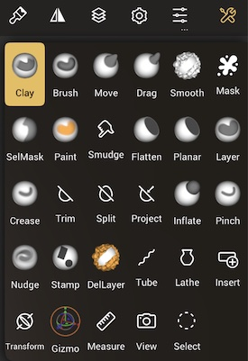

::: tip
Jump down to [Tools](#tools-1) for descriptions of the individual tools.
:::

## Overview

Tools are selected from the `Toolbox` on the right, and controlled with the `Tool Controls` on the left. Extra settings are found in the `Settings` menu, the first icon in the top-right menu.

Brush tools have controls for size and intensity. Selection tools have controls for several selection styles. The bottom of the tool controls has shortcuts for frequently used operations (Smooth, Mask, Hide, Gizmo, Color, Alpha).

Nomad's tools are colour coded in the toolbox:

* **Brush tools** (Clay, Brush, Smooth, Layer, Inflate, Nudge, Stamp, DelLayer)
* **Move tools** (Move, Drag)
* **Mask tools** (Mask, SelMask)
* **Paint tools** (Paint, Smudge)
* **Flatten tools** (Flatten, Planar)
* **Pinch tools** (Crease, Pinch)
* **Selection based tools** where a 2d mask is drawn first, then an operation happens (Trim, Split, Project)
* **Creation tools** (Tube, Lathe, Insert)
* **Transform tools** (Transform, Gizmo)
* **Misc tools** (Facegroup, Hide, Measure, Select)
* **View tool**

Many of these tools can be customized with different brush behavior, pressure, textures etc via the [Stroke](stroke.md) menu. 

### Brush controls

The left toolbar has sliders for radius and intensity, and then tool category specific controls, explained below.

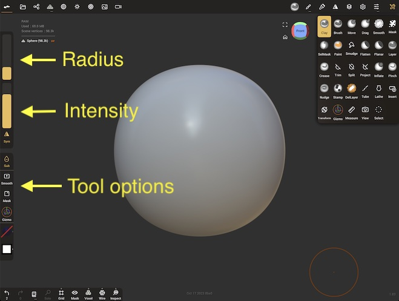

::: tip
The intensity slider for many tools can go above 100%, worth experimenting with!
:::

### Sub mode
The button directly below the intensity slider is the `Sub` button. It's label and function will change with every tool, and when pressed will invoke an alternate, usually opposite behavior. Eg for [Paint](#paint) it will invoke an Erase mode, for [Crease](#crease) it will create raised edges rather than creases etc.

By default it functions as a sticky button; ie you can hold it down to temporarily invoke it, when you let go it will be turned off. If you tap it, the sub mode will be permanently activated.

### Shortcuts
At the bottom of the left toolbar are shortcuts for [Smooth](#smooth), [Mask](#mask), [Hide](#hide), [Gizmo](#gizmo), [Color](painting.md#pbr-sliders), [Alpha](stroke.md#alpha) . 

By default these all function as sticky buttons; ie you can hold it down to temporarily invoke it, when you let go it will be turned off. If you tap it, that shortcut mode will be permanently activated.

### Selection controls

The [Selection Mask](#selection-mask), [Trim](#trim), [Split](#split), [Project](#project), [Facegroup](#facegroup) and [Hide](#hide) tools all use similar controls for selecting areas of the mesh.

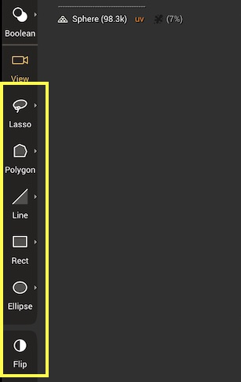

* `Lasso` - A freehand drawn shape
* `Polygon` - An enclosed shape defined by a combination of curves and/or straight lines. See [Shape editing](#shape-editing) below for more info.
* `Curve` - (Project only) - A freehand curve for the projection
* `Path` - (Project only) - A curve defined by points. See [Shape editing](#shape-editing) below for more info.
* `Line` - Drag a line to define a planar segment. By default it will operate on the mesh immediately, turn off auto validate if you don't want this (long press or swipe on the line icon)
* `Rect` -  Drag a diagonal line, this will define the corners of a rectangle shape. Long press or swipe to reveal options for auto validate, force to a square shape, and for the first click to be the center of the rectangle.
* `Ellipse` - Drag a diagonal line, this will define the size of an ellipse. Long press or swipe to reveal options for auto validate, force to a circle shape, and for the the first click to be the center of the ellipse.
* `Flip` - invert the shape mask, or the direction of the project tool.

Most tools have an option to auto validate, meaning the operation will happen as soon as you have finished drawing the shape. When auto validate is off, A green button will be drawn next to the shape which will execute the operation. This allows you to edit the shape, adjust the view, when you're ready to use the shape, press the green button.

### Shape editing
Polygon editing and curve editing behave in similar ways:

* To start, drag a line to define 2 points, then drag out from the middle of the line to define a polygon or curve.
* Click on the points to toggle between smooth and sharp. 
* Click and drag on the curve or line sections to create new points.
* To delete a point, drag a point into its neighbor until it turns red.
* The trash icon in the corner of the polygon or path icon will delete the shape.

### Settings menu

Many tools have extra setttings that are found in the settings menu, the first icon in the top right menu:

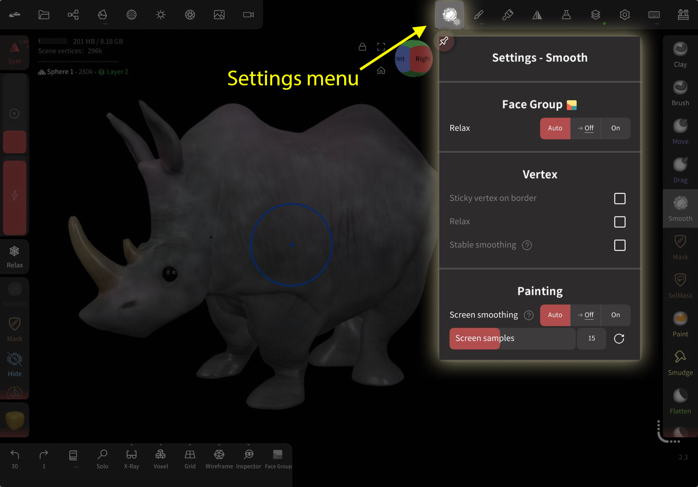

## Tools

|                                                                    |                                                    |                                                                  |                                                        |                                                           |                                                                    |
| :----------------------------------------------------------------: | :------------------------------------------------: | :--------------------------------------------------------------: | :----------------------------------------------------: | :-------------------------------------------------------: | :----------------------------------------------------------------: |
|         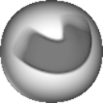        [Clay](#clay)         | 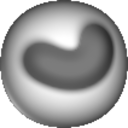    [Brush](#brush)  |       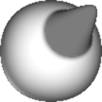          [Move](#move)       |    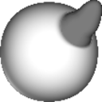     [Drag](#drag)     |  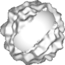       [Smooth](#smooth)  |                [Mask](#mask)          |
|    [Sel Mask](#selector-mask) | 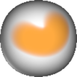     [Paint](#paint) |            [Smudge](#smudge)      | 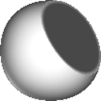   [Flatten](#flatten) |          [Planar](#planar) |             [Crease](#crease)       |
|         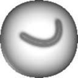     [Pinch](#pinch)         |        [Trim](#trim)  |               [Split](#split)      |    [Project](#project)    |         [Layer](#layer)     |     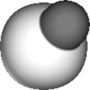      [Inflate](#inflate)      |
|      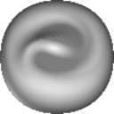          [Nudge](#nudge)       |      [Stamp](#stamp) | 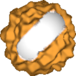   [Del Layer](#delete-layer) |          [Tube](#tube)    |            [Lathe](#lathe)  |            [Insert](#insert)        |
|       [Transform](#transform)    |      [Gizmo](#gizmo) |       [FaceGroup](#facegroup)  |          [Hide](#hide)    |       [Measure](#measure) |     [Quad Remesher](#quad-remesher) |
|              [Select](#select)      |        [View](#view)  |                                                                  |                                                        |                                                           |                                                                    |

------

###  Clay
The Clay tool is useful for building up your sculpture. `Sub` will remove material from your sculpture.

###  Brush
The standard brush. `Sub` will remove material.

###  Move
The area under the brush will stick to the brush, allowing for elastic deformation. The selection is maintained during the move, so if you move the brush away, then move it back where you started, you will see no deformation.

The sub mode is `Normal`, and will move the area under the brush along the surface normal.

This brush is good for both large scale deformation and careful small deformation.

#### Move Settings

* `Radius (Background)` - How far away from the edge of a model you can be and still sculpt, useful when working on the silouette of an object. 
* `Same-side vertex only` - Ignore verticies that point in the opposite direction of the deformation.

###  Drag
The area under the brush will stick to the brush, allowing for elastic deformation. Unlike the move brush, the selection is continuously updated during the stroke, so it is possible to make longer, snake like objects, especially when Dynamic Topology is activated.

THe sub mode is `Normal`, and will move the area under the brush along the surface normal.

This brush is good for more loose, gestural shape changes.

#### Drag Settings

* `Radius (Background)` - How far away from the edge of a model you can be and still sculpt, useful when working on the silouette of an object. 
* `Same-side vertex only` - Ignore verticies that point in the opposite direction of the deformation.

###  Smooth
Smooth the area by average the point positions. This tool is highly dependent on the polygon density.
So if you have many polygons, the smoothing will be less effective.

The sub mode is `Relax`, which only smooths the wireframe but tries to retain the geometric details.

#### Smooth settings

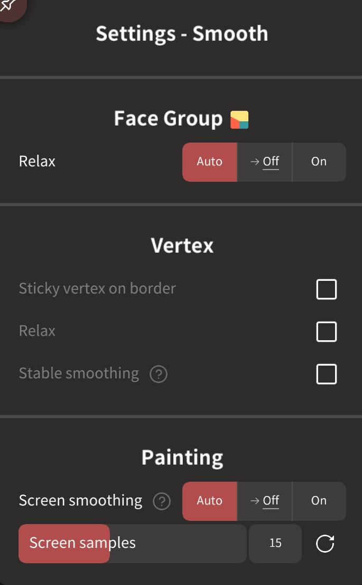

##### Facegroup

* `Relax` - Will smoooth the borders of facegroups. Use intensity greater that 100% to quickly smooth borders. `Auto` will smooth only if facegroup preview is enabled, `Off` will disable, `On` will enable. 

##### Vertex
* `Sticky vertex on border` - For meshes with open edges, eg a plane, it is possible to smooth out the corners. Enabling this option will lock the open edges.
* `Relax` - the same as the relax alternate mode in the left hand toolbar.
* `Stable smoothing` - Tries to make the smoothing topology independent. This works best with varying topology density and with a high smoothing intensity value.

##### Painting
* `Screen Smoothing` - Use this option to get topology independent smoothing, even at high poly counts.
* `Screen samples` - The quality of the smoothing, higher numbers will be be smoother, but slower.

::: tip
Higher polygon densities can require raising the intensity above 100%. Very high values (300%, 500%) can also work well as a sculpting tool, forcing areas to go flat and smooth quickly under the brush, like hitting clay with a mallet!
:::

###  Mask
This tool lets you mask vertices. Masked vertices are protected from sculpting or painting. 

The sub mode is `Unmask`, and will erase where the mask has been painted.

Similar to selections in 2d painting programs, masks can be painted with a brush, or made with shape selections, blurred or sharpened. 

Unlike 2d painting programs, they can also be made via facegroups, and masks can be used to create new geometry via extrusion/extraction style operations. 

 A toolbar will appear at the top of the viewport with extra controls. 

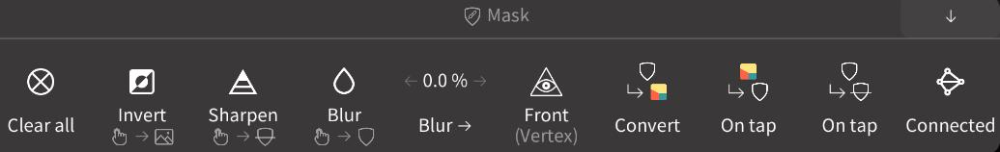

The title of the bar can be tapped to expand/collapse, or the arrow in the top right can be tapped to move it to the top or bottom of the UI.

| Action                                                        | Description                                                                                |
| :------------------------------------------------------------ | :----------------------------------------------------------------------------------------- |
|       Clear                     | Clear the mask                                                                             |
|                 Invert                 | Invert the mask                                                                            |
|                    Sharpen            | Sharpen the mask edge                                                                      |
|                     Blur                 | Blur the mask edge                                                                         |
| Blur ->                                                       | Drag left/right to interactively blur the mask                                             |
|                     Front             | Toggle to only mask front facing vertices                                                  |
| Convert                                                       | Convert the mask to a facegroup                                                            |
|              On tap (facegroup) | When enabled facegroups will be shown, tapping a facegroup will mask it                    |
| On tap (mask)                                                 | When enabled tapping an 'island' of mask or unmasked polygons will flood fill that island. |
|                   Connected            | When enabled only allow mask strokes to affect connected topology.                         |

##### Mask Quick gesture
You can perform zbrush-style gestures while holding the quick masking button in the left toolbar:
| Action  | Gesture (hold lower-left shortcut) |
| :-----: | :--------------------------------: |
| Invert  | Tap on the background              |
| Clear   | Drag on the background             |
| Blur    | Tap on masked area                 |
| Sharpen | Tap on unmasked area               |

#### Mask settings
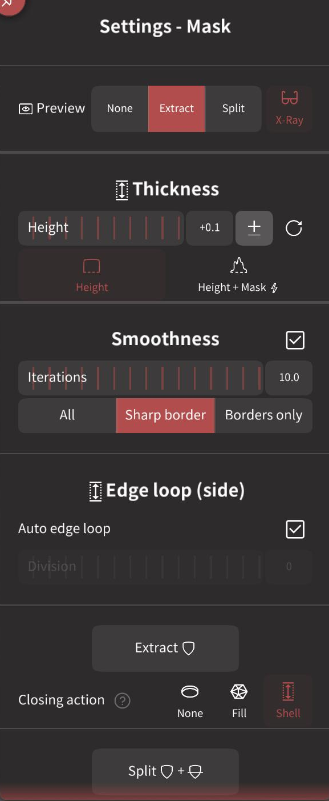

* `Preview` - The Mask settings menu is mainly used to create geometry from the mask. Because of this the default behavior is to preview what the new geometry will look like. You can choose to have no preview, an extract preview, a split preview, and if this geometry will be shown in x-ray mode.

##### Thickness
* `Height` - The height of the extracted shape. The Plus/Minus icon lets you  cycle between an outwards extrusion, or inwards, or centered. 
* `Height/Height+Mask` - Toggle between the height being constant, or if blurred parts of the mask should affect the height, allowing for soft and varying height shapes. 

##### Smoothness
When active, will smooth the border of the extracted shape, it works better with higher polygon counts. 
* `Iterations` - The amount of smoothing applied. High values will produce very smooth curved edges, but will start to drift from the mask shape.
* `All/Sharp border/Borders only` - Smoothing can work in all directions, smoothing both the sides and top of the extracted shape, or smooth the top and sides but maintain a sharp edge, or only smooth the border, leaving the top surface unaffected.

##### Edge loop (side)
* `Auto Edge-loop (side)` - Will calculate the amount of divisions on the sides of the extracted shape to make square polygons that match the polygons of the masked area. When disabled, you can set the number of edge loops yourself with the edge loop slider.

----

##### Extract
* `Extract` - Create the extracted geometry.
* `Closing action` - How extract should behave. 'None' will duplicate the masked polys into a new shape. 'Fill' will do the same, and try and patch the back surface. 'Shell' will extrude to the amount set in 'thickness', and is the default.

::: tip

If preview is in 'Extract' mode with 'X-ray' enabled, clicking the Extract button can be confusing at first. Because the menu is active, it will try and preview an extraction on your new shape, and xray the original surface. However because you have no mask on the new surface, it can't preview the extraction, and Nomad will warn you 'Nothing to Extract!'. 

This is normal, close the mask settings menu to view the new shape and the original, and select the original surface again if you need to clear the mask or draw new masks.
:::

##### Split
* `Split` - Will extract the both the masked AND unmasked regions into new shapes. 
* `Closing action (masked)` - How the mask extract should behave. 'None' will duplicate the masked polys into a new shape. 'Fill' will do the same, and try and patch the back surface. 'Shell' will extrude to the amount set in 'thickness', and is the default.
* `Closing action (unmasked)` - How the unmasked extract should behave. 'None' will duplicate the masked polys into a new shape. 'Fill' will do the same, and try and patch the back surface. 'Shell' will extrude to the amount set in 'thickness', and is the default.
* `Sync border` - Ensure the border between the masked and unmasked extracted shapes stay close together. When disabled, because the shell operation will extrude each face along its normal, a gap can form between the shapes.

##### Carve
* `Carve` - In default mode, behave a if you had trimmed into the surface by the 'thickness' amount, like cutting a section of orange peel. 

###  Selection Mask
This tool is mostly similar to the [Masking tool](#mask), the main difference is that you don't use stroke to paint mask, but instead use the [Selection Controls](#selection-controls).

The sub mode is `Unmask`, and will erase the mask using selection controls.

Selection mask shares the same tool settings as the `Mask` tool.

###  Paint
Apply color and material properties. To learn more about material you can visit the [Painting](painting.md) section.

The sub mode is `Erase` and will remove paint.

#### Paint settings
* `Layer fitering` - This functions like the layer alpha lock in photoshop or procreate. If you're painting on a layer, when this is enabled, you can only modify where paint already exists; unpainted areas will be protected.

###  Smudge
Smudge color and material proprties. The smudge settings menu contains a `Quality` slider, lower values mean faster strokes.

###  Flatten
Flatten the area by projecting the points onto the average plane.

The sub mode is `Fill` and will define a plane set by the highest point, and tend to pull points up.

#### Flatten settings

* `Lock plane direction` - Use the plane direction calculated at the first click. By default this is disabled.
* `Lock plane origin`- Use the first click as the center of the plane. By default this is disabled.

When either or both of these are disabled, the flatten can be gradually deepened or the plane angle altered by using long strokes that move over different depths and curvatures. This in conjunction with the area sampling options of the brush menu can offer very precise control.

::: tip
When working in ears of high curvature, eg trying to flatten the cheeks but the tool keeps affecting the sides of the nose, try creating a mask to protect areas the flatten brush shouldn't affect.
:::

###  Planar
Make points planar by projecting onto the average plane, but with less buildup than the flatten brush. This creates cleaner hard-edge surfaces. Quick strokes will push and pull on the surface more, slower strokes that start from already planar areas and work out will maintain the plane more.

The sub mode is `Fill` and will define a plane set by the highest point, and tend to pull points up.

Planar is actually the same tool as `Flatten`, but with `Lock plane direction` enabled, meaning it will tend to make more stable, hard edged surface, while flatten can be more sculptural and used to create semi-flat areas.

###  Crease
Crease tools can be useful to sculpt small cuts or dents.

The sub mode is `Invert`, and will create a raised crease.

#### Crease Settings

* `Pinch factor` - How much to pull vertices sideways towards the brush. If pinch is at 1, and offset at 0, the surface won't have any depth changes, just topology changes, pulling edges towards the stroke.
* `Offset factor` - How much to push/pull vertices in depth. If pinch is at 0, and offset at 1, deep creases or raised dents will be made, but will look jagged because not enough geo is pulled towards the crease to define the sides or the bottom of the crease accurately.

###  Pinch
This tool can be used to sharpen edges.

The sub mode is `Invert` and will spread vertices apart.

###  Trim
The Trim tool works by removing a chunk of your mesh, and gives options for how to process the gap left behind. It uses the [Selection controls](#selection-controls) to define the trim.

::: tip
Because this tool projects from the camera, you will get a warning if the camera is in perspective mode.

In orthographic mode the cut made through the mesh is parallel to the view, which is what people usually expect. When done with a perspective camera, the cut will look different on the far side of the object vs the near side.
:::

#### Trim settings

* `Stroke painting` - If paint is enabled in the paint menu, the patched region will be filled with the currently selected color.
* `Boolean` - fill the hole of the trim using a quad poly region. The filled region will be flat.
* `Legacy` - fill the hole of the trim with a triangulated region. The filled region will be flat.
* `Fill` - fill the hole with a triangulated region. The filled region will a curved surface, like the film of a soap bubble.
* `None` - do not fill the hole.
* `Boolean Detail Shape` - The approximate size of the quads and triangles used on the shape side of the trim.
* `Boolean Detail Hole` - The approximate size of the triangles or polys used on the filled hole of the trim. 
* `Legacy Detail` - The approximate size of the triangles used on the trim.
* `Legacy Hole smoothing` - How much the triangles are relaxed on the filled area.
* `Legacy Threshold espilon` - A value that can be adjusted to improve the legacy hole filling algorithm.
* `Fill Detail` - The approximate size of the triangles used on the trim.

###  Split
Similar to the [Trim](#trim) tool, except that while Trim discards the selection, Split will keep the selection as a new object.

#### Split settings

* `Stroke painting` - If paint is enabled in the paint menu, the patched region will be filled with the currently selected color.
* `Boolean` - fill the hole of the split using a quad poly region. The filled regions will be flat.
* `Legacy` - fill the hole of the split with a triangulated region. The filled regions will be flat.
* `Fill` - fill the holes with a triangulated region. The filled regions will curved surfaces, like the film of a soap bubble.
* `None` - do not fill the holes.
* `Boolean Detail Shape` - The approximate size of the quads and triangles used on the shape side of the split.
* `Boolean Detail Hole` - The approximate size of the triangles or polys used on the filled hole of the split. 
* `Legacy Detail` - The approximate size of the triangles used on the split.
* `Legacy Hole smoothing` - How much the triangles are relaxed on the filled area.
* `Legacy Threshold espilon` - A value that can be adjusted to improve the legacy hole filling algorithm.
* `Fill Detail` - The approximate size of the triangles used on the split.

###  Project
The Project tool looks like the [Trim](#trim) tool, but it does not delete or create any geometry, it just moves verticies to conform to the selection.

::: tip
If you use Project while in a layer, you can blend between the original and the projected shape with the layer slider.
:::

###  Layer
Raise the surface, but limit the height.

If you keep the pencil down and keep brushing over an area, the Clay and Brush tools will keep increasing in height, while Layer will raise to a certain height then go no further.

If you start a new stroke, it will build from the new surface height, which is usually not what people expect. Because of this, the tool is designed to work with Nomad's [Layers](layers.md) system.

If you create and select a layer, then use this brush, then the maximum height is set by the layer itself, so you can apply many brush strokes and the height will always be the same.

`Sub` will use a minimum depth displacement, creating grooves.

#### Layer Settings

* `Use layer data` - When active, and when a layer is selected, use the layer data to set the maximum height.
* `Inflate`- When active adjust the direction that layer works to get smoother results.
* `Relax (Normal)` - The amount of smoothing applied to the normals.

###  Inflate
Move the vertices along their own normals. `Sub` will move vertices along their inverted normal.

#### Inflate Setings
* `Relax (Normal)` - The amount of smoothing applied to the normals.

###  Nudge
Move or 'smear' points in the direction of the stroke.

###  Stamp
This is simply the [Brush tool](#brush) with a stroke type set to `Grab - dynamic radius`. `Sub` will push the stamp in rather than pull it out from the surface.

::: tip
Stamp usually works best with high resolution geometry. If you search online for 'wrinkles alpha', 'pores alpha', 'scales alpha' etc, these alpha textures and Stamp can be a great way to add organic detail to a character sculpt.
:::

###  Delete Layer
This tool can reset layers locally, you need an active layer otherwise nothing will happen.

###  Tube
Create a tube by drawing a curve. 
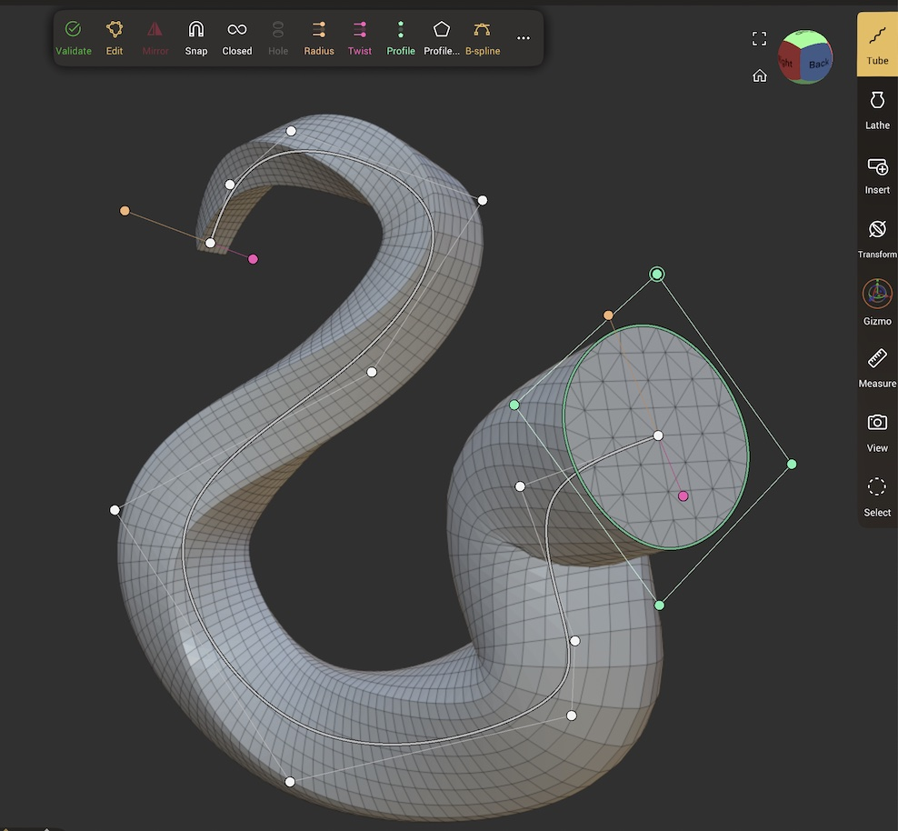

Once the tube is created, the path can be edited in 3d space using similar controls to the standard [Shape editing](#shape-editing) and curve editing tools. 

#### Tube left toolbar

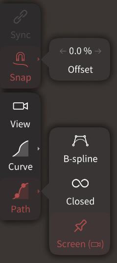

The left toolbar has the following options:

* `Sync` - If the current tube is instanced, and there are child nodes of the tube that differ between the instances, this will resync them.
* `Snap` - When active, the curve and path modes will snap onto other objects as you draw. When inactive, the first point will snap, then the rest of the tube will be drawn at that depth. It has a small flyout menu:
    * `Offset` - Set the depth of the snap; 0% will have the middle of the tube cross section snap to the surface, positive values will lift it from the surface, negative values will lower it.
* `Curve` - Freeform sketch a tube. It has a small flyout menu:
    * `Auto-validate` - Will create the tube as soon as the stroke is complete. When disabled, a green validate circle will be visible next to the curve path, press it to validate, or use the `Reset` link that appears in this menu to remove the path.
    * `Closed` - make the tube into a loop.
    * `Screen` - Available only when Auto-validate is disabled. When active, the path is 'pinned' to the screen, allowing you to move the view and the object, and the path stays in place. When inactive, the path is part of the 3d scene, and it will move with the camera and objects.
    * `Accuracy` - How many curve points will be used to convert the drawn path into a tube. 0% will use the lowest number of points, but will miss small curvature path changes. 100% will be very accurate, and use many points.
* `Path` - Create a tube by clicking to define curve points. Tap the green circle to validate the path. It has a small flyout menu:
    * `B-spline` - An alternate curve drawing method where curve points usually don't sit directly on the curve, but can make smoother results than the default method.
    * `Closed` - make the tube into a loop
    * `Screen` - When active, the path is 'pinned' to the screen, allowing you to move the view and the object, and the path stays in place. When inactive, the path is part of the 3d scene, and it will move with the camera and objects.

##### Tube top toolbar

Whe a tube is selected, a toolbar will appear at the top of the viewport with extra controls. Click the title of the toolbar to collapse/expand the toolbar, and click the arrow in the top right to move the toolbar to the top or bottom of the viewport.

* `Validate` - bake the tube into regular polygons so it can be sculpted.
* `Edit` - display the curve points so they can be manipulated
* `Mirror` - add a mirror repeater as a parent of this curve
* `Snap` - snap curve points to nearby surfaces
* `Closed` - Join the start and end of the curve to form a loop
* `B-spline` - Toggle between Catmull-rom and B-spline interpolation.
* `Cap` - Cycle between caps on both ends of the tube, or the start or end, or no caps.
* `Hole` - Add thickness to the tube, converting it into a pipe. Cycle between having a hole at both ends, at only the end, or no holes. 
* `Radius` - Cycle between a uniform radius, a radius at the start and end, or a radius per curve point. These are edited with orange handles on the curve.
* `Twist` - Cycle between no twist, a uniform twist, a twist at the start and end, or a twist per curve point. These are editing with pink handles on the curve.
* `Profile` - Cycle between no profile (so a circle profile), a uniform profile, a profile at the start end end, or a profile per point.
* `Profile edit` - Display a profile editor. This functions similar to the [Shape editing](#shape-editing) tools, can save and load profile presets, and has a toggle to allow you to edit the profile in 3d space.
* `Spiral` - Toggle a menu to add a spiral twist to the tube. This menu has options for `Twist Angle`, `Offset`, `Scale`, and `Angle offset`.
* `X Divisions` - the number of divisions around the tube, 4 divisions will make a square tube for example. 
* `Constant density` - when active, will keep the polygons square. when disabled, will allow you to set `Y divisions` along the length of the tube.
* `...` - Tube settings menu.

#### Curve point delete toggle

Below the toolbar is a curve point delete toggle. When you drag a curve point near another, it will turn red, indicating that if you let go, the point will be deleted. If you are doing small edits and you do not want to delete points, this button will disable the point delete behavior.

#### Tube settings
* `Primitive` - buttons to allow you to enable/disable UV's, or to validate the tube.
* `Post subdivision` - a shortcut to set the multiresolution level before validating.
* `Linear subdivision` - shortcut to set the linear subdivision level before validating. 
* `Division X` - same as X Divisions in the toolbar.
* `Division Y` - same as Y Divisions in the toolbar.
* `Curve (Repeater)` - convert the tube into a [Curve Repeater](scene.md#curve)

::: tip
Divisions at 4 and Post subdivision at 3 will make smooth round tipped tubes, good for worms, snakes, body parts.
:::

###  Lathe
Create a revolution surface by drawing a curve.

#### Lathe left toolbar

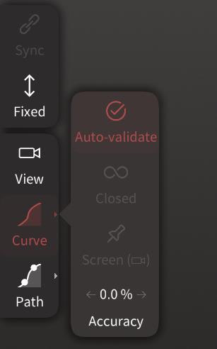

The left toolbar has the following options:

* `Sync` - If the current lathe is instanced, and there are child nodes of the lathe that differ between the instances, this will resync them.
* `Fixed` - When enabled, the center of the lathe is fixed and displayed on screen. This center line has edit points that can be adjusted. When disabled, the center of the lathe will dynmaically update to match to the start and end of the drawn curve.
* `Curve` - Draw the lathe profile in one stroke. It has a small flyout menu:
    * `Auto-validate` - When enabled, the lathe will be created when the pencil is lifted from the screen. When disabled, a green circle next to the curve can be pressed to create the lathe. The curve can be deleted with the `Reset` button.
    * `Closed` - Join the start and end of the curve to form a loop
    * `Screen` - Available only when Auto-validate is disabled. When active, the path is 'pinned' to the screen, allowing you to move the view and the object, and the path stays in place. When inactive, the path is part of the 3d scene, and it will move with the camera and objects.
    * `Accuracy` - How many curve points will be used to convert the drawn path into a tube. 0% will use the lowest number of points, but will miss small curvature path changes. 100% will be very accurate, and use many points.
* `Path` - Create a lathe by clicking to define curve points. Tap the green circle to validate the path. It has a small flyout menu:
    * `B-spline` - An alternate curve drawing method where curve points usually don't sit directly on the curve, but can make smoother results than the default method.
    * `Closed` - make the tube into a loop
    * `Screen` - When active, the path is 'pinned' to the screen, allowing you to move the view and the object, and the path stays in place. When inactive, the path is part of the 3d scene, and it will move with the camera and objects.

#### Lathe top toolbar
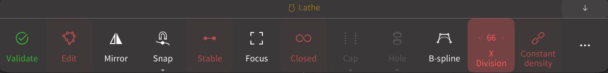

Whe a lathe is selected, a toolbar will appear at the top of the viewport with extra controls. Click the title of the toolbar to collapse/expand the toolbar, and click the arrow in the top right to move the toolbar to the top or bottom of the viewport.

* `Validate` - bake the lathe into regular polygons so it can be sculpted.
* `Edit` - display the curve points so they can be manipulated
* `Mirror` - add a mirror repeater as a parent of this lathe
* `Snap` - snap curve points to nearby surfaces
* `Stable` - When enabled, the curve profile will be parented to the center line of the lathe. When disabled, the center line can be edited and will not move the curve, allowing for more complex shapes.
* `Focus` - Will rotate the view to see the curve profile perfectly flat to camera.
* `Closed` - Join the start and end of the curve to form a loop
* `Cap` - If Closed is disabled, cycle between caps on both ends of the tube, or the start or end, or no caps.
* `Hole` - Add thickness to the lathe, converting it into a pipe. Cycle between having a hole at both ends, at only the end, or no holes. 
* `B-spline` - Toggle between Catmull-rom and B-spline interpolation.
* `X Divisions` - the number of divisions around the tulathebe, 4 divisions will make a square profile lathe for example. 
* `Constant density` - when active, will keep the polygons square. when disabled, will allow you to set `Y divisions` along the length of the tube.
* `...` - Lathe settings menu.

#### Lathe settings
* `Primitive` - buttons to allow you to enable/disable UV's, or to validate the tube.
* `Post subdivision` - a shortcut to set the multiresolution level before validating.
* `Linear subdivision` - shortcut to set the linear subdivision level before validating. 
* `Division X` - same as X Divisions in the toolbar.
* `Division Y` - same as Y Divisions in the toolbar.
* `Curve (Repeater)` - convert the curve profile into a [Curve Repeater](scene.md#curve)

###  Insert
Insert an object in the scene.  
When the insertion takes place, Nomad switches automatically to the [Transform tool](#transform) for quick adjustment and then switches back the [Insert](#insert) tool when you release your fingers.

If an object is using a custom gizmo pivot, then it will be used as an anchor point for the insertion, see video below.

###  Transform
Move/Rotate/Scale a model directly with 1 and 2 fingers. 

The tool is controlled with the left toolbar, and has 5 buttons:

* `Snap` - snap the model onto other surfaces
* `Group` - If the selected object has a combination of objects and instances, this allows you to determine the behaviour of the tool.
* `Move` - Single finger drag will move the object. When snap is active, this will slide the object along the surface under your finger.
* `Rotate` - Single finger drag will rotate the object. When snap is active, will rotate around the normal of the surface under your finger.
* `Scale` - Single finger drag will scale the object.

Transform can be used to operate 2 of these modes quickly by using 2 fingers:

* Drag an object to place it. Stop moving your first finger, but don't lift it from the screen.
* Touch your second finger on the screen while keeping the first finger down. As the second finger is dragged, the object will scale.
* Lift the second finger, and continue to drag the first finger, the object will be in move mode again.

You can also change the second mode with a second finger tap gesture:

* Drag the object to place it, stop moving, but don't lift your finger from the screen.
* Tap your second finger while holding the first finger down
* The tool is swapped to rotation mode. Drag your first finger to set the rotation.
* Tap the second finger as before, the tool is swapped back to move mode.

This presents a fast workflow for cloning objects over another, eg rocks over a landscape. Notice that the clone button is also in the left toolbar for easy access:

* Use the transform tool to move a rock into place.
* Let go, press the clone button
* Move this rock, rotate/scale as needed
* Let go, press the clone button
* Move this rock, repeat.

###  Gizmo
This tool lets you move, rotate and scale your mesh with a single tool. It also lets you do certain operatations on the scene hierarchy.

The viewport handle has the following features:

* `Move` - Drag on the line+arrow to move on X/Y/Z. Drag on the peach dot in the middle of the gizmo to translate freely in screen-space. Click on the red, green, blue squares to translate on the X/Y/Z planes.
* `Rotate` - Drag on the red/green/blue circles to rotate on X/Y/Z. Drag the sphere within the circles to free rotate.
* `Scale`- Drag on the outer red/green/blue dots to scale on X/Y/Z. Drag on the outer red/green/blue cones to scale on the X/Y/Z planes. Drag on the outer peach circle to uniform scale.

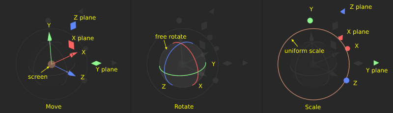

#### Nodes and vertices 

Every object in Nomad is made of a node and vertices:

* `Node` - The 'handle' of the object, which stores its translation, rotation, scale, called its transformation matrix.
* `Vertices` - The points that define the surface of an object, they store position and paint information.

If you have a simple box made up of 8 vertices, you could translate it by modifying its transformation matrix, or by modifying the vertex positions. When sculpting you usually want to modify the vertices, when moving objects with the gizmo, you usually want to modify the node. Nomad lets you do both. 

#### Left menu toolbar

The left hand toolbar controls if the gizmo will work on the node or the vertices, as well as other functions:

* `Clone` - Make a standalone copy of the current object, which can be dragged away with the gizmo.
* `Instance` - Make an instance copy pf the current object. The objects are linked, so sculpting changes on one object will appear on all the instanced objects.
* `Group/Object/Vertex/Auto` - Will set if the gizmo will affect the node or the vertices of an object. The default 'auto' mode will attempt a best guess. If there are several objects parented together in a hierarchy, 'Object' will only move the current object, child objects will remain stationary. The gizmo can also take masking and symmetry into account.
* `Pin` - By default the gizmo will move to the pivot of the selected object. When pin is enabled, the gizmo will stay where it currently is.
* `Align` - Toggle the pivot being aligned with the current object, or being aligned with the world.
* `Snap rotation` - Enable rotation values being snapped to increments, the snap value is displayed and can be edited when snap is active.
* `Snap translation` - Enable translation values being snapped to increments, the snap value is displayed and can be edited when snap is active.
* `Pivot` - When enabled, the gizmo can be moved and rotated without moving the object. It has an extra menu explained below.

#### Pivot
When pivot mode is active, a menu is displayed to allow quick pivot changes:

**Reset** 
* `Center` - Move the pivot to the center of the object
* `Bottom` - Move the pivot to the bottom of the object
* `Align` - Reset the rotations to be aligned to the world.
* `Mask` - Move the pivot to the center of the unmasked region.

**On Tap**
* `None` - do nothing when the object is tapped
* `Normal` - Move and rotate the pivot to align to where the surface is tapped
* `First` - Move (but don't rotate) the pivot to where the surface is tapped
* `Medial` - Move the pivot to the middle of the object, under where the surface is tapped.

#### Gizmo settings

* `Move origin` - Move the object to the center of the scene, called the origin.
* `Reset` - A shortcut that sets the translation values to 0, rotation values to 0, scale to 1, moving and rotating the object.
* `Bake` - Freeze the object where it currently is, and set the translate/rotate values to 0, scale to 1.

* `Translation` - the translate X, Y, Z values
* `Rotation` - the rotate X, Y, Z values
* `Scale` - The uniform scale if that is enable, or the scale X, Y Z if disabled.
* `Uniform scale` - Toggle the ability to scale uniformly or independantly on each axis

* `Compact` - toggle the gizmo layout to put the extra handles outside or inside the rotation sphere
* `Widget size` - the size of the gizmo
* `Thickness` - the size of the lines on the gizmo
* `Hide on interaction` - toggle if the gizmo should be temporarily hidden when being dragged

* `Tangent roll threshold` - Control how the rotation UI behaves when dragging on the circle handles to rotate on X/Y/Z. If this value is 0, rotating works like a dial, drag the gizmo in circles. If this value is 90, rotating works like pulling the string of a yo-yo; drag in a straight line towards or away from where you first clicked. Values between 0 and 90 will do a combination of both; below the value will be the linear move, above the value will be circular move.
* `Numerical input` - when enabled, a single tap on the gizmo will pop up a window to enter an exact value for the tapped widget axis.

::: warning
The [Gizmo](#gizmo), [Translate](#translate), [Rotate](#rotate) and [Scale](#scale) use their own symmetry checkbox!

By default this symmetry is turned off.
:::

On the left you can move the gizmo pivot, you can see the video below in action.
This is especially useful for the rotation, as it doesn't change anything for translation.

###  Facegroup

Facegroups let you organise your object into differently colored faces. You can use these groups in many ways in Nomad:

* A quick selection method for masks
* Hide/show sections of your object
* Organize your object without having to split it into separate parts
* Define uv regions
* Guide the quad remesher
* Additional control for tools like smooth.

#### Facegroup left toolbar

* `Patch ` - Display the available facegroups as patches. Unused patches can be deleted. Tap on a patch to rename or change its color. The plus icon lets you create new patches.
* `Dot` - Paint on the object to define facegroups. When '+ Face Group' is enabled, every new stroke will automatically create a new facegroup, useful for quickly defining regions. A tap will flood fill the selected regon. The slider sets the radius of the dot.
* `Relax` - Smooth the borders of facegroups. Very useful for defining clean edges for quad remeshing, or for defining panels for hard surface modelling. The sliders control the radius and intensity of the relax operation.
* `Shape selector` - Create facegroups with shapes instead of a brush, via `Lock+Radius`, `Lasso`, `Polygon`, `Rect` and `Ellipse`. See [Shape Selector](#shape-selector) for more info.
* `Auto-pick` - When enabled, will select the patch where the stroke starts, and apply that patch for the rest of the stroke. Very useful for tidying up facegroup regions; if a facegroup has extended too far, enable auto-pick, start a stroke from where the facegroup patch is correct, and drag up to the border to reassign the correct patch.

###  Hide
Hide or isolate parts of the object. 

The primary modes are controlled from the left hand menu:

* `Dot` - Brush on the object to hide parts of the object.
* `Shape selector` -  Hide with shapes instead of a brush, via `Lasso`, `Polygon`, `Line`, `Rect` and `Ellipse`. See [Shape Selector](#shape-selector) for more info.
* `Show` - invert the operation, so the selected mode will show instead of hide parts of the object.

A toolbar will appear at the top of the viewport with extra controls:

* `Clear` - Restore the object, all hidden parts will be unhidden.
* `Invert` - Swap the hidden and unhidden parts.
* `Facegroup` - Use facegroups to quickly hide sections, tapping on a facegroup will hide the entire facegroup.
* `Mask` - If a mask is active, tapping this button will hide the masked section.
* `Delete` - Delete the hidden part of the object
* `Split` - Split the hidden part of the object into a new shape.

###  Measure
Drag to measure the distance between 2 points.

###  Quad Remesher

This tool will convert the selected object into a clean quad topology layout, with controls for density, edge flow, symmetry. 

::: tip
The quad remesher is available as an in-app purchase for iOS only. Android users can use 'Quad Remesh - Instant' available under the Topology -> Misc menu.
:::

When this tool is activated for the first time, it will ask if you want to enable it as an in-app purchase. Once active, the left and top toolbars will be enabled.

* `Dot` - This brush will set the target density. Intensity at 100% will paint in red, which will use twice the target quad density at those regions. Intensity at 0% will paint in cyan, which will use half the target quad density in those regions. Intensity at 50% will paint in gray, which will use the default target quad density.
* `Smooth` - Smooth the red/gray/cyan density transitions.
* `Curve` - Sketch curves on the surface of the sculpt, quad remesher will use these as guides for the edge flow. Tap on a curve to delete it.
* `Path` - Draw paths on the the surface of the sculpt, quad remesher will use these as guides for the edge flow. Tap on a path to delete it. 
* `Rect` - Draw rectangles on the the surface of the sculpt, quad remesher will use these as guides for the edge flow. Tap on a path to delete it.
* `Ellipse` - Draw ellipses on the the surface of the sculpt, quad remesher will use these as guides for the edge flow. Tap on a path to delete it.

A toolbar will appear at the top of the viewport with extra controls:

* `Remesh` - Click this to start the quad remesher process.
* `Quads` - Set the target quad count by sliding left and right, or tap to set an exact number. Note that this is a guide more than a fixed number, the various controls on the quad remesher will often mean the result will not exactly match this target.
* `Guides` - indicate the total number of guides, or tap to delete all guides.
* `Density X` - tap to remove all density painting.
* `Density (painting)` - toggle to use or ignore density painting.
* `Face Group` - toggle to use or ignore facegroups to steer the quad remesher.
* `Relax` - toggle to automatically relax facegroup borders during quad remeshing. If your have already relaxed/smoothed your facegroup borders, disable this option.
* `Symmetry` - Toggle to enable a symmetrical result. Note that symmetry is always calculated around the world x-axis, so ensure your model is at the origin if you expect a symmetrical result.

The ... menu contains further options, note that the top toolbar has shortcuts for most of these:

* `Remesh` - Same as the `Remesh` button in the top toolbar
* `Target Quads` - Same as the `Quads` button in the top toolbar
* `Adaptive quad count` - toggle to enable using smaller quads in areas of high curvature, and larger quads in lower curvature.
* `Adaptive size` - Set the amount of adaptivity. 100% will alow maximum adaptive size, at 0% quads will be uniform.
* `Auto-Detect Hard Edges` - toggle to adapt the quad remesh layout to better follow sharp surfaces.
* `Density (painting)` - Same as the `Density (painting)` button in the top toolbar
* `Face Group` - Same as the `Face Group` button in the top toolbar

###  Select
Use the shape modes to select objects in the scene. `Unselect` will remove objects from the selection.

###  View
This "tool" does nothing in particular, this is simply a way to view the model without modifying your scene.

## Toolbox context menu

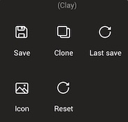

A right click or long press on a tool in the toolbox will bring up a context menu. This menu has the following options:

* `Save` - save any changes you made to the tool
* `Clone` - duplicate the tool into a new tool shortcut
* `Last save` - revert to the previously saved version of the tool
* `Icon` - change the icon for the tool
* `Reset` - reset the tool to its defaults