# Topology

---

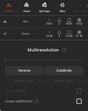

Nomad is based on polygons, it uses triangles and quads to handle the geometry.
By topology, we refer to both the number of faces but also the way points (vertices) are connected.

It's important to keep track of the topology, especially if you want to sculpt or paint fine details.

::: tip How to keep track of your topology?
You can display the [Wireframe](settings.md#wireframe) or simply disable [Smooth Shading](settings.md#smooth-shading).
:::

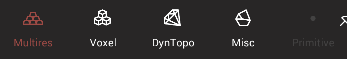

The topology menu of Nomad has several sections:

| Method                                | Icon | Description  |
| :---:                                 | :---: | :---:        |
| [Multiresolution](#multiresolution)   |  | Edit multiple levels of detail using subdivision  |
| [Voxel Remesher](#voxel-remesher)     |   | Recompute a new topology with uniform density |
| [Dynamic Topology](#dynamic-topology) |  | Add/Remove faces locally in real-time when sculpting or painting |
| [Misc](#misc)             |  | Decimation, UVs, baking, remeshing, reprojection |
| [Primitive](#msc)             |  | Primitive options |

## Polygon stats

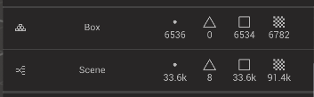

The top section of the topology menu displays polygon information for the selected object and the entire scene. The numbers show the total number of vertices, total number of triangles, and total number of quads (4 sided polygons).

Tapping on this section will bring up a list of polygon statistics for all the polygon objects in the scene.

## Multiresolution 

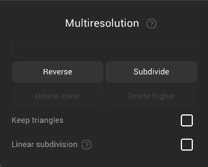

### What is multiresolution?
The multiresolution feature is useful for two main scenarios:
- The smooth subdivision algorithm to increase the polycount of your object
- Handle multiple level of resolution so that you can alternate between small and large scale edits

#### Multiresolution Workflow
One important aspect of the multiresolution is that you can go back to a lower resolution, make changes on your object and then go back to the highest resolution without losing the high resolution details. All the high resolution details will be projected automatically.

::: warning
If you are using a tool that alters the topology of your object, you will lose all the other resolutions of your object!
You should always get a warning in case it should happen, for example when you are using:
- the [Voxel Remesher](#voxel-remesher)
- the [Dynamic Topology](#dynamic-topology)
- the [Trim tool](tools.md#trim)
- the [Split tool](tools.md#split)
:::

### Multiresolution slider
This slider indicates the number of subdivision levels in the current object. If there are 6 vertical bars, there are 6 subdivision levels. The circle indicates the currently displayed subdivision level. 

### Reverse
When on the lowest subdivision level, the reverse button will attempt to create a level below the current one. Note that this generally can only happen if the object was created with subdivision to begin with, say in Nomad or in other 3d applications that multiresolution subdivision surfaces.

### Subdivide
The *Subdivide* button will increase the number of polygons by 4, so make sure to keep an eye on the polycount as it can increase very quickly!
One important aspect of *Subdivision Surface*  is that they will converge to a *Smooth Surface*.
To understand how it works, you can try the *Subdivide* button on an object with only a few polygons.

You can disable this *Smooth* behavior by checking the `Linear` option.

### Delete lower
If there are subdivisions below the currently displayed level, delete them. If you do this by accident, you can recreate them with the Reverse button.

### Delete higher
If there are subdivisions above the currently displayed level, delete them.

### Keep triangles
Most standard subdivision surface systems will attempt to convert all polygons to quads during a subdivision operation. This toggle will force the subdivision to use triangles instead.

### Linear subdivision
Subdivide the mesh without applying smoothing.

::: tip 

Subdivision will smooth all sharp edges by default. To keep edges slightly sharp, experiment with using linear subdivision on the first 2 subdivide levels, then turn it off for the higher levels. This will create a semi-sharp subdivided mesh.

:::

## Voxel Remesher 
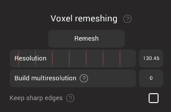
When using the `Voxel Remesher`, the entire mesh will force the topology to have an uniform resolution, meaning all the polygons have more or less the same size. This is very useful when you don't want to think about topology and simply do free-form sculpting.

A typical sculpting workflow can start by using the `Voxel Remesher` to block-out a rough shape with a low resolution.
Simply hit the *Remesh* button once in a while when you are stretching the mesh too much to avoid too much distortion.

::: tip Voxel?
As stated above, Nomad is a polygonal software, but the `Voxel Remesher` is one exception where another approach is used (temporarily) to perform the remeshing.

One big difference is that the voxel approach won't accept self intersection, so these will be resolved.
Also it doesn't support meshes with holes in them.

By holes, we don't mean the `genus hole` (`hole` of a donus), but instead mesh that are not `watertight`/`closed`.
Typically, what it means is that before applying the remeshing, every holes will be filled, similarly to the [Trim tool](tools.md#trim) or [Hole filling feature](scene.md#hole-filling).
:::

### Remesh
Execute the voxel remesh.

### Resolution
The size of the voxels used during the calcuation. While changing this parameter a checkerboard pattern will be overlayed on the mesh to give a preview of the result.

### Build multiresolution
Create lower multiresolution levels for the voxel remesh. If you use the checkerboard pattern to set a resolution, and set build multiresolution to 1, the remesh operation will first create a voxel mesh at double the checkboard size, project it onto your model, then subdivide, and project again. This can be a good way to both generate a clean mesh with even polygons, and have a lower resolution control mesh.

### Keep sharp edges
Enable snapping of the new points to sharp edges on the original mesh. It can introduce distortion.

## Dynamic Topology 

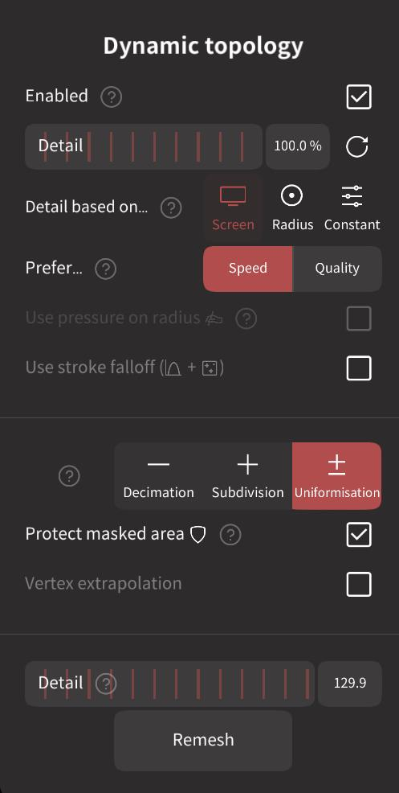
Multiresolution and voxel remeshing are common industry methods to control topology, but both require you to watch that you're not stretching polygons too far, or squeezing polgyons too tight. 

Dynamic Topology is an alternative method. As you sculpt, Nomad will adaptively add and remove polygons during the brush stroke, so carving in small details will add many small polygons where you need them, and smoothing elsewhere will take away polygons.

Note that dynamic topology will use triangle polygons rather than quads. This can look a little messy, but it's almost better to not look at the wireframe, just concentrate on making a nice looking sculpt without worrying about topology, then later you can use one of Nomad's other remeshing tools to generate a clean quad mesh.

See the video below in action.

### Enabled
Turn on dynamic topology. A DynTopo icon will be placed below the brush radius and intensity sliders to remind you it is active.

### Detail
The target polygon density when the detail mode is in `Constant`. A checkboard preview will be displayed when changing detail to indicate polygon size.

### Detail based on...
| Method              | Description  |
| :---:               | :---:        |
| Screen           | The level of detail will depend how big the object is on screen |
| Radius          | The tool radius defines the amount of detail |
| Constant          | The detail slider defines the amount of detail |

### Prefer...
| Method              | Description  |
| :---:               | :---:        |
| Speed               | Favor performance |
| Quality             | Favor quality |

When you favor `Quality`, the 2 main differences are:
- refinement is applied before sculpting, so you will get less interpolating artifact when painting or sculpting very small details
- refinement is running until it converges to the correct level of detail, in contrast to an incremental behavior.
 
That way, if you sculpt very small details or do quick strokes, the topology will always be refined as expected

### Use pressure on radius
Only relevant if `Radius` is activated. When enabled, the level of detail will always reflect the brush size, even when the brush size is affected by pencil pressure.

### Method
Whether you are using `Dynamic Topology` on your [Brush](#brush) or [Globally](#global), you can choose in which mode it operates:

| Method              | Description  |
| :---:               | :---:        |
| Uniformisation      | It can add and remove faces, this is the mode used in the video above |
| Subdivision         | Add new faces only, it cannot remove faces  |
| Decimation          | Remove faces only, it cannot add new faces |

### Protect masked area
Enable masked areas protecting the topology from being changed.

### Detail
A linked copy of the detail slider, placed near the remesh button for convenience.

### Remesh
Execute a global remesh using the dyntopo algorithm. Usually you should use the [Voxel Remesher](#voxel-remesher) for full remeshing.

However one advantage over the voxels is that the masked area will be protected, so you can have a better control on where to put more or less density.

## Misc 

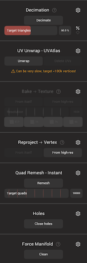

##### Gear menu 
Many of the tools in this menu have extra options. They can be accessed through the gear icon next to the section title.

### Decimation

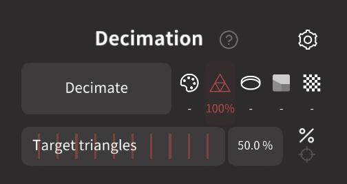

Reduce the number of polygons by trying to keep as many details as possible, using triangle polygons.

This feature can be useful if you want to export for 3d printing.
However you should probably not use it if you want to continue sculpting on it, as it can produce uneven triangles.

Note that the masked areas won't be decimated.

#### Decimate
Start the decimate operation.

#### Decimate gear menu 
The gear menu has these advanced options:
##### Target triangles
Set the target triangle count. The default value is 50%, the %/target button will toggle between a percentage or an exact target poly count.

##### Preserve painting
The checkbox will toggle this mode, the value will determine how accurately painting detail will be preserved. Higher values will preserve more painting. Set to 0 if you do not care about painting.

##### Uniform faces
The checkbox will toggle this mode. Higher values will output triangles with similar size.

##### Preserve borders
Enable to stop borders being decimated. Border weights can be selected for `Geometry`, `Face Group` or `UV` borders.

### UV Unwrap - UVAtlas

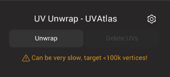
Compute texture coordinates (UVs) for the current mesh, generally preferring to make more islands with cuts, to minimise distortion.

::: warning
Computing UVs can take some time, it is best to have a mesh with fewer than 100k vertices.
:::

::: tip UVs?
A common analogy for UV's is wrapping a gift; what is the best way to cut wrapping paper to completely cover an object, with no overlaps? 

Uv's are similar, but instead of cutting the paper, you cut the object. Imagine if your model was made of thin plastic, how would you cut your model apart to unwrap it to lie flat, paint on it in that flat state, then reassemble it?

Now imagine the surface of your model is made of stretchy lycra. You could stretch the model flat, or cut it, or a combination of both. But if you painted a checkerboard on the object when flattened, the checkerboard would be distorted when you reassemble it. Which is a better method, more cuts with less distortion, or less cuts with more distortion?

Uv's are instructions to tell 3d software how to 'cut and stretch' the object when applying textures. The UV Atlas tool generally uses a 'more cuts, less distortion' approach.

:::

::: tip UV's and Nomad and other apps

Most textured models you find online will be textured with UVs. Nomad can import and display this via the [material](material#textures) panel.

When models are made in Nomad, you can paint directly onto objects without UVs. If you need to export them to other apps, eg [Procreate](https://procreate.art/), you can 'bake' Nomad color information into textures via UVs. 

:::

#### Unwrap
Calculate UVs for the selected object, which will be displayed in the background.

#### Delete UVs
Delete UVs on the object.

#### UVAtlas gear menu 
The gear menu has these advanced options:

#### Face Group

Use facegroups to define the cuts for the UV's.

##### Max Stretch
Low values create less distortion and more islands, high values create more distortion and less islands. 

##### Island spacing
The amount of padding between the islands. Low values will waste less space, but will risk textures bleeding between islands. 

### Bake -> texture 
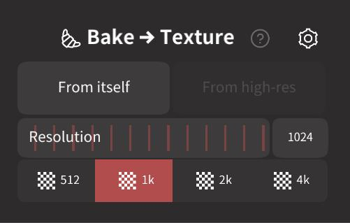

Texture baking will create textures by projecting other visible objects in the scene.

Here is the typical workflow for baking:
- You have a mesh with fine details and painting
- Clone it
- Decimate it (set `Preserve painting` to 0!)
- UV unwrap it
- Bake it!

Nomad by default will take every visible mesh in the scene into account.
You can also use the Solo mode to quickly hide most of the other meshes.
If there is no other visible objects, then it will take the entire scene into account.

You should now have a low-resolution mesh that retains most of the paint and details of your previous object.

After the operation, vertex colors will be moved in a new disabled layer, so that it gets ignored instead of being multiplied against the colored texture.

#### From itself
Bake the highest multiresolution level to the lowest level on the current object. This is simple to setup, but often you will require more control, in which case the next option is more useful.

#### From high-res ()
Bake from the other visible objects in the scene to the selected object. The number in brackets indicate the number of other visible objects that will be used as high-res targets, and baked into the current low-res object with uv's. The other objects do not need to be similar in layout or topology to the object being baked, allowing for interesting bake workflows.

#### Resolution
The resolution of the baked texture. Bake textures are always square, so 1024 will create a 1024x1024 image. 

The buttons below are shortcuts for commonly used resolutions. For reference, 512x512 is relatively small, say for web graphics and simple geometry. 4096x4096 (4k for short) is for high quality renders.

#### Bake gear menu 
The gear menu has these advanced options:

##### Normal, Roughness, Metalness, Color, Emissive, Opacity
These checkboxes will determine which properties will be baked, each into separate maps. After the bake is complete, these will be added as textures to the material of the current object.

##### Backup
To preview the baked textures, the object's paint information should be disabled. This option will transfer any paint information to a new layer as a backup, and so it can be easily enabled/disabled.

#### Cage radius
Adjust how far away from the bake object rays are sent to look for target objects. By default this distance is kept low to avoid artifacts, but can be increased if the target objects are far away from the bake object.

##### Ray offset
Adjust where the bake calculations start from on the bake object. By default they start 5% away from the surface, which avoids certain artifacts. If the target objects are very far away from the bake object, this offset might need to be increased.

### Reproject to vertex

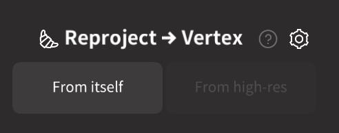

Project sculpted details, painting, layers, textures into vertex values.

::: tip
When using `Bake to texture` or `Reproject to vertex`, both the vertex colors and material textures will be taken into account.
:::

#### From itself
Convert textures from the material into vertex values. This button will only be active if the object has UV's, and textures are active in the material.

::: tip TIP: Texture painting
Nomad doesn't directly support painting and editing textures, but very similar results can be achieved by projecting textures -> vertex values, painting on vertices, then bake vertex -> textures:

1. Setup a low poly object with UV's
1. Load textures into it's material
1. Subdivide it enough to paint on
1. `Reproject to vertex` in `From itself` mode, now the texture has been converted to vertex values
1. Paint, smooth, smudge, stamp, do whatever edits you need
1. `Bake to texture`, in `From itself` mode. Those edits are converted back into textures.
:::

#### From high-res ()
Convert any visible objects into vertex values on the selected object. The number on this button indicates the number of visible objects.

::: tip
Reprojecting other objects can be used not just for transferring color information from other objects, but to project vertices onto other objects, eg bandages can be projected onto a character.
:::

#### Reproject gear menu 
The gear menu has these advanced options:

#### Vertices, Roughness, Metalness, Color, Opacity, Opacity->Mask, Mask, Layers, Face Group
These checkboxes determine which properties will be projected to the selected object. 

#### Relax
The selected mesh can have its layout smoothed or relaxed a certain amount to better fit the reprojection targets. Smooth is better for high poly meshes. Relax is better for low poly meshes. Auto will let Nomad determine the best method.

#### Iterations
How many times the relax operation should be applied during the reprojection.

#### Cage radius
Adjust how far away from the selected object rays are sent to look for target objects. By default this distance is kept low to avoid artifacts, but can be increased if the target objects are far away from the bake object.

#### Ray bias
Lower values will favor projection to the nearest point on the target surface. Higher values will favor an intersecton point using the surface normal. 

#### Ray offset
Adjust where the bake calculations start from on the selected object. By default they start 5% away from the surface, which avoids certain artifacts. If the target objects are very far away from the bake object, this offset might need to be increased.

### Quad Remesh - Instant
Remesh using the Instant Meshes algorithm by Wenzel Jakob, Marco Tarini, Daniele Panozzo, Olga Sorkine-Hornung. It will analyze the flow of a mesh and create clean quad topology.

#### Remesh
Start the instant meshes operation.

#### Target quads
The number of quad polygons quad remesh will attempt to create.

#### Crease angle
A threshold of sharp corners that will try and help guide the remesh operation.

### Max fill hole
The algorithm can sometimes produce unwanted holes. If a hole has fewer vertices than this value, then it will be filled.

### Holes
Most of the time, your object will probably be watertight, meaning the mesh is 'closed'.

However if you import You can fill the holes in your mesh If your object has holes, you can fill them.
Note that it only works on 'naive' holes, as such, it cannot 'weld' two separate borders.

::: tip
When you run the Voxel remesher, all the holes are automatically closed, whether you are using it on 1 or multiple meshes.
:::

#### Close holes
Execute the hole close action.

### Detail
The polygon density used to fill the whole. While dragging this slider a checkerboard pattern will be shown on the model, this will give an indication of the triangle size to use. The checkbox will disable this, and only use the existing points, which will usually create long thin triangles over the hole, which can be difficult to sculpt.

#### Fill non-manifold
Try to fill non manifole hole.

### Force Manifold
Try to clean non manifold edge. It can be useful for external software that don't support edges that have more than 2 faces in common.

#### Clean
Execute the clean action.

#### Delete small faces
A threshold used to remove and join small polygons.

### Triplanar
Converts the mesh into a [triplanar](scene.md#triplanar) primitive.
You might lose lot of details in the process.

#### Force cubic
Enable the triplanar to be a cube. Otherwise the triplanar will fit to the closest bounding box around your object.

#### Convert
Execute the triplanar action.

#### Resolution
The detail of the 'voxels' used in the triplanar operation.

## Primitive
If a primitive is selected, it's parameters will be displayed in this menu. Most of these options will be available from the viewport toolbar that is visible when a primitive is selected.
