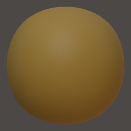
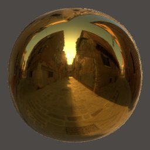

# Painting

[[toc]]

---

## Material

[PBR](lighting.md#pbr) painting is using 3 channels at the moment.
- `Color` As the name suggests it represents the base color
- `Metalness` It simply tells if the surface is metallic or not. The value should be either 0% or 100% most of the time, in-between values should be exceptional.
- `Roughness` It tells how "rough" or "smooth" a surface is. A low value for the roughness means that the reflections will be sharp.

You can choose to disable some of these channels.

::: tip
You might consider turning on `Smooth Shading` [globally](settings.md#smooth-shading) or [per-object](material.md#smooth-shading) if you are painting a metallic surface on on object with polycount.
:::

<!--
| Metalness | Roughness 0%                    | Roughness 50%                    | Roughness 100%                    |
| :---:     | :---:                           |:---:                             |:---:                              |
| 0%        |  |  |  |
| 100%      |       |       |       |
-->

|                | Metalness 0%                      | Metalness 100%               |
| :---:          | :---:                             |:---:                         |
| Roughness 0%   |    |    |
| Roughness 50%  |   |   |
| Roughness 100% |  |  |

::: warning
Metalness and roughness can't be supported if you are using [Matcap rendering](lighting.md#matcap), so if you paint you will only see the colors.
:::

## Vertex Painting

Nomad only supports Vertex Painting.

With this method the material information is stored on the vertices (unlike [Texturing](#texturing), which stores the information on an image).

::: tip
You can enable painting with most tools.
For sculpting tools, the paint intensity has its own slider, independent of the main deformation slider.
:::

## Texturing

Nomad supports textures, but only if they are already present in an imported model.

A texture is simply an image, but in the 3d context it usually refers to an image assigned to an object.
In order to wrap an image around a model, the model needs texture coordinates (UV).

Nomad can compute [them automatically](topology.md#uv-unwrap) but you don't have much control on the overall quality.
Since Nomad cannot do texturing, generating UVs is only useful if you plan on exporting the object to a texturing application.

::: tip
One example of workflow:
- Sculpt on Nomad, then [UV unwrap](topology.md#uv-unwrap)
- If you already started to paint in Nomad you can [transfer the vertex painting to textures](topology.md#bake-vertex-colors-to-texture)
- Export to Procreate
- Texture in Procreate
- Export back to Nomad for rendering purpose
:::

## Stamp

In the 3d context, most of the time you assign textures:
- to a brush stamp, for texturing purpose
- to a brush stamp, for vertex painting purpose
- or directly to an [object](#texturing), if it has UVs

In Nomad you can only assign a Color texture to the brush (for vertex painting then).
Roughness and Metalness stamps are not supported.

However the [Alpha](stroke.md#alpha) texture will impact all 3 channels: Color, Roughness and Metalness.
